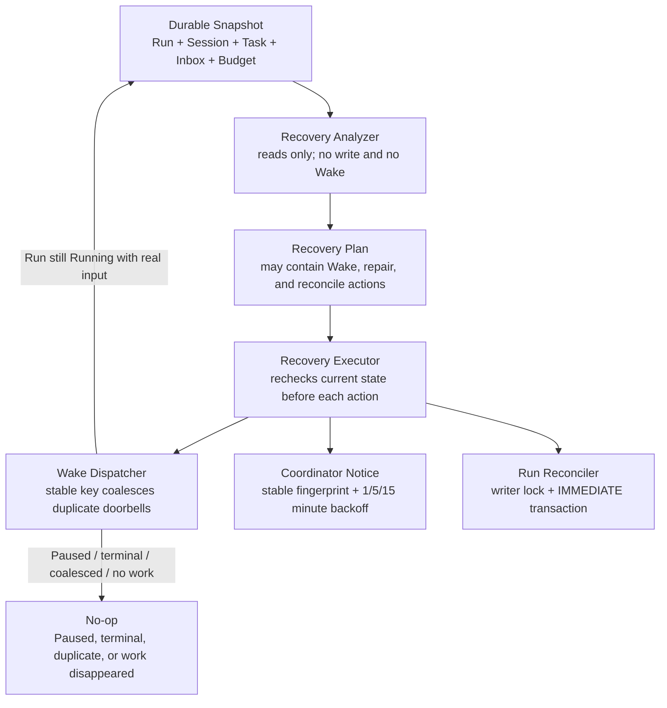
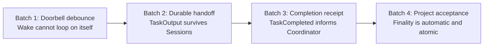
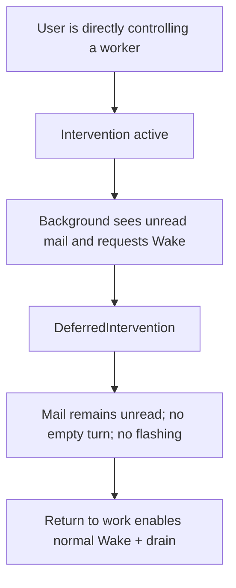
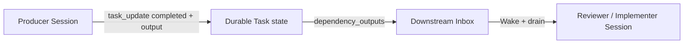
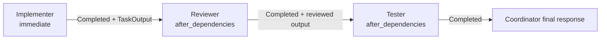

# Agent Org Recovery and Consistency Hardening — Architecture Audit

- Audit date: 2026-07-13, updated with final verification on 2026-07-18
- Branch: `fix/issue-272-agent-org-recovery-invariants`
- Baseline: `develop`
- Scope: GitHub issue #272, adjacent Agent Org state consistency, recovery, scheduling, Task atomicity, CLI capability boundaries, and related UI entry points
- Status: The design described here is implemented and verified. The later review-safety audit in `docs/architecture-audit-2026-07-16/AgentOrgReviewSafetyAudit.md` is the final source for review findings and final test totals.

## Executive conclusion

Agent Org recovery changed from “something looks stalled, so wake somebody or reclaim old work by time” to “read a durable Snapshot without side effects, analyze the facts, then execute bounded recovery under a persistent budget, exact Task authority, and current Run state.” Run, Session, Task, and Inbox/Wake state no longer impersonate one another. Duplicate Wakes coalesce, Paused or terminal Runs cannot be revived by a queued doorbell, Task completion is handed to downstream members through durable output, and Run finality is serialized with Task mutation.

Real development runs exposed several failures that unit-level reasoning alone did not reveal:

- a blue Running indicator repeatedly flashing because a WakeNoop loop fought an intervention guard;
- a normal message to the Coordinator being misclassified as direct takeover;
- completed upstream work lacking a durable handoff to the next worker;
- the Coordinator remaining one state behind Task completion;
- Review/Test Tasks silently starting early when dependencies were omitted;
- duplicate Wake requests coalescing in memory while leaving durable queued intents behind;
- completed Runs requiring manual Pause/Resume before finality became visible.

All of those paths were traced to durable state and corrected. The final design also removes autonomous worker claiming after failure: ownerless work is an honest “currently unassigned” state and requires explicit Coordinator assignment.

## Plain-language model

| Code term       | Plain-language meaning                                     | Durable source of truth                               |
| --------------- | ---------------------------------------------------------- | ----------------------------------------------------- |
| `AgentOrgRun`   | One team execution or project                              | `agent_org_runs`                                      |
| `Session`       | Whether one member is currently executing a turn           | `agent_sessions`, plus historical CLI `code_sessions` |
| `Task`          | A board item recording owner, dependencies, and completion | `agent_org_tasks`                                     |
| `AgentInbox`    | Durable mail that survives process restart                 | `agent_inbox`                                         |
| Wake            | A doorbell asking the scheduler to give a Session work     | A scheduler turn with a stable idempotency key        |
| Watchdog        | A periodic recovery inspector                              | Pure analysis followed by a bounded executor          |
| Recovery budget | Persistent retry accounting                                | `agent_org_recovery_attempts`                         |



Core rules:

1. An Idle Session means that a worker is not executing a turn now; it does not mean the project ended.
2. A Running Run means that work is allowed to continue; it does not mean every member is healthy.
3. A Pending Task is not automatically claimable. Dependencies, eligibility, ownership, and authority still apply.
4. An unread Inbox row is durable truth. Wake is only a doorbell; enqueue failure cannot be presented as delivered work.
5. Task mutation and Run finality share the same writer serialization so a terminal Run cannot acquire new open work.

## Four recovery batches identified by real runs



### Batch 1 — Stop the WakeNoop loop

The flashing blue state was not repeated model reasoning. During direct user intervention, Inbox drain is intentionally deferred so background work does not interrupt the user's turn. The old post-turn race guard still saw unread mail and immediately queued another Wake. That empty turn ended with the row unread and scheduled the next Wake indefinitely.

The fix:

- `wake_one_member` checks `AgentMemberInterventionStore` before scheduling and returns `DeferredIntervention`.
- The post-turn unread guard requires a Running Run, no active intervention, and actual unread data.
- The Inbox row remains durable and unread until Return to work or intervention expiry.



### Fix the upstream Coordinator-intervention cause

A later log review proved that the user was not chatting with the Coordinator during the flashing period. An earlier normal Coordinator instruction had incorrectly created a three-minute intervention. Workers then wrote unread Coordinator mail. The system prohibited the Coordinator from reading it while continuously creating Wake intents for it.

The final classification is:

| User action                                                 | Meaning                                       | Create intervention?                |
| ----------------------------------------------------------- | --------------------------------------------- | ----------------------------------- |
| Normal instruction in Root/Coordinator input                | Direct the Agent Org                          | No                                  |
| Direct chat after switching to Planner/Implementer/Reviewer | Temporarily take over that worker's next turn | Yes                                 |
| Group Chat message or member mention                        | Normal organization delivery                  | No; clear stale target intervention |
| Return to work                                              | Return the worker to organization scheduling  | Clear it                            |

The backend uses the Session's canonical `member_id`; it does not infer role from the current page title. Generic `agent_send_message` no longer infers takeover from non-empty text. Duplicate intervention writes in the Rust adapter were removed. The Store refuses new Coordinator interventions and self-heals historical Coordinator records when read. Wake and lifecycle guards remain as defense for legitimate worker intervention.

### Batch 2 — Persist a cross-Session handoff

A Task previously recorded only Pending, In progress, or Completed. It did not reliably preserve what was produced. Downstream workers cannot safely inspect arbitrary peer transcripts, so completion alone was insufficient.

`TaskOutput` adds:

| Field                   | Meaning                                          |
| ----------------------- | ------------------------------------------------ |
| `summary`               | A short result summary                           |
| `content`               | Bounded content that downstream work may consume |
| `artifact_ids`          | Durable references for large files or artifacts  |
| `produced_by_member_id` | Producer identity                                |
| `produced_at`           | RFC3339 production time                          |

An upstream Task with downstream dependents cannot complete without a valid output. When it completes, `TaskAssigned.dependency_outputs` carries bounded content or artifact references into the next member's real Inbox turn.



### Batch 3 — Separate member idleness from Task completion

`MemberIdle` means only that a member's current turn ended. It does not prove a Task completed. A system-only `TaskCompleted` receipt tells the Coordinator exactly which Task completed, who produced it, what its bounded output summary is, and how much open work remains.

- Only the current owner may set its Task to Completed.
- Completed Task state is monotonic; revisions create follow-up Tasks rather than reopening history.
- Transaction-local `TaskMutationOutcome` decides whether exactly one receipt is emitted.
- The Coordinator re-reads durable Task state before dispatching more work or replying to the user.

### Batch 4 — Make Run finality a durable project acceptance step

Previously all members could become Idle while the Run stayed Running. Manual Pause/Resume caused an extra Coordinator turn, making the system appear to discover completion only after user intervention.

Finality now evaluates durable facts under the same SQLite writer serialization as Task mutations. Completion requires:

1. a valid resolved Task board or an explicit empty-board completion intent;
2. quiescent Root and worker Sessions;
3. no unresolved unread Inbox delivery;
4. no active intervention;
5. no in-flight turn intent;
6. proof that the Coordinator observed the latest work revision and had a terminal opportunity to respond.

The frontend projects explicit Run phases instead of making users infer state from animation:

| Phase                                                 | Meaning                                                                    |
| ----------------------------------------------------- | -------------------------------------------------------------------------- |
| `coordinating`                                        | Coordinator is decomposing or organizing work.                             |
| `dispatching`                                         | Durable messages are being delivered.                                      |
| `members_working`                                     | At least one member is executing or waiting for user/funds.                |
| `waiting`                                             | Open work exists but no member currently executes it.                      |
| `finalizing`                                          | Tasks are resolved while final messages and Coordinator response converge. |
| `paused / completed / failed / cancelled / abandoned` | Durable Run state.                                                         |

### Additional defects found while auditing the four batches

| Finding                                                             | Risk                                                                    | Correction                                                                      |
| ------------------------------------------------------------------- | ----------------------------------------------------------------------- | ------------------------------------------------------------------------------- |
| Historical tests reopened Completed Tasks                           | Tests encouraged an invalid lifecycle.                                  | Use a legal subject update and release while preserving history-order coverage. |
| Finality initially checked only `queued` intents                    | `optimistic` and `running` windows could be missed.                     | Any non-terminal intent blocks finality.                                        |
| New limits used UTF-8 byte length but documentation said characters | Non-ASCII content received a much smaller effective limit.              | Character and byte limits are explicit and independently enforced.              |
| `produced_at` deserialized without timestamp validation             | Direct Store calls could persist unauditable time values.               | Store enforces RFC3339 and tests malformed metadata.                            |
| UI active count omitted `waiting_for_funds`                         | Backend considered a member active while UI showed zero active members. | Phase and activity badge use the same status set.                               |

## Sequential dispatch and durable Wake-intent fixes

### Explicit dispatch policy

The old `task_create` defaulted to `blocked_by=[]`. If the Coordinator omitted dependencies, Reviewer and Tester received `TaskAssigned` immediately even when their descriptions required upstream output.

The tool now requires an explicit policy:

| Field                                                          | Meaning                                                    | Dispatch timing                  |
| -------------------------------------------------------------- | ---------------------------------------------------------- | -------------------------------- |
| `dispatch_policy="immediate"`                                  | Current information is sufficient and work is independent. | Immediately after creation       |
| `dispatch_policy="after_dependencies"` + `dependency_task_ids` | Work must consume durable upstream results.                | After every dependency completes |

The wire schema uses provider-compatible flat fields and parses them into typed `TaskDispatchPolicy` at the tool boundary. It rejects empty dependencies, unknown Task ids, self-cycles, and dependency ids attached to `immediate`. A dependency-confirmation gate returns structured guidance when non-transitively open work appears to have been omitted; creation proceeds only after the Coordinator adds the dependency or explicitly confirms safe parallelism.



### Scheduler-owned terminal intent disposition

The old path wrote a queued intent before calling the scheduler. The scheduler correctly detected a duplicate `client_message_id`, but the new durable intent remained queued forever and blocked finality.

The scheduler now persists precise terminal outcomes:

- `coalesced`: the logical turn was already queued or running, so this intent never executed;
- `rejected`: the queue was full or closed, so this intent was never accepted.

`coalesced`, `rejected`, and `stale` are pre-execution terminal states. They create no chat round and do not block finality. Twenty concurrent identical Wakes produce one accepted turn and nineteen coalesced intents, with every database row reaching an accurate disposition.

### Startup healing

After process restart, the previous in-memory scheduler no longer exists. Historical `optimistic` or `queued` intents become `stale`, while historical `running` intents become `failed`.

Startup order is now:

1. reconcile stale intents;
2. apply durable terminal markers to ended Sessions;
3. mark remaining in-flight Sessions abandoned;
4. apply Task failure disposition;
5. clear interventions;
6. atomically finish Runs whose work is resolved;
7. pause only Runs that still require work.

The debug restart simulator and production startup use the same ordered routine.

## Implementation summary

### Recovery Analyzer and Executor

- `inspect_stalled_run` reads Run, Task, Session, Inbox, and budget facts and returns a composable plan without side effects.
- One plan may contain member Wakes, Coordinator repair notices, and reconciliation.
- Every `SessionStatus` is explicitly classified.
- E3 remains an explicit limitation: while a worker is Active, the system does not perform general peer auto-recovery; unavailable unread recipients are still diagnosed.
- Pending Sessions receive a two-minute materialization grace. Paused Sessions are not woken. Missing, Archived, and historical CLI transport are escalated.
- Executor revalidates Run, Session, recipient, Task graph, fingerprint, and real work before committing an action.

### Wake idempotency and timing

- Agent Org Wake uses `agent-org-wake:{run_id}:{member_id}`.
- Session Running is persisted only when the scheduler actually begins the turn.
- A queued Wake whose Run later becomes Paused or terminal exits without draining Inbox or calling the provider.
- A turn with no real durable input returns WakeNoop instead of injecting an empty nudge.
- Persistent 1/5/15-minute recovery budgets survive restart. Only Enqueued consumes an attempt; coalesced and rejected requests do not.
- Corrupt budget deadlines are diagnosed and cannot permanently suppress recovery.

### Task authority and ownerless semantics

- Ownerless means “currently unassigned.” It never authorizes worker self-claim, automatic Wake, or execution-mode change.
- Watchdog reports ready ownerless work to the Coordinator for explicit assignment.
- `eligible_member_ids` is a candidate allowlist for Coordinator assignment, not worker administrative authority.
- Owner and eligibility must belong to the immutable launch roster.
- Reserved metadata fields are typed and revalidated in the Store.

### Failure, shutdown, and restart disposition

Worker failure releases open work to ownerless Pending state, preserves metadata, and sends the Coordinator an explicit assignment notice. It does not wake the failed owner or an eligible peer automatically.

Accepted shutdown uses administrative disposition: work may return to a valid peer pool, or ownership is escalated to the Coordinator when no peer can accept it. A deliberately stopped member is not revived as though it suffered provider failure.

App restart marks leftover Running Sessions abandoned before applying the same failure disposition. Recovery queries select all Running Runs directly in SQL rather than truncating an arbitrary 500-row mixed-status list.

### Atomic finality and Task mutation

- Create, update, delete, reassign, requeue, and shutdown disposition validate a Running parent Run inside the transaction.
- Reconciliation reads Run, Root, workers, Tasks, Inbox, interventions, and intents under one serialized finality transaction.
- Concurrent reconcile/create tests permit only serializable outcomes.
- Transaction-local outcomes drive `TaskAssigned`, `TaskCompleted`, and dependency-unblock side effects exactly once.

### Stale ownership and CLI boundary

- A merely old Running Session no longer loses Task ownership. Staleness produces a Coordinator notice only.
- Ownership changes require explicit Failed, Cancelled, Abandoned, Timeout, accepted shutdown, or restart recovery semantics.
- Invalid timestamps produce diagnosis rather than silent behavior.
- New or updated Agent Orgs reject CLI Coordinator/member definitions because CLI lacks production Inbox drain, Agent Org tools, and a correct resume bridge.
- Launch preflight fails before creating a Run or Root Session and names the unsupported `member_id` and `cli:*` transport.
- Historical definitions remain readable so users can remove unsupported members.

## User-visible behavior

| Scenario                            | Current behavior                                                                                                         |
| ----------------------------------- | ------------------------------------------------------------------------------------------------------------------------ |
| Create Agent Org                    | Coordinator/member selectors show supported Rust-native built-in and custom agents, not CLI transports.                  |
| Edit historical CLI Agent Org       | Existing data opens, but unsupported members must be removed or replaced before saving.                                  |
| Launch old Org containing CLI       | Clear preflight error; no partial Run or Root Session is left behind.                                                    |
| Pause Run                           | Unread Inbox remains durable; background Wake does not call the provider; Resume continues through normal progress Wake. |
| Terminal Run                        | Task mutation returns structured immutable guidance; queued Wakes no-op and never revive members.                        |
| Member failure                      | Work becomes visible ownerless Pending work and the Coordinator receives exact assignment guidance.                      |
| Accepted shutdown                   | Work returns to a valid pool or the Coordinator; the stopped member is not revived.                                      |
| Concurrent Wake sources             | The user sees one real turn; duplicate requests become Coalesced.                                                        |
| Normal Coordinator instruction      | No intervention is created; the Coordinator can drain worker replies in the same turn.                                   |
| Direct worker chat                  | Only that worker gains intervention; Return to work restores organization scheduling.                                    |
| Historical Coordinator intervention | The Store removes it on read so it cannot continue blocking delivery after upgrade.                                      |
| Old Running member                  | Coordinator receives a stale notice; ownership is not stolen by time.                                                    |
| App restart                         | Intents heal first; resolved Runs finalize; only Runs with remaining work are paused.                                    |

## Audit findings and resolution

| Priority | Finding                                                              | Risk                                                                         | Resolution                                                                                                      | Status |
| -------- | -------------------------------------------------------------------- | ---------------------------------------------------------------------------- | --------------------------------------------------------------------------------------------------------------- | ------ |
| P0       | Debug Task seed imported the wrong crate root                        | `agent_core` compiled while top-level `org2` did not.                        | Use the public `agent_core::...` path and check top-level `org2`.                                               | Fixed  |
| P0       | Normal Coordinator instructions created worker-takeover intervention | Unread replies conflicted with intervention and generated hundreds of Wakes. | Classify by canonical `member_id`; prohibit Coordinator intervention; self-heal old rows.                       | Fixed  |
| P1       | Generic message code inferred intervention from non-empty text       | Internal continuation could look like user takeover.                         | Only direct-submit paths send an explicit takeover signal.                                                      | Fixed  |
| P0       | Accepted shutdown left sole-owner work on a Cancelled member         | Watchdog could revive an administratively stopped worker.                    | Escalate ownership to Coordinator when no peer exists.                                                          | Fixed  |
| P1       | Failure hook woke an eligible peer                                   | Workers received work without explicit assignment.                           | Remove automatic peer claim/Wake; report exact Task ids to Coordinator.                                         | Fixed  |
| P1       | Corrupt recovery deadline suppressed all action                      | A member could remain permanently silent.                                    | Diagnose, fail open for recovery evaluation, and overwrite with a valid UTC deadline after a successful action. | Fixed  |
| P1       | Restart recovery scanned only 500 Runs                               | Older active Runs could miss disposition.                                    | Query Running Runs directly without the arbitrary cap.                                                          | Fixed  |
| P2       | CLI validation named only the display name                           | Duplicate names were not diagnosable.                                        | Include `member_id` and `cli:*` transport.                                                                      | Fixed  |
| P2       | Global formatting introduced unrelated diffs                         | Review noise obscured behavioral changes.                                    | Revert unrelated formatting-only changes and use changed-scope formatting.                                      | Fixed  |
| P0       | Omitted dependency silently dispatched Review/Test work              | Downstream members repeatedly ran without upstream output.                   | Require explicit dispatch policy and validate dependencies.                                                     | Fixed  |
| P0       | Narrative dependencies disagreed with structured dependency ids      | Scheduler correctly executed the wrong graph.                                | Add a side-effect-free dependency-confirmation gate or explicit safe-parallel acknowledgement.                  | Fixed  |
| P0       | Duplicate Wake left a durable queued intent                          | Finality was blocked until manual Pause/Resume.                              | Scheduler persists Coalesced or Rejected terminal outcomes.                                                     | Fixed  |
| P1       | Historical queued intents remained stuck after upgrade               | New fixes did not repair old Runs.                                           | Startup maps queued/optimistic to Stale and running to Failed.                                                  | Fixed  |
| P1       | Restart paused a Running Run whose Tasks were already resolved       | User still needed manual Resume.                                             | Attempt normal atomic finality before the pause sweep.                                                          | Fixed  |
| P1       | Debug restart order diverged from production                         | Rendered E2E tested a false lifecycle.                                       | Share the same seven-step restart routine.                                                                      | Fixed  |
| P1       | Tagged dispatch enum produced provider-incompatible `oneOf`          | Some providers could not invoke `task_create`.                               | Use flat wire fields and parse into a typed policy at the boundary.                                             | Fixed  |

No actionable P0/P1 finding in this audit remains open.

## Ten-layer architecture audit

| Layer                      | Audit focus                                                                            | Conclusion                                                                                                                             |
| -------------------------- | -------------------------------------------------------------------------------------- | -------------------------------------------------------------------------------------------------------------------------------------- |
| 1. Compilation correctness | `org2`, `agent_core`, `e2e-test`, TypeScript, ESLint, Node syntax                      | Relevant code compiles and frontend gates pass. Strict workspace Clippy remains blocked by existing baseline outside this scope.       |
| 2. Dead code / duplication | Trace Watchdog, resume, Task tools, lifecycle finalization, and scheduler entry points | Removed dead availability, stale release, old Wake wrappers, autonomous claim helpers, and misleading positive CLI E2E.                |
| 3. Naming consistency      | Sweep stale/release/Wake/owner terminology                                             | Stale means notice, not ownership release. Failure and shutdown use distinct disposition names.                                        |
| 4. Semantic overloading    | Compare Run, Session, Task, Delivery, and Budget                                       | Each dimension persists independently. Idle is not terminal, unread is not accepted Wake, and eligibility is not claim authority.      |
| 5. Default branches        | Review `SessionStatus`, Run state, Wake outcome, and timestamp fallback                | Session recovery is explicit; database errors fail closed; corrupt deadlines and timestamps are diagnosed. E3 is named and tested.     |
| 6. Cross-domain leakage    | Rust/CLI transport, Task Store, and UI selectors                                       | Historical CLI is recognized at the boundary but never sent through Rust-member Wake. Shared selectors hide CLI only where required.   |
| 7. New-developer clarity   | Check names and comments against side effects                                          | Analyzer, Executor, doorbell, disposition, and finality transaction have distinct responsibilities.                                    |
| 8. Wire / serialization    | Scheduler response, Task metadata, Inbox payload, and tool guidance                    | Durable intent outcomes are exact, schema is provider-compatible, guidance is structured, and metadata is validated by tool and Store. |
| 9. Initialization parity   | Production setup, unit sandbox, debug seed, restart                                    | Recovery schema is shared; production and simulated restart use identical ordering; fixtures create legal eligibility.                 |
| 10. Resolver symmetry      | Member identity, assignment, Run gate, Session resolution                              | All paths treat ownerless as Coordinator-owned assignment work, use canonical member identity, and carry typed Run ids.                |

## State ownership

| State dimension                          | Single source of truth                         | May another state be used as a substitute? |
| ---------------------------------------- | ---------------------------------------------- | ------------------------------------------ |
| Whether the Run may continue             | `agent_org_runs.status`                        | No                                         |
| Whether a member is executing            | `agent_sessions.status`                        | No                                         |
| Task owner, completion, and dependencies | `agent_org_tasks`                              | No                                         |
| Whether mail remains unread              | `agent_inbox.read_at` plus delivery resolution | No                                         |
| Whether a Wake was accepted              | Scheduler intent and idempotency registry      | No                                         |
| Whether automatic recovery may retry     | `agent_org_recovery_attempts`                  | No                                         |

## Entry-point consistency

| Entry point                    | Running gate                                                                 | Assignment policy                              | Durable Inbox      | Idempotent Wake                              | Budget                            |
| ------------------------------ | ---------------------------------------------------------------------------- | ---------------------------------------------- | ------------------ | -------------------------------------------- | --------------------------------- |
| Watchdog                       | Analyzer + Executor + turn-start recheck                                     | Ownerless only repairs/notifies Coordinator    | Yes                | Yes                                          | Yes                               |
| Resume progress                | Dispatcher + turn-start recheck                                              | Delivers real work only to an existing owner   | Yes                | Yes                                          | Terminal retry only               |
| Task create/update side effect | Mutation transaction + dispatcher                                            | Delivery begins after Coordinator writes owner | Yes                | Yes                                          | Terminal retry only               |
| Member failure finalize        | Task transaction + dispatcher                                                | Clears owner and waits for Coordinator         | Coordinator notice | Yes                                          | Not consumed in failure hook      |
| Accepted shutdown              | Task transaction                                                             | Valid pool or Coordinator ownership            | `MemberTerminated` | Coordinator Wake coalesces                   | Never revives stopped member      |
| App restart                    | Intent reconcile + failure disposition + resolved finality + remaining pause | Explicit                                       | Preserved          | Old queue is closed; Resume creates new Wake | Persisted and pruned by Run state |

## Final verification

| Check                                                                         | Final result                                                                                   |
| ----------------------------------------------------------------------------- | ---------------------------------------------------------------------------------------------- |
| `cargo check -p org2`, `cargo check -p e2e-test`, `cargo check -p org2 --lib` | Pass                                                                                           |
| Full `agent_core` suite in isolated environment                               | 3,155 / 3,155 pass                                                                             |
| Full `session_persistence` suite outside restricted sandbox                   | 34 / 34 pass                                                                                   |
| Agent Org HTTP runtime E2E against real Debug App                             | 47 / 47 pass                                                                                   |
| Rendered Debug App E2E                                                        | 19 / 19 pass: Group Chat 6, Pause/Resume 8, Recovery 2, Settings 3                             |
| Full frontend Vitest                                                          | 450 files, 5,181 / 5,181 pass                                                                  |
| `pnpm typecheck` and `pnpm lint`                                              | Pass                                                                                           |
| `git diff --check`                                                            | Pass                                                                                           |
| Strict Clippy                                                                 | Existing develop findings remain; no remaining warning is on a line introduced by this review. |
| Full workspace rustfmt                                                        | Six unchanged develop files remain unformatted; changed-scope formatting passes.               |
| Circular dependency check                                                     | Two existing cycles remain in unchanged Org2Cloud/SessionCore paths.                           |

## Intentional design boundaries

- **E3 remains deferred.** General member-level peer recovery is not attempted while another worker is Active. This is explicit and tested.
- **Eligibility remains in metadata JSON.** Typed tool checks, Store invariants, and SQLite JSON1 queries harden the current representation; normalization to a join table is a separate schema project.
- **CLI Agent Org is explicitly unsupported rather than partially supported.** Full parity requires CLI Inbox drain, Agent Org tools, a resume bridge, and production E2E.
- **WakeNoop is an execution-time result.** Request time distinguishes Enqueued, Coalesced, Paused, Terminal, Unavailable, and Failed. Work that disappears after enqueue becomes a logged no-op in the processor.
- **Full Revision Events remain outside #373.** See `docs/architecture-audit-2026-07-16/AgentOrgRevisionEventPlan.md`.

## Commit readiness

The approved #373 correctness scope is implementation- and test-complete:

- relevant compilation, type, lint, focused tests, full Agent Core tests, runtime E2E, rendered E2E, and diff hygiene pass;
- no known P0/P1 correctness issue in the approved scope remains;
- strict workspace Clippy, workspace rustfmt, and circular checks are blocked only by explicitly recorded unchanged develop baseline;
- no unrelated local artifact, credential, database, screenshot, or generated report is included.

Recommended commit title:

```text
fix(agent-org): harden recovery, wake delivery, and run finality
```
