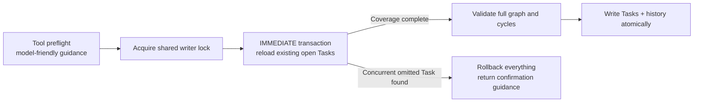
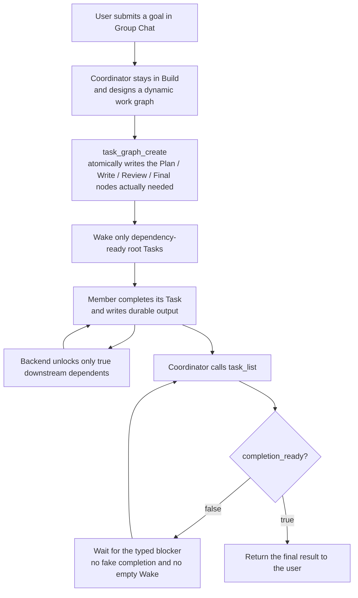

# Agent Org “Modern Family” Five-Batch Recovery Architecture Audit

- Date: 2026-07-13
- Branch: `fix/issue-272-agent-org-recovery-invariants`
- Scope: The real-run failures in which the Root Coordinator entered Plan incorrectly, Task chains were created incompletely, messages bypassed formal Tasks, finality was declared while the Reviewer was still Running, and Pause or empty filters produced visible failures.
- Conclusion: All five batches are wired into production tool assembly and durable persistence paths. No P0/P1 issue in this scope remains. The audit also found and fixed a narrow race in which another Task could be inserted between graph preflight and graph persistence.

## Acceptance criteria and result

| User-visible failure                                                                             | Required behavior                                                                                                                                          | Result |
| ------------------------------------------------------------------------------------------------ | ---------------------------------------------------------------------------------------------------------------------------------------------------------- | ------ |
| Group Chat asked the user to switch the Coordinator to Plan mode.                                | The Root Coordinator of an active Agent Org does not expose the generic mode-switch tool. Planning is carried by a member Task with `execution_mode=plan`. | Pass   |
| Plan, writing, and Review cards did not correspond.                                              | The Coordinator can atomically create one complete, dynamic dependency graph with `task_graph_create`; any failure writes zero Tasks.                      | Pass   |
| After Review Task creation failed, the Coordinator still told the Reviewer to work through chat. | A formal plain message to a worker must reference a real, incomplete, dependency-ready Task that the recipient is authorized to perform.                   | Pass   |
| Coordinator announced completion while Reviewer was still Running.                               | `task_list.run_summary.completion_ready` checks Task, Session, Inbox, Turn intent, Intervention, and Plan approval state together.                         | Pass   |
| `status=""` produced a red tool failure and Pause damaged unstarted members.                     | Empty status means no filter; `OrgPause` does not mark a lazy member with no live runtime as Failed.                                                       | Pass   |

## Ten-layer architecture audit

| Layer                           | Line / element                                           | Verdict | Reason                                                                                                                                                                         | Suggested change                                      |
| ------------------------------- | -------------------------------------------------------- | ------- | ------------------------------------------------------------------------------------------------------------------------------------------------------------------------------ | ----------------------------------------------------- |
| 1. Compilation and verification | Rust, TypeScript, and Task suites                        | keep    | Rust and frontend checks pass, and focused Task, Store, and message suites cover the behavior.                                                                                 | None.                                                 |
| 2. Live code / duplication      | `task_dependency_closure`                                | fixed   | Single-Task, graph, and transaction-time checks previously could define dependency coverage differently; they now share one closure algorithm.                                 | None.                                                 |
| 2. Live code / duplication      | `task_graph_create` production/debug/test wiring         | keep    | The tool is connected to builtin metadata, policy, production overlay, debug runtime, test API, Rust/TS tool names, extractor routing, and frontend event rendering.           | None.                                                 |
| 3. Naming                       | `TaskGraphCreate`, `related_task_id`, `completion_ready` | keep    | The names mean atomic graph creation, the Task associated with a message, and a multi-dimensional completion certificate.                                                      | None.                                                 |
| 4. Semantic dimensions          | Run / Session / Task / Delivery / Approval               | keep    | Whether a Run may continue, a member is working, a Task is complete, a message was delivered, and a Plan was approved are persisted separately.                                | None.                                                 |
| 5. FSM completeness             | `session_is_quiescent_for_completed_run`                 | keep    | Every `SessionStatus` is explicit. Running, Pending, Waiting, and Paused all block a completion certificate.                                                                   | Require exhaustive handling for future variants.      |
| 5. FSM completeness             | Task dispatch                                            | keep    | Only dependency-ready root Tasks receive assignment. Downstream work unlocks from durable completion.                                                                          | None.                                                 |
| 6. Cross-domain boundary        | Root Plan vs member Plan Task                            | fixed   | Generic Root mode switching is not part of active Agent Org orchestration. Explicit Plan mode for an ordinary single-agent Root Session remains supported.                     | None.                                                 |
| 6. Cross-domain boundary        | Chat routing vs Task authority                           | fixed   | Hierarchy Mode controls who may communicate. Task authority controls who may assign or mutate work. Communication never bypasses Task ownership.                               | None.                                                 |
| 7. New-developer clarity        | Coordinator prompt and tool descriptions                 | fixed   | Contracts explain atomic graphs, dynamic dependencies, Task-bound messages, Plan Tasks, and completion certificates. Non-code work is not forced into a GitHub issue workflow. | Retain string-contract tests for prompt changes.      |
| 8. Wire / schema                | Rust and TS `TASK_GRAPH_CREATE`                          | keep    | Tool name, provider schema, extraction, and frontend routing are aligned; schema portability is tested.                                                                        | None.                                                 |
| 8. Wire / schema                | Recoverable guidance                                     | keep    | Missing dependencies, missing related Task, and empty dependency policies return structured guidance instead of a visible red failure card.                                    | A dedicated guidance UI card may be considered later. |
| 9. Initialization parity        | Production overlay, debug runtime, test API              | keep    | Only the Coordinator receives the cross-member graph tool, and every debug/test entry point calls the production implementation.                                               | None.                                                 |
| 10. Resolver symmetry           | Member owner, eligibility, recipient                     | keep    | Owner, eligible member, and message recipient resolve through stable Run-roster `member_id`, never display-name guesses.                                                       | None.                                                 |

## Additional race fixed during audit

The tool originally read open Tasks before entering the persistence transaction. Another execution could insert a Task between preflight and graph insertion. The graph itself remained internally valid but could omit the newly opened work.

The Store now repeats the dependency-coverage check inside the same SQLite IMMEDIATE transaction that persists the graph:

A regression proves that when transaction-time validation finds an omission, the database retains only the original Task and no partial new graph.

## Final flow

## Intentional boundaries

1. The dependency chain is not hardcoded as Planner → Implementer → Reviewer → Tester. The Coordinator designs it per request. Independent Tasks may run in parallel; Tasks that consume upstream results must declare dependencies.
2. `HierarchyMode::Soft` remains. It controls communication reachability, not cross-member Task authority.
3. `completion_ready` is a durable completion certificate for the Coordinator. It is not another model and does not replace the Coordinator's final reasoning or response.
4. This report covers the Agent Org paths named above and does not endorse unrelated Git, Key Vault, Provider, or other worktree changes.

## Final verdict

These five batches change orchestration from “the model guesses the next step from chat and a partial board” to “the Coordinator designs a graph, the database enforces Tasks and dependencies, messages add context without bypassing authority, and completion requires a multi-dimensional certificate.” The three shortcuts exposed by the Modern Family run—Root Plan switching, work assigned outside a Task, and finality before Reviewer completion—are blocked at code boundaries rather than discouraged only by prompts.
