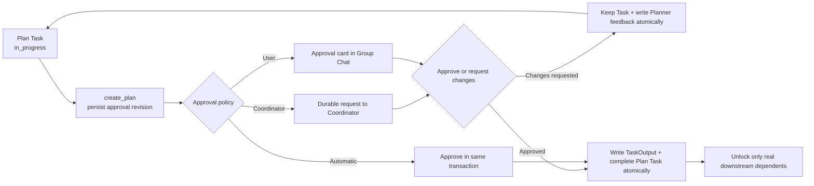

# Agent Org Planner, Approval, and Wake Hardening — Architecture Audit

- Date: 2026-07-13
- Scope: The #272 recovery path and the five Planner Task, dynamic dependency, approval, Wake, and Group Chat projection batches.
- Conclusion: No P0/P1 architecture issue in this scope remains. Three “half-written database state” risks found during the audit now commit in a single transaction. Unrelated Git, Key Vault, Provider, and other worktree changes are outside this report.

## Acceptance results

| Check                         | Result                            | Notes                                                                      |
| ----------------------------- | --------------------------------- | -------------------------------------------------------------------------- |
| Rust compilation              | Pass                              | `cargo check -p org2`                                                      |
| TypeScript                    | Pass                              | `pnpm typecheck`                                                           |
| Agent Org approval tests      | Pass                              | Approval, changes requested, edit, pause, automatic approval, and rollback |
| `create_plan` tests           | Pass                              | Empty title/content, wrong Session, and dynamic guidance                   |
| Real Agent Org desktop E2E    | Pass                              | Task-driven Plan → approval → downstream unlock                            |
| Final full `agent_core` suite | 3,155 / 3,155                     | Isolated persistence and loopback-enabled environment                      |
| Clippy                        | Existing develop baseline remains | The warning introduced on a new review line was fixed.                     |
| Diff whitespace               | Pass                              | `git diff --check`                                                         |

## Ten-layer audit

| Layer                        | Line / element                                | Verdict          | Reason                                                                                                                                                                                        | Suggested change                                                                |
| ---------------------------- | --------------------------------------------- | ---------------- | --------------------------------------------------------------------------------------------------------------------------------------------------------------------------------------------- | ------------------------------------------------------------------------------- |
| 1. Compilation               | `src-tauri` / frontend                        | keep with reason | Rust and TypeScript compile; strict workspace Clippy remains affected by existing develop findings.                                                                                           | Address baseline lint in a separate cleanup PR.                                 |
| 2. Dead code and duplication | Plan approval transaction helpers             | fixed            | Coordinator request, automatic approval, and changes-requested feedback previously risked independent partial writes; they now share transactional helpers.                                   | None.                                                                           |
| 2. Dead code and duplication | Inbox `insert_in_tx`                          | fixed            | Approval and Inbox persistence participate in the same caller-owned transaction.                                                                                                              | None.                                                                           |
| 2. Dead code and duplication | Legacy `ExecModeSetRequest` reader            | keep with reason | Production no longer creates this message, but historical database rows must remain readable. This is compatibility, not a second scheduler.                                                  | Remove only when historical local database compatibility is explicitly dropped. |
| 3. Naming                    | `TaskExecutionMode`                           | keep             | The type says whether this Task's next turn runs in Plan or Build; it is not the generic mode of the whole Session.                                                                           | None.                                                                           |
| 3. Naming                    | `AgentOrgPlanInboxDelivery`                   | keep             | The name explicitly binds approval state to a durable delivery instead of using a vague Result or Context type.                                                                               | None.                                                                           |
| 4. Semantic dimensions       | Run / Session / Task / Approval / Delivery    | keep             | Whether work may continue, a Session is executing, a Task is done, a Plan is approved, and Inbox/Wake delivered input remain separate.                                                        | New UI should continue to name the dimension it displays.                       |
| 4. Semantic dimensions       | `AwaitingPlanApproval`                        | keep             | This UI phase is projected from durable approval state. It neither pauses the Run nor pretends the Plan Task is Completed.                                                                    | None.                                                                           |
| 5. Default branches          | `PlanApprovalPolicy`                          | keep             | Coordinator, User, and Automatic policies are exhaustively matched; there is no dangerous catch-all automatic approval.                                                                       | Require exhaustive handling for new policies.                                   |
| 5. Default branches          | Historical missing `execution_mode`           | keep with reason | Old Task/Inbox rows default to Build for compatibility; new creation requires an explicit value.                                                                                              | Keep historical reads tolerant and new writes strict.                           |
| 6. Cross-domain leakage      | Agent Org approval vs top-level Plan approval | keep             | Single-agent Build/Skip remains separate. Agent Org approval is scoped to Run, member, and source Task.                                                                                       | None.                                                                           |
| 7. New-developer clarity     | `create_plan` description                     | fixed            | The contract requires an owned in-progress Plan Task, stops after submission, and makes approval responsible for completing the Task rather than producing a fake Build turn.                 | None.                                                                           |
| 7. New-developer clarity     | Coordinator prompt                            | fixed            | The prompt explains dynamic dependencies, dispatch policy, execution mode, and approval outcomes together.                                                                                    | Retain string-contract tests.                                                   |
| 8. Wire / serialization      | `TaskAssigned.execution_mode`                 | keep             | A flat typed field controls the real assignment; historical omission defaults to Build.                                                                                                       | None.                                                                           |
| 8. Wire / serialization      | `task_create` schema                          | fixed            | `dispatch_policy` and `execution_mode` are required. Missing dependency confirmation returns structured guidance instead of a visible tool failure.                                           | None.                                                                           |
| 8. Wire / serialization      | Plan content boundary                         | keep             | Durable approval retains complete Markdown/artifact identity while text inserted into Inbox or TaskOutput is bounded.                                                                         | Payload telemetry may be added later but is not a correctness prerequisite.     |
| 9. Initialization parity     | Setup / test environment / debug fixtures     | fixed            | Approval schema and `plan_approval_policy` initialization are consistent across production, tests, and E2E.                                                                                   | Compile every desktop/E2E target when adding OrgDefinition fields.              |
| 9. Initialization parity     | Global `ORGII_HOME` guard                     | fixed            | Parallel tests could previously move HOME while lifecycle schema initialization ran, causing false “no such table” failures. Environment-mutating tests now use the canonical workspace lock. | Require `test_helpers::test_env` for new environment-mutating tests.            |
| 10. Resolver symmetry        | Owner / member / Task / execution mode        | keep             | `create_plan` finds an owned in-progress Plan Task through runtime member identity; ownerless work neither influences mode prepeek nor self-claims.                                           | None.                                                                           |
| 10. Resolver symmetry        | Explicit assignment                           | fixed            | Watchdog, resume, Inbox drain, and Task side effects all interpret ownerless as awaiting Coordinator assignment. Only a real `TaskAssigned` selects a worker's next mode.                     | None.                                                                           |

## Transaction findings and fixes

| Class                        | Previous risk                                                                                     | Current behavior                                                                                               |
| ---------------------------- | ------------------------------------------------------------------------------------------------- | -------------------------------------------------------------------------------------------------------------- |
| Request Plan changes         | Approval became `changes_requested`, then feedback delivery failed and Planner never received it. | Approval state and feedback Inbox row commit in one SQLite transaction; either both succeed or both roll back. |
| Coordinator approval request | Pending approval could exist without a durable request to Coordinator.                            | Approval revision and request Inbox row commit together.                                                       |
| Automatic approval           | Approval could be Approved while the source Plan Task remained In progress.                       | Approval creation, approval decision, TaskOutput, and Plan Task completion commit together.                    |

Tests deliberately remove the Inbox table to force failure and prove that no half-successful state remains.

## State and event boundary

## Wake audit conclusion

- #272 recovery remains active for unread Inbox, newly ready owned work, approval feedback, and budgeted real recovery input.
- Ownerless Tasks only notify the Coordinator for explicit assignment.
- “An unfinished Task exists” alone is not a Wake reason.
- Awaiting user approval is an intentional quiet state: it does not call the model, flash, or consume recovery budget.
- A real unread durable row still wakes its recipient. Wake remains the doorbell; the Inbox row remains truth.
- Concurrent Wake requests for one member coalesce under a deterministic key, and Running is written only when the scheduler starts the turn.

## Intentional boundaries

1. SQLite and a Markdown artifact cannot form one cross-filesystem transaction. The database retains canonical `plan_content`; managed artifact installation is staged and recoverable after a crash.
2. Historical `ExecModeSetRequest` remains read-only compatibility. New code has no producer.
3. This report audits Agent Org only and does not modify or endorse unrelated user changes in the worktree.

## Final verdict

Planning changed from “Coordinator sends an ad hoc message telling a member to switch mode” to “the Task carries an execution contract.” Planner mode, approval wait, feedback, approved completion, and dependency release all have durable state and transactional boundaries. Wake delivers real events into a turn; it no longer guesses that work exists. No blocking finding in this scope remains.
