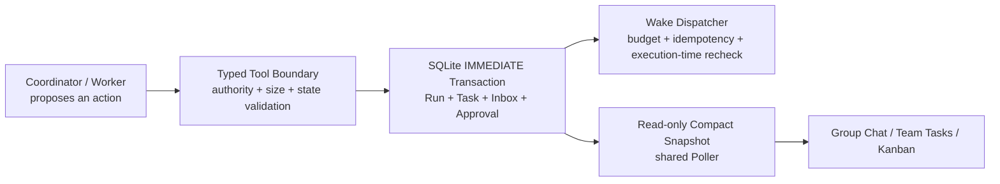

# Agent Org PR #373 Review Safety — Architecture Audit

- Date: 2026-07-16
- Scope: All safety fixes identified by the two PR #373 review rounds, excluding the full Revision Event architecture
- Conclusion: The correctness, concurrency, payload, polling, recovery, deletion-lifecycle, and test-fidelity issues found in this review are addressed on production paths. The full Revision Event architecture remains a separate follow-up PR by design.

## Executive conclusion

This work does not change the product responsibilities of Agent Org, nor does it turn the Analyzer, Poller, or Snapshot into a new decision-making “brain.” Coordinators and workers still perform reasoning. The Rust backend constrains their actions into recoverable, concurrent, auditable state transitions, while the frontend reads and displays facts already persisted by the backend.

The review hardened this production chain:

## Acceptance checklist

| Acceptance item                               | Result              | Evidence                                                                                                                                                        |
| --------------------------------------------- | ------------------- | --------------------------------------------------------------------------------------------------------------------------------------------------------------- |
| Rust / TypeScript compilation                 | Pass                | `cargo check -p agent_core --all-targets`, `cargo check -p e2e-test`, `cargo check -p org2 --lib`, and `pnpm typecheck`                                         |
| New Clippy warnings introduced by this change | 0                   | The one warning on a newly added line was fixed. Remaining strict-Clippy findings are existing develop baseline; see “Known develop and environment baseline.”  |
| Frontend lint                                 | Pass                | `pnpm lint`                                                                                                                                                     |
| Full frontend unit suite                      | Pass                | 450 files, 5,181 tests                                                                                                                                          |
| Focused Agent Org Rust suites                 | Pass                | Watchdog, Run, Plan, Task, Inbox, Lifecycle, Commands, and Send suites                                                                                          |
| Full `agent_core` suite                       | Pass                | 3,155 / 3,155 with loopback access and an isolated persistence directory                                                                                        |
| Full `session_persistence` suite              | Pass                | 34 / 34, single-threaded outside the restricted sandbox                                                                                                         |
| High-frequency Run View has no hidden writes  | Pass                | Snapshot uses a read-only deferred transaction. Historical Plan artifact reconciliation is an explicit, low-frequency operation limited to a managed directory. |
| Large payloads are bounded                    | Pass                | Task summaries, Inbox drain batches, Plan detail, pagination, identifiers, and per-Run task counts all have explicit limits.                                    |
| Runtime HTTP E2E                              | Pass                | 47 / 47 scenarios against a real isolated Debug App                                                                                                             |
| Rendered UI E2E                               | Pass                | 19 / 19 WebDriver scenarios across Group Chat, pause/resume, recovery, and settings                                                                             |
| Production return-to-work path                | Pass                | Real scheduler → processor → deterministic provider → Inbox drain path                                                                                          |
| Revision Event architecture                   | Explicitly excluded | See [AgentOrgRevisionEventPlan.md](./AgentOrgRevisionEventPlan.md).                                                                                             |

## Ten-layer architecture audit

### Layer 1 — Compilation and static correctness

- All three relevant Rust crates compile.
- TypeScript typecheck and ESLint pass.
- Strict Clippy found no warning on a line introduced by this review after the final cleanup. Remaining warnings are reproducible on existing develop code.
- Changed-scope rustfmt and `git diff --check` pass.

Conclusion: no `allow` attribute was added to hide a new error, and unrelated modules were not changed merely to make a gate look green.

### Layer 2 — Dead code and duplicate paths

This review traced production entry points instead of relying on reference counts:

| Business entry point                          | Unified production path                                                        | Duplicate behavior removed or avoided                                                             |
| --------------------------------------------- | ------------------------------------------------------------------------------ | ------------------------------------------------------------------------------------------------- |
| Watchdog / resume / task tool requests a Wake | recovery disposition → shared budget → dispatcher → scheduler                  | Each entry point making its own decision, enqueueing directly, and consuming budget independently |
| Root / Member / Kanban reads a Run            | one per-Run shared poller → compact snapshot → caller projection               | Every session polling and copying the full Run independently                                      |
| Single Task / Task Graph creation             | typed validation → one transaction → one mutation outcome                      | Writing graph nodes one by one and leaving a partial graph after failure                          |
| Dependency release after Task completion      | transaction outcome → exact transactional outbox / Wake                        | Re-reading state outside the transaction and duplicating `TaskAssigned` under concurrency         |
| Plan artifact persistence                     | stage temporary file outside lock → short durable transaction → atomic install | Slow file I/O while holding the global writer lock and repeated connection setup                  |
| Plan artifact ownership                       | source session → managed Plan root → exact `.plan.md` child                    | Overwriting or deleting an external Markdown file or symlink referenced by historical bad data    |
| Member intervention clear                     | clear + capture unread high-water mark in one IMMEDIATE transaction            | Reading clear state and delivery boundary separately, creating a race                             |
| Turn intent ownership                         | persist nullable `org_run_id` on every intent                                  | Guessing Run ownership from the Session tree and damaging nested Runs or missing Resume Wakes     |

Conclusion: Analyzer, Executor, Snapshot, Progress, and Finality types are wired into real production entry points. They are not abstractions kept alive only by tests.

### Layer 3 — Naming consistency

| Name                              | Exact meaning                                                                                                    |
| --------------------------------- | ---------------------------------------------------------------------------------------------------------------- |
| `AgentOrgRun`                     | The durable business container for one team execution; it is not a model turn.                                   |
| `RunView` / Snapshot              | A compact, read-only projection of one Run at a point in time; it is not another source of truth.                |
| `work_revision`                   | A monotonic proof that the Coordinator observed the latest work state; it is not a full event-stream revision.   |
| `RecoveryAnalyzer`                | A pure analysis step that reads a snapshot and proposes actions; it does not call a model or write the database. |
| `RecoveryExecutor`                | Executes proposed recovery actions after revalidating current state; it does not reason about task content.      |
| `Wake`                            | Requests a scheduler opportunity for a Session; it does not mean the turn is already Running.                    |
| `TaskSummary`                     | A bounded list/poll projection; full content is loaded through `task_get`.                                       |
| `session_turn_intents.org_run_id` | Explicit ownership of a turn intent by an Agent Org Run; it is not inferred from Session ancestry.               |

Comments, wire fields, and TypeScript types were checked so that `running` does not ambiguously mean Run state, Session state, Task state, and UI activity.

### Layer 4 — Semantic overloading

The four state dimensions remain independent sources of truth:

| Dimension      | Source of truth                | Invalid inference                                     |
| -------------- | ------------------------------ | ----------------------------------------------------- |
| Run state      | `agent_org_runs.status`        | An Idle Session does not mean the Run is complete.    |
| Session state  | `agent_sessions.status`        | A Running Run does not mean every worker is healthy.  |
| Task state     | `agent_org_tasks.status/owner` | A Pending Task does not mean any worker may claim it. |
| Delivery state | Inbox row + scheduler intent   | Unread Inbox data does not prove a Wake was accepted. |

Run finality is now evaluated from typed facts rather than treating one status as a substitute for the entire collaboration state.

### Layer 5 — Default-branch audit

- Recovery explicitly classifies `SessionStatus` as Active, Wakeable, Backoff, Exhausted, Paused, Pending materialization, Missing, or Archived.
- Paused, pending grace, Missing, Archived, and invalid timestamps have explicit behavior instead of falling into `_ => false`.
- Before a Wake begins execution, Running, Paused, terminal, missing, and database-error states are handled separately. Database errors fail closed.
- The frontend handles null, stale responses, and unknown or failed payloads separately; parse failure never defaults to “clear the board.”
- A Run View generation created by an abandoned React render and never subscribed is retired after 30 seconds. Late IPC responses cannot restore it as poll owner.

Conclusion: new states and malformed input cannot silently become normal Idle or Running behavior.

### Layer 6 — Cross-domain leakage

- Coordinator and worker reasoning remains in the model layer. Recovery Analyzer, Recovery Executor, and Poller contain no business-reasoning prompts.
- The frontend does not directly mutate Task, Run, or Inbox truth. It invokes typed commands and projects durable outcomes.
- Incomplete CLI Agent Org runtime support still fails loudly instead of borrowing the Rust-member transport.
- A Plan file is an artifact of durable approval content. The SQLite approval row remains lifecycle truth.

Conclusion: UI, model, scheduler, and persistence layers retain separate responsibilities.

### Layer 7 — New-developer comprehension

Important rules are now expressed through types, structured outcomes, and comments:

- `WakeRequestOutcome` distinguishes Enqueued, Coalesced, DeferredPaused, DeferredBackoff, NoWork, RunTerminal, SessionUnavailable, and Failed.
- `TaskMutationOutcome` carries transaction-local previous/current state and meaningful transitions, so side effects do not guess after the transaction.
- Finality follows facts → assessment → decision and returns typed blockers explaining why completion is unsafe.
- Task tools return structured guidance for recoverable misuse instead of leaking red SQL or validation failures into the model trajectory.

Conclusion: a new developer can distinguish an action that occurred from a request, deferral, or no-op without knowing the history of the bug.

### Layer 8 — Wire protocol and payloads

| Channel          | Current boundary                                                                                                          |
| ---------------- | ------------------------------------------------------------------------------------------------------------------------- |
| `task_list`      | 50 rows by default, 200 maximum; descriptions are at most 512 Unicode characters and expose `description_truncated`.      |
| `task_get`       | Loads one Task with full detail on demand.                                                                                |
| Run View         | At most 200 Task summaries; exact totals and counts are returned separately and are never inferred from window length.    |
| Task persistence | At most 200 Tasks per Run and 32 nodes per graph; existing + incoming counts are checked inside the same transaction.     |
| Task identifier  | At most 1,000 Unicode characters / 4,000 UTF-8 bytes across Task, dependency, cursor, and every Inbox task-id position.   |
| Inbox            | Message, array, and JSON fields have character and byte bounds; one drain is capped at 128 rows / 1 MiB.                  |
| Plan             | Snapshot carries only a summary; detail is loaded and cached by `run + approval + revision`.                              |
| Tool outcome     | New events prefer typed outcomes. Legacy events require durable success evidence and cannot succeed from arguments alone. |

High-frequency polling no longer copies full TaskOutput, Plan, or Inbox payloads. Full information remains available through bounded, on-demand APIs.

### Layer 9 — Initialization parity

| Entry point              | Run schema              | Task / Inbox / Recovery  | Plan approval             | Session runtime                     | Production drain                 |
| ------------------------ | ----------------------- | ------------------------ | ------------------------- | ----------------------------------- | -------------------------------- |
| Tauri production         | Yes                     | Yes                      | Yes                       | Yes                                 | Yes                              |
| App restart              | Yes                     | Yes, with reconciliation | Yes, with artifact repair | stale Running → failure disposition | Yes                              |
| Rust unit sandbox        | Yes, shared initializer | Yes, shared initializer  | Yes                       | Complete test schema                | Production Store                 |
| HTTP E2E production path | Yes                     | Yes                      | Yes                       | Real Session registration           | scheduler → processor → provider |

`session_turn_intents.org_run_id` is included in both fresh DDL and historical database initialization. It is nullable for non-Agent-Org and Wingman intents, while root, member, Wake, steering, and normal follow-up Agent Org turns persist explicit Run ownership. Historical NULL rows may be backfilled safely; an existing, different non-NULL owner fails closed and cannot be silently reassigned.

Fixtures that previously omitted tables or Run rows now use the canonical initializer and Store. Production invariants were not weakened to accommodate tests.

### Layer 10 — Resolver symmetry

| Resolver            | Primary condition                                        | Fallback / recheck                                                                                               | Symmetry result                                                                      |
| ------------------- | -------------------------------------------------------- | ---------------------------------------------------------------------------------------------------------------- | ------------------------------------------------------------------------------------ |
| Wake target         | Run + member + session + real work                       | Re-read Run before execution; classify terminal, paused, and missing separately.                                 | Every entry point uses the same dispatcher and budget.                               |
| Plan detail         | run id + approval id + revision id                       | Validate Run ownership before artifact repair.                                                                   | No cross-Run file read or mutation.                                                  |
| Run View poll owner | live Session + known Run id                              | On owner error/null/hang, hand off to another live Session in the same Run; unknown-Run bootstrap has a timeout. | Root and member use the same source chain.                                           |
| Task availability   | pending + ownerless + ready + eligible + member not busy | Coordinator assignment / recovery only; arbitrary workers no longer self-claim.                                  | Watchdog, resume, and tools use the same definition.                                 |
| Turn intent owner   | explicit `org_run_id`                                    | Explicit/runtime mismatch fails closed; non-Agent-Org intent remains NULL.                                       | Deletion, finality, and nested Runs no longer infer ownership from Session ancestry. |

Conclusion: related fields do not mix database truth with memory-only truth, and no production Wake entry point bypasses the shared recovery budget.

## Mapping the two review rounds to fixes

| Finding category                           | Original risk                                                                                                                     | Final fix                                                                                                                                                   |
| ------------------------------------------ | --------------------------------------------------------------------------------------------------------------------------------- | ----------------------------------------------------------------------------------------------------------------------------------------------------------- |
| Read View side effects                     | Opening the UI could repair or write state and block the global writer.                                                           | Read-only deferred Snapshot; repair moved to explicit write paths.                                                                                          |
| Duplicate polling by multiple Sessions     | Root and every member repeatedly fetched the full Run.                                                                            | One shared poller per Run with caller-specific `currentMemberId` projection.                                                                                |
| Failed poll owner                          | A null/error/hung owner could clear the board or block another Run.                                                               | Sequence guard, same-Run failover, null ghost cleanup, and one-second bootstrap timeout.                                                                    |
| Unstable Snapshot identity                 | `useSyncExternalStore` could repeatedly render or loop.                                                                           | Create a stable entry on the first read and preserve reference identity until an actual publish.                                                            |
| Oversized Task / Inbox / Plan payloads     | High-frequency polling copied long content, increasing memory and token pressure.                                                 | Summary by default, detail APIs, pagination, and independent row/byte limits.                                                                               |
| Unbounded Task count                       | A Run could accumulate unlimited Tasks.                                                                                           | 200 per Run, 32 per graph, checked transactionally under concurrency.                                                                                       |
| Plan file write under lock                 | Slow file I/O blocked the Agent Org writer.                                                                                       | Stage outside the lock, perform a short transaction, then atomically install after commit.                                                                  |
| Cross-Run Plan detail                      | A wrong id could repair an artifact belonging to another Run.                                                                     | Validate the exact `run + approval + revision` relationship before read or repair.                                                                          |
| Plan path escape                           | Historical or corrupt paths could reference arbitrary Markdown files, symlinks, or another workspace.                             | Permit only a direct `.plan.md` child under the source Session's managed root; external historical paths are warning-only and are never written or deleted. |
| Wake budget bypass                         | Some sources could enqueue directly while only Watchdog respected backoff.                                                        | Every production Wake source checks the durable budget; only Enqueued consumes an attempt.                                                                  |
| Intervention-clear race                    | A new message between clear and boundary reads could be misclassified.                                                            | Clear and capture unread high-water in one IMMEDIATE transaction.                                                                                           |
| `block_in_place` on current-thread Tokio   | Lifecycle code could panic on a current-thread runtime.                                                                           | Shared blocking-section helper selects safe behavior for the active runtime flavor.                                                                         |
| Finality guessed from status               | Coordinator could finish without seeing the latest Task state.                                                                    | Durable `work_revision`, observed revision, terminal turn, and explicit completion request.                                                                 |
| Reconcile/create race                      | A terminal Run could end up with a newly created open Task.                                                                       | Same writer lock and IMMEDIATE transaction; only serializable outcomes are allowed.                                                                         |
| Incomplete deletion lifecycle              | Deleting a worker could delete a Run, or deleting a root could retain Inbox/Plan history.                                         | Worker deletion removes only the Session; root deletion removes the owned Run and cascades owned history by foreign key.                                    |
| Session tree mistaken for Run boundary     | Outer-Run deletion/finality could damage a nested Run, while Resume Wake intents could be missed.                                 | Persist `org_run_id` on intents and query deletion/in-flight state by exact Run.                                                                            |
| Abandoned React render leak                | `getSnapshot` without subscribe retained a bounded preview forever and late IPC could revive poll ownership.                      | Retire zero-listener generations after 30 seconds and reject responses for retired or replaced generations.                                                 |
| Task identifier beyond delivery boundary   | A Task could persist but fail to produce `TaskAssigned`, leaving unreachable work.                                                | Store, tool, and Inbox independently validate Task, dependency, and cursor IDs before persistence.                                                          |
| False test path                            | Debug drain or partial SQL fixtures produced false positives and false negatives.                                                 | Canonical Store fixtures plus real scheduler/provider/Inbox-drain paths.                                                                                    |
| Undeliverable unread Inbox blocks finality | Missing, Archived, Paused, CLI, or expired-pending recipients could never read a row, while unread state blocked the Run forever. | Immutable roster + canonical member identity produces typed repair; the source remains unread and is never guessed or falsely acknowledged.                 |
| Analyzer/Executor TOCTOU                   | Member, Task, or Run state could change after analysis and produce stale Assignment, Continuation, or repair actions.             | Revalidate Run, Session, transport, agent identity, Task graph, and typed fingerprint in the final writer transaction.                                      |
| Coordinator notice budget race             | Notice insert, unavailable diagnostic, and attempt accounting were separate writes.                                               | Budget gate, notice/diagnostic, and attempt update commit in one IMMEDIATE transaction.                                                                     |
| Legacy shared AgentDefinition double count | A historical Inbox row with only `agent_id` could be attributed to multiple members.                                              | Member cards use canonical `member_id`; legacy rows remain visible only in Run-level history.                                                               |
| Old unread message treated as empty UI     | Exact unread state outside the most recent 200 activities could show a member as `No tasks` and disable navigation.               | Both member switchers share a pure predicate that checks recent activity and exact unread total.                                                            |

## Core invariants

1. Only a Running Run may mutate Tasks; Paused and terminal Runs reject writes.
2. Ownerless means “currently unassigned,” not “any worker may claim this Task.”
3. An `in_progress` Task must have a valid owner, and a normal worker may change only its own work state.
4. A Wake counts as an attempt only after scheduler acceptance; coalesced and rejected requests consume no attempt.
5. A queued Wake does not mean the Session is Running; Running is persisted only when the turn actually starts.
6. A Paused Run does not drain Inbox or call the provider; a terminal Run is never revived.
7. Without a real message, unlocked Task, approval response, or explicit work item, Wake returns no-op and does not call the model.
8. Every Task mutation and its side-effect outbox share one transaction outcome.
9. Completed requires proof that the Coordinator observed the latest work revision and that no finality blocker remains.
10. Historical Inbox rows, Plan revisions, and future Events live as long as the Run by default and cascade only on explicit Run deletion.
11. Every Agent Org turn intent carries explicit `org_run_id`; deletion and finality do not infer a Run from Session ancestry.
12. A Plan artifact must be under the source Session's managed directory; Agent Org never overwrites or deletes an external path or symlink.
13. Task identifiers independently satisfy the same character and byte limits in the Store, tool boundary, and every Inbox task-id position.
14. A retired frontend Run View generation never accepts late responses or regains poll ownership.

## Performance and resource boundaries

- Running Runs are selected directly with `WHERE status='running'` instead of fetching an arbitrary 500 rows and filtering in memory.
- Unread checks use `SELECT EXISTS`.
- Watchdog interval uses missed-tick skip, so a process stall does not replay a burst of historical ticks.
- Task readiness uses sets and a single scan instead of Task × member × full-list queries.
- Watchdog and high-frequency Run View unread statistics scan only the `read_at IS NULL` partial index, not all read history.
- Recovery `TaskAssigned` actions for one member are revalidated in one writer transaction against Session state, the Task graph, and existing delivery.
- One Run shares one UI Snapshot. Full Plan and Task bodies are fetched on demand.
- Lists enforce count/cursor bounds and independent byte/character bounds.

## Test results

### Rust suites

| Suite                      | Result                                                                                                                                        |
| -------------------------- | --------------------------------------------------------------------------------------------------------------------------------------------- |
| Agent Org Watchdog         | Pass, including budget, backoff, paused/terminal, invalid timestamp, undeliverable recipient, and stale-plan matrices                         |
| Agent Org Run / finality   | Pass, including work revision, concurrent mutation, nested Run, explicit intent owner, empty board, and recoverable Failed/Cancelled sessions |
| Plan approvals             | Pass, including external files, symlinks, managed-path deletion, paused restart, atomic notification, and historical compatibility            |
| Task Store / tools         | Pass, including graph atomicity, pagination, `task_get`, Run cap, identifier boundary, legacy `blocks`, and worker authority                  |
| Inbox production drain     | Pass, including row/byte bounds, task-id message matrix, idempotent materialization, delivery resolution, and the real consumption path       |
| Member idle / Lifecycle    | Pass, including failure disposition, pause/resume, and restart recovery                                                                       |
| Agent Org Tauri commands   | Pass, including pure Snapshot, exact counts, Plan detail ownership, and execution mode wire projection                                        |
| Send / Wake / turn intents | Pass, including coalescing, budget reservation/refund, execution-time Run checks, and explicit `org_run_id`                                   |
| Full `agent_core`          | 3,155 / 3,155 pass in an isolated environment                                                                                                 |
| Full `session_persistence` | 34 / 34 pass, single-threaded outside the restricted sandbox                                                                                  |

### Frontend

- Full Vitest: 450 files, 5,181 / 5,181 tests.
- Typecheck: pass.
- ESLint: pass.
- Independent UI audit: [AgentOrgReviewSafetyAudit.md](../frontend-ui-audit-2026-07-16/AgentOrgReviewSafetyAudit.md).

### Real isolated Debug App runtime E2E

The Agent Org HTTP suite passed 47 / 47 scenarios against a real Debug App with isolated ports and an isolated `ORGII_HOME`.

The production return-to-work scenario proved:

- `TaskAssigned` begins unread;
- production return-to-work enqueues and completes a Wake;
- production Inbox drain materializes exactly one visible assignment input and acknowledges the source row only after success;
- the deterministic provider completes a real member turn;
- a second return-to-work with no new durable input returns no-op.

This is a real Rust/Tauri runtime path with a deterministic provider. It is not presented as a paid external-provider integration test.

### Rendered Debug App E2E

WebDriver tests passed 19 / 19 against rendered Debug App instances:

- Group Chat: 6 / 6, including real keyboard mention selection, 230+ durable history rows, and Plan approval.
- Pause / Resume: 8 / 8.
- Recovery: 2 / 2.
- Settings: 3 / 3.

Debug helpers only seed or inspect state; the user-visible behaviors under assertion use production application paths.

## Known develop and environment baseline

The following were deliberately not “fixed along the way” in #373:

1. Full workspace `cargo clippy --all-targets -- -D warnings` stops on existing findings in unchanged `integrations` and `orgtrack-core` code.
2. `cargo clippy -p agent_core --all-targets --no-deps -- -D warnings` reports existing warnings on lines not introduced by #373. The one warning on a newly added line was fixed, and a non-blocking Clippy run completed successfully.
3. `pnpm check:circular` reports two existing cycles in unchanged Org2Cloud and SessionCore paths; every file in those cycles has zero #373 diff.
4. Full workspace `cargo fmt --all -- --check` reports six unchanged develop files. Changed-scope formatting and `git diff --check` pass.
5. Tests that bind local ports require loopback access outside the restricted sandbox; final isolated runs were executed with that access.
6. Rendered and runtime E2E use deterministic fake-provider responses to make state-machine assertions reproducible. They do not make paid external model calls.

## Explicitly outside this PR

The full Revision Event architecture is not part of #373. The current `work_revision` answers only whether the Coordinator observed the latest work state; it is not an incremental UI event bus.

The follow-up design will atomically commit canonical mutations and small, sequentially numbered Events, then drive the frontend with Snapshot + replay + real-time notification. Design, phases, and acceptance gates are documented in [AgentOrgRevisionEventPlan.md](./AgentOrgRevisionEventPlan.md).

## Final verdict

This review does not change Agent Org's macro collaboration model. It converges the implementation from “multiple paths independently guess current state” to:

- the model proposes intent;
- a typed tool boundary validates it;
- one SQLite transaction writes canonical truth;
- recovery performs bounded actions from persisted facts only;
- the UI reads a small, consistent Snapshot;
- full content is loaded on demand;
- completion requires durable proof.

Within the approved #373 scope, no known P0/P1 correctness issue remains. Deferred work is limited to the explicitly separated Revision Event architecture and existing develop baseline findings.
