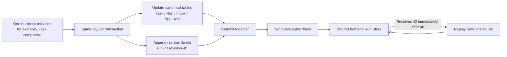
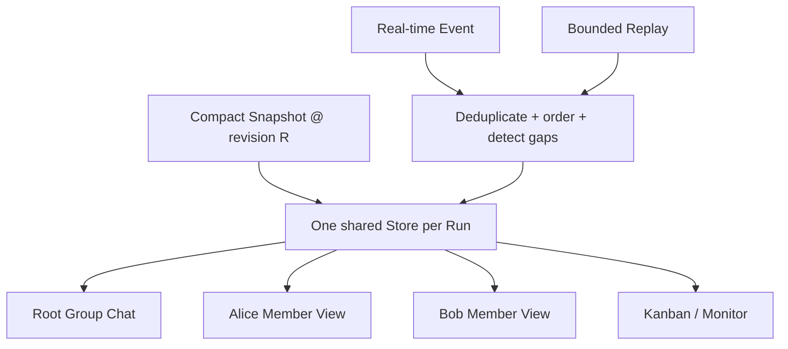

# Agent Org Revision Event Follow-up Architecture Plan

- Date: 2026-07-16
- Target branch: A separate follow-up PR, not part of #373
- Prerequisite: The #373 safety fixes must land and remain stable first.

## Executive summary

The current UI periodically reloads the latest compact Snapshot. The proposed Revision Event architecture changes synchronization as follows: **every durable state change appends one small, sequentially numbered Event in the same database transaction; the UI first loads a full Snapshot, then receives only Events after that Snapshot. If an Event is missed or the client disconnects, it replays the missing revision range and reloads a Snapshot only when continuous replay is unavailable.**

The Event log does not replace Run, Task, Session, Inbox, or Plan Approval tables. Those canonical business tables remain the source of truth. Events reliably tell consumers what changed.



## Why this is not part of #373

PR #373 already changes recovery, finality, Task transactions, Inbox behavior, approvals, and frontend projections. Revision Events affect every mutation path and the frontend synchronization model. Combining both changes would make review, regression attribution, and rollback substantially harder.

PR #373 establishes the required safety foundation:

- Reads use a consistent, read-only Snapshot and do not mutate the database merely because a view is open.
- Every view of the same Run shares one Poller instead of reloading the full state for each member.
- Large Task, Inbox, and Plan content is paginated or loaded on demand.
- Mutations and their corresponding durable notifications commit together.
- A minimal `work_revision` proves whether the Coordinator observed the latest Task state.

`work_revision` serves only as finality evidence. It is not a complete event-stream revision. A future Event revision covers every observable state change in a Run.

## Design principles

1. **Canonical tables are truth; Events are change notifications.** A mutation cannot write only an Event without updating the Task or other canonical state, and current state must not require replaying the entire Event history.
2. **State and Event commit atomically.** If either canonical mutation or Event insertion fails, the whole transaction rolls back.
3. **Each Run has an independent, strictly increasing sequence.** Revision 41 may only be followed by 42, allowing consumers to detect gaps, duplicates, and reordering.
4. **Events remain small.** They contain identifiers, state, and bounded summaries. Full Plans, TaskOutput, and long messages remain available through `task_get`, Plan detail, or artifact APIs.
5. **Delivery is at least once; consumers are idempotent.** Receiving the same revision twice is harmless. The system must not silently lose an Event in pursuit of exactly-once delivery.
6. **Disconnection is recoverable.** A client records its last applied revision and replays the gap after reconnecting.
7. **Backpressure requests resynchronization instead of unbounded buffering.** If the real-time queue overflows, consumers receive a resync signal.
8. **History lives as long as the Run by default.** No arbitrary 30- or 90-day TTL is introduced. Explicit Run deletion cascades its Events.

## Persistence model

The first version should add two tables:

```sql
CREATE TABLE agent_org_run_event_cursors (
    org_run_id TEXT PRIMARY KEY,
    current_revision INTEGER NOT NULL DEFAULT 0,
    updated_at TEXT NOT NULL,
    FOREIGN KEY(org_run_id) REFERENCES agent_org_runs(id) ON DELETE CASCADE
);

CREATE TABLE agent_org_run_events (
    org_run_id TEXT NOT NULL,
    revision INTEGER NOT NULL,
    event_id TEXT NOT NULL UNIQUE,
    kind TEXT NOT NULL,
    entity_type TEXT NOT NULL,
    entity_id TEXT,
    causation_id TEXT,
    payload_json TEXT NOT NULL,
    created_at TEXT NOT NULL,
    PRIMARY KEY(org_run_id, revision),
    FOREIGN KEY(org_run_id) REFERENCES agent_org_runs(id) ON DELETE CASCADE
);
```

Mutation flow:

1. Increment the Run's `current_revision` inside the active business transaction.
2. Append an Event using the new revision.
3. Update Task, Inbox, Approval, or other canonical business state.
4. Commit once.
5. Publish a lightweight in-process notification only after commit succeeds.

`causation_id` groups the Events produced by one cause, such as Task completion producing `task.updated`, dependency readiness, and `inbox.inserted`. Every Event still has its own unique `event_id`.

## Initial Event kinds

| Event                    | Purpose                                                   | Bounded payload                                         |
| ------------------------ | --------------------------------------------------------- | ------------------------------------------------------- |
| `run.status_changed`     | Paused, Running, Completed, and other Run transitions     | Previous status, new status, reason code                |
| `task.created`           | A Task appears                                            | Task id, owner, status, dependency ids                  |
| `task.updated`           | Owner, status, dependency, or other tracked fields change | Changed fields and a small summary                      |
| `task.deleted`           | A Task is deleted                                         | Task id and deletion reason                             |
| `inbox.inserted`         | A member has new durable input                            | Inbox id, recipient, and kind; never the full long body |
| `inbox.read`             | Input was successfully consumed                           | Inbox id and recipient                                  |
| `approval.changed`       | Plan waits, is approved, or receives requested changes    | Approval id, revision id, and status                    |
| `member.runtime_changed` | A worker starts, becomes Idle, or fails                   | Member id, Session id, and status                       |
| `run.resync_required`    | The real-time queue overflowed                            | Current highest revision                                |

Watchdog scans, polling ticks, duplicate Wake requests, and Coalesced Wake requests do not generate business Events. Only a durable state change produces an Event, preventing millions of meaningless records.

## Snapshot + Replay protocol

### Initial open

1. The frontend loads a compact Run Snapshot with `snapshotRevision = 40`.
2. It subscribes to live Events for that Run.
3. It requests Replay with `afterRevision=40`.
4. Replay and real-time delivery may overlap; the frontend deduplicates by `(runId, revision)`.
5. The shared Store then applies only revisions 41, 42, 43, and later.

### Gap detection

If the frontend has applied 40 but receives 42 first:

- do not apply 42 immediately;
- request Replay with `afterRevision=40`;
- apply 41 and 42 in order;
- if the service explicitly cannot provide continuous history, reload a Snapshot.

### Reconnection

The frontend retains the last applied revision in memory. When the window regains focus or the subscription reconnects, it replays the missing range instead of immediately reloading the entire Task board.

### Pagination and payload boundaries

- Every Replay page has both a row limit and a total-byte limit.
- Responses return `nextRevision`, `hasMore`, and `currentRevision`.
- Each Event enforces strict character, byte, and array-length limits.
- Large content is represented by a detail handle and is never copied into the Event.

## Frontend architecture



The shared Store contains public Run facts. Caller identity such as `currentMemberId` is a lightweight projection on top of the Store; each Session must not copy an entire independent Run state.

The reducer must:

- no-op when the same revision is delivered twice;
- discard an older revision delivered late;
- pause application and Replay when an intermediate revision is missing;
- preserve the connection and emit a compatibility warning for an unknown Event kind instead of clearing the board;
- isolate reducer failure to the affected Run rather than disrupting other Runs.

## Phased implementation

### PR A — Event contract and database foundation

- Add tables, shared initialization, and deletion cascade.
- Define a typed Event envelope, payload limits, and stable serialization.
- Add a helper that allocates a revision and appends an Event inside the active business transaction.
- Integrate Task, Run, and Approval mutation paths first without changing UI behavior.

### PR B — Replay and real-time bridge

- Return `snapshotRevision` with the compact Snapshot.
- Add a bounded keyset Replay API.
- Broadcast in-process only after commit; emit `resync_required` under backpressure.
- Add authority checks, reconnect handling, and per-Run error isolation.

### PR C — Shared frontend Event Store

- Implement the Snapshot + subscribe + Replay handshake.
- Add an idempotent reducer, gap recovery, and per-Run isolation.
- Share one Store across Root, Member, and Kanban views.
- Keep the current slow Snapshot Poller as verification and fallback.

### PR D — Gradually reduce polling

- Compare Event Store output with direct Snapshot output using consistency metrics.
- During the stability period, reduce polling from 2.5 seconds to a 30–60 second safety check.
- Remove high-frequency polling only after loss, reordering, reconnection, and pressure metrics are stable.

## Required tests

| Scenario                 | Required proof                                                          |
| ------------------------ | ----------------------------------------------------------------------- |
| Task transaction fails   | Neither Task mutation nor Event persists.                               |
| Event insertion fails    | The canonical mutation rolls back with it.                              |
| 20 concurrent writes     | Every Run revision is unique, continuous, and replayable in order.      |
| Duplicate delivery       | The reducer applies the revision exactly once.                          |
| Out-of-order 42 → 41     | The client fills the gap before applying the sequence.                  |
| Disconnect and reconnect | The client resumes from the last revision without clearing the board.   |
| Replay pagination        | Row and byte limits are both enforced.                                  |
| Large Plan / TaskOutput  | Event omits the full body and the detail API retrieves it.              |
| Pause / Resume           | Status order is correct and Paused never calls the model.               |
| Run deletion             | Snapshot-owned state, Events, Inbox, and Plan history cascade together. |
| App restart              | Revision and unconsumed Events persist and recovery remains continuous. |
| Real-time queue overflow | A resync signal is emitted and memory does not grow without bound.      |
| Multiple active Runs     | A malformed Event in one Run does not affect any other Run.             |

## Acceptance gates

- Every canonical mutation and its Event commit atomically.
- Applying Snapshot + Replay produces the same UI state as loading a fresh Snapshot directly.
- A Run has no duplicated, decreasing, or permanently missing revision.
- Event storage contains no unbounded long text or binary content.
- Event-subscription failure cannot block Coordinator, worker, Watchdog, or Task writes.
- Low-frequency Snapshot verification remains until the Event path is proven stable with production evidence.

## Expected user experience

Users do not need to know the term “Revision Event.” They should notice only that:

- Task completion appears in the UI sooner;
- Root, member, and Kanban views no longer disagree briefly;
- pause, resume, approval, and finality changes do not wait for the next full poll;
- reconnecting or restarting the App resumes from an exact point;
- keeping the UI synchronized no longer requires repeatedly reading large TaskOutput or Plan bodies.

This is the relationship between #373 and the final architecture: **#373 first makes every read and write safe and consistent. The Revision Event follow-up then makes the delivery of those committed changes reliable, ordered, and incremental.**
