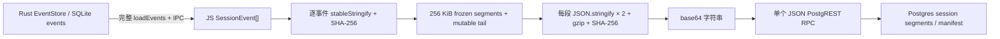
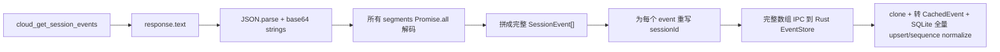
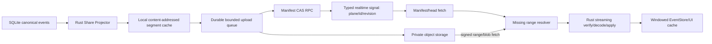

# Sharing Session 带宽、内存、CPU 与架构调研

日期：2026-07-18

范围：ORG2 Cloud 的 shared session 元数据、事件上传、成员/访客下载、只读 replay、fork & continue、Realtime 失效通知，以及本地 EventStore / SQLite 桥接。本文是审计与方案文档，不修改业务代码。

> **执行状态注记（2026-07-17，fix/session-sharing-reliability）**
>
> 本文最初针对该分支改动前的代码撰写。以下条目已在分支上落地，阅读下文问题清单时以此为准：
>
> | 条目                                          | 状态                                                                                                                                                        |
> | --------------------------------------------- | ----------------------------------------------------------------------------------------------------------------------------------------------------------- |
> | P0 `afterSeq` 不透传、测试固化全量行为        | ✅ 已修：adapter 透传 `p_after_seq`，客户端过滤降级为 defense-in-depth，测试断言透传；另有凭据门控的部署端契约探针（cloud-org-ui 场景 M）                   |
> | P0 OCC conflict 全量下载                      | ◐ 缓解：`readServerEpoch` 用 `afterSeq: MAX_SAFE_INTEGER` 做 head read，跳过全部 frozen body；tail body 仍随响应返回，真正的 manifest/head RPC 需服务端配合 |
> | P1 双重 stringify                             | ✅ `segmentCanonicalBytes` 单次编码同时喂 gzip 与 hash                                                                                                      |
> | P1 无界 `Promise.all` 编解码                  | ✅ `mapSegmentsBounded`（并发 4）覆盖上传编码与下载解码                                                                                                     |
> | P1 fetch 无 AbortSignal                       | ✅ resolve → fetch → decode → durable apply 全链路接受 signal；dialog 关闭/attempt 切换、member replay unmount 真正取消                                     |
> | P2 UTF-16 计量                                | ✅ segment budget 已按 UTF-8 字节计量，含 CJK 回归测试                                                                                                      |
> | P2 未接线的 `cloudPublishSeededSessionEvents` | ✅ 已移除；driver 新增真实 wire 形状的 `publishCloudSessionEvents` fixture                                                                                  |
> | 逐段 hash/count 校验缺失（测试缺口）          | ✅ `fetchAndAssembleSegments` 逐段验证 `eventCount` 与重算 hash，typed `SegmentIntegrityError`，含 payload-tamper 测试                                      |
>
> | P0 同一 session 分享 N 个 org 重复读取/哈希 | ✅ per-pass prepare memo：完整读取 + per-event hash + frozen/tail 规划每 pass 每 session 只做一次，懒计划保留各早退路径 |
> | P1 entitlement 双协调器 | ✅ `org2CloudEntitlementCoordinator`：store-keyed 单飞 + TTL，roster bootstrap/refetch 与 Realtime 共用，旧 floor stamp 删除 |
>
> 仍然成立、待办的条目：单 event hard max 与 attachment 外置、`syncAllOrgs` 的全量扫描本身（clean marker 已让未变 session 免哈希，但循环仍 O(org×session)）、cursor/metadata hash 持久化到 SQLite、telemetry 与 5/20/100 MiB perf fixture、Phase 1+ 的 Rust 数据面、Phase 2+ 的 manifest + object storage、Phase 3 的 lazy replay / copy-on-write fork。这些属于独立的性能 epic，不阻塞本分支合并。

## 结论先行

当前设计已经具备 gzip、frozen segment、mutable tail、OCC epoch、上传游标和下载游标这些正确的基础积木，但数据面仍然放在 renderer/TypeScript 中执行，并且多处“增量”只减少了服务端写入范围，没有减少客户端的全量读取、全量哈希、全量组装和全量持久化。

最值得优先处理的不是换一个压缩算法，而是以下四件事：

1. **让下载游标真正到达服务端。** `getSessionEvents` 已有 `p_after_seq`，但 `org2CloudBackendAdapter` 没有传 `afterSeq`，仍下载完整 epoch 后在客户端过滤；现有单测甚至固定了这个旧行为。
2. **把 session 事件数据面从 React/TS 移到 Rust。** 目前上传要把完整 SQLite 历史反序列化成包含 UI 派生字段的 `SessionEvent[]`，跨 IPC 送入 JS，再全量哈希、压缩和 base64；下载则反向执行同样的完整数组搬运和全量回写。
3. **把 RPC 变成控制面，把大 payload 变成可寻址、可恢复的数据对象。** manifest、权限、epoch/OCC 留在 Postgres RPC；不可变 segment 放对象存储，按 hash/seq 拉取，支持签名 URL、断点续传和缓存。
4. **让一次本地事件只调度对应的 `(session, org)`。** 当前 `es:changed(sessionId)` 最终仍扫描所有 org × 所有 session；同一个 session 分享到多个 org 时，还会重复读取、哈希和压缩同一份历史。

如果只做低风险修复，先完成服务端 range contract、`afterSeq` 透传、manifest-only 冲突恢复、AbortSignal、有限并发和指标埋点。要从根本上降低带宽/内存/CPU，则需要 Rust streaming projector + manifest/blob 数据面。

## 调研边界与证据

本次读取了以下主链路：

- 上传调度与协议：`org2CloudSyncEngine.ts`、`org2CloudSyncClient.ts`、`org2CloudSyncAtoms.ts`
- segment 规划与 codec：`collabSyncEngineHelpers.ts`、`segmentCodec.ts`、`collabGzip.ts`
- 下载适配、import、fork：`org2CloudBackendAdapter.ts`、`useCloudSessionActions.ts`、`CloudShareImportDialog.tsx`、`forkSession.ts`、`useForkImportedSession.ts`
- 本地事件存储：`EventStoreProxy.ts`、`session-persistence` schema/CRUD、Rust event conversion 与 payload compaction
- Realtime 与列表：`useOrg2CloudRealtime.ts`、`org2CloudRemoteSessionsAtom.ts`
- 既有 polling 审计：`SharedSessionPolling.md`

限制：部署端 `cloud_*` SQL/RPC 实现不在本仓库内，因此本文能确认客户端 wire contract、调用行为和 mock tests，不能确认生产数据库的实际 query plan、函数内存、statement timeout、Storage/RLS policy 或当前线上是否已经接受 `p_after_seq`。上线前必须增加一组针对真实 staging endpoint 的 contract/performance test。

## 当前数据流

### 上传



`eventStoreProxy.subscribe` 能告诉同步引擎哪个 session 发生了变化，但调度器只用它清理 clean marker，随后仍进入 `syncAllOrgs`，循环所有 org 和所有本地 session。命中的 session 每个 org 都重新执行一次完整历史读取与哈希。

### 下载 / import



成员 replay、访客 share-token import 最终共享这条 importer。fork 直接从 seq 0 全量下载；对已经 import 的 session 再 fork，还会先完整列出 org sessions，再重新下载完整 replay。

## 可复现的合成基线

使用 Node 22 按现有算法等价地生成中等可压缩的 tool-call JSON，执行：逐事件稳定序列化/哈希、256 KiB 分段、所有 segment 并行 gzip/hash、base64、RPC body 序列化；下载侧执行 response parse、所有 segment 并行 gunzip/parse、完整数组组装、sessionId 重写和 IPC body 序列化。

这些数字是**保守的算法基线**，不包含网络/TLS、服务端 Postgres、Tauri IPC 两侧实际反序列化副本、Rust `SessionEvent`/`CachedEvent` clone、SQLite 全量比较与 turn-index 工作，也不是生产 WebView 的正式 benchmark。

| 原始 transcript | frozen segments |  gzip 后 | base64 / RPC body | 上传 hash | 上传 encode | JS 侧额外 RSS 峰值 |
| --------------: | --------------: | -------: | ----------------: | --------: | ----------: | -----------------: |
|        5.00 MiB |              21 | 1.61 MiB |          2.15 MiB |     86 ms |      148 ms |          约 62 MiB |
|       20.00 MiB |              81 | 6.47 MiB |          8.64 MiB |    456 ms |      664 ms |         约 159 MiB |

| 原始 transcript | 下载 response | 再次 IPC JSON | parse + decode + IPC serialize | JS 侧额外 RSS 峰值 |
| --------------: | ------------: | ------------: | -----------------------------: | -----------------: |
|        5.00 MiB |      2.16 MiB |      5.01 MiB |                       约 37 ms |          约 33 MiB |
|       20.00 MiB |      8.67 MiB |     20.02 MiB |                      约 134 ms |          约 98 MiB |

base64 本身把压缩后的二进制放大约 33.3%；在 JS heap 中它还是字符串，编码/JSON stringify/Fetch body 构建期间会出现额外副本。20 MiB 样本仅 renderer 算法就已经产生约 8 倍原始大小的额外 RSS 峰值，说明首要优化点是减少完整 materialization 和跨层复制，而不是微调 gzip level。

## 问题清单

| 优先级 | Line / Element                                                                                                          | Verdict          | Reason                                                                                                                                                                                                                                       | Suggested change                                                                                                                                                                                   |
| ------ | ----------------------------------------------------------------------------------------------------------------------- | ---------------- | -------------------------------------------------------------------------------------------------------------------------------------------------------------------------------------------------------------------------------------------- | -------------------------------------------------------------------------------------------------------------------------------------------------------------------------------------------------- |
| P0     | `org2CloudSyncClient.ts:369-398`; `org2CloudBackendAdapter.ts:70-95`; `org2CloudBackendAdapter.test.ts:91-104`          | fix              | client wrapper 已能发送 `p_after_seq`，adapter 却不传，并在收到完整 epoch 后客户端过滤；测试把“RPC 总是返回完整 epoch”当成预期。一个新增 segment 仍可能下载整个 session。                                                                    | 先用 staging contract test 确认部署端能力；支持时直接传 `{ afterSeq, shareToken }` 并删除客户端 frozen 过滤。若服务端尚不支持，先升级 RPC，再改测试。                                              |
| P0     | `org2CloudSyncEngine.ts:1472-1559`; `EventStoreProxy.ts:656-670`; `event_conversion.rs:687-850`                         | fix              | 每次事件面变脏都完整读取 SQLite、解析 `args/result/meta`、重新计算 `extracted`，跨 IPC 形成完整 `SessionEvent[]`，然后逐事件稳定序列化与哈希。CPU、JS heap、Rust heap 和 IPC 都是 O(完整历史)。                                              | 在 Rust 增加 versioned `share_prepare_session`，直接从持久层生成/复用 segment manifest，只返回小控制结果或可流式读取的 blob；renderer 不再接触完整事件数组。                                       |
| P0     | `collabSyncEngineHelpers.ts:398-468`; `EventStoreProxy.ts:489-494, 710-720`; `cache_bridge.rs:97-135`; `crud.rs:93-197` | fix              | 所谓 incremental import 仍先读完整本地历史、组装完整新历史、为每个 event 复制对象、完整 IPC `set`，Rust 再 clone 全量 store、转换全量 CachedEvent、逐行 upsert 并 normalize 全部 sequence。仅网络有机会增量，本地 CPU/内存/写放大仍是 O(N)。 | 增加 Rust `share_apply_segments` 事务：校验 epoch/seq/hash，append 新 frozen、replace tail，只写变化行；事件数组留在 Rust，返回 count/revision。                                                   |
| P0     | `org2CloudSyncEngine.ts:1673-1745`                                                                                      | fix              | OCC conflict 为了只取得 `epoch` 调用 `getSessionEvents`，该调用默认返回全部 segments。首次 push 游标丢失或多设备冲突时，会先完整下载再完整上传。                                                                                             | 新增 manifest/head RPC，或让 conflict 响应携带 current epoch/frozenSeq/tailHash；冲突恢复不得返回 segment body。                                                                                   |
| P0     | `org2CloudSyncEngine.ts:625-653, 656-914`                                                                               | fix              | `es:changed` 有 sessionId，但同步 pass 仍扫描所有 org × 所有 sessions。同一变更分享给多个 org 时，相同历史被重复读取、哈希、分段和压缩。大 session 上传又排在 projects/tasks 控制面之前。                                                    | 使用持久化 dirty set，key 为 `(sessionId, targetOrgIds, localRevision)`；每个 localRevision 只 prepare/压缩一次，再 fan-out manifest。把 session blob queue 与 projects/tasks control queue 分开。 |
| P1     | `collabSyncEngineHelpers.ts:124-141`; `org2CloudSyncEngine.ts:1553-1617`                                                | fix              | frozen 区域是“最长终态前缀”。一个较早的 `awaiting_user/running/pending` 会把其后所有已完成事件都留在 tail；tail 每次 append 都完整替换，可能随 session 无限增长。                                                                            | 以 turn/block 为独立可变单元，终态 turn 立即冻结；或使用 content-addressed event blocks + 小 patch/tail manifest，避免单个旧 pending event pin 住整个后缀。                                        |
| P1     | `segmentCodec.ts:24-43`; `collabGzip.ts:15-100`; `org2CloudSyncClient.ts:94-120, 281-325`                               | fix              | 每段在 gzip 和 hash 中各 `JSON.stringify` 一次；所有段 `Promise.all` 同时编码；压缩输出先收集 chunks 再复制；随后转 base64，再把所有字符串拼入一个 JSON body。下载同样并行展开所有段。                                                       | 暂留 JS 时至少限制并发到 2-4、复用 canonical bytes、边生成边上传、传 AbortSignal。中期由 Rust 以 bounded buffer streaming 编解码，数据面使用 binary object，不再 base64-in-JSON。                  |
| P1     | `session_event.rs:115-170`; `event_conversion.rs:713-850`; `payload_compaction.rs:58-73`                                | fix              | sharing wire 复用 UI enriched `SessionEvent`：raw args/result、display 字段和重新派生的 `extracted` 可能重复同一大文本；UI snapshot 有 64 KiB compaction，但分享读取的是完整 persisted event，绕过该 compact projection。                    | 定义版本化 `ReplayEventV2`，只含跨设备重放所需的 canonical 字段；纯派生 UI 字段在接收端重建。大 stdout/diff/image 变为 content-addressed attachment，默认 lazy fetch。                             |
| P1     | `org2CloudSyncClient.ts:94-120`; `CloudShareImportDialog.tsx:121-169`; `useCloudSessionActions.ts:86-145`               | fix              | fetch 没有 AbortSignal；关闭 dialog 或 token generation 变化只忽略结果，已开始的网络、解压、JSON parse、IPC 与 SQLite 写入仍继续。单个 JSON RPC 也没有进度和断点恢复。                                                                       | 所有 replay fetch/import 接受 `AbortSignal`，关闭/切换/新 generation 时真正取消；提供 bytes/segments 进度。大对象使用可恢复传输。                                                                  |
| P1     | `org2CloudSyncAtoms.ts:32-56, 91-100`; `org2CloudSyncEngine.ts:349-358`                                                 | fix              | segment cursor 在 localStorage，metadata hash 只在内存。清 storage、重装或多设备会丢 cursor；下次用 full rewrite + OCC 恢复。每次 app restart 还会重新 upsert 所有候选 metadata。                                                            | 将 share manifest/cursor/hash 放 SQLite，与事件 revision 同事务或同一 durable queue；服务端提供 cheap head/ETag。metadata 使用 server revision/If-Match 风格比较。                                 |
| P1     | `org2CloudRemoteSessionsAtom.ts:143-202`; `useForkImportedSession.ts:176-193`; `useOrg2CloudRealtime.ts:261-291`        | fix              | `listOrgSessions` 支持 `since`，主要 consumer 却始终取完整列表；对已 import session 的 fork 为找一个 row 先列整个 org。粗粒度 `org_change_signals` 仍让 session/project/comment 互相失效。                                                   | session list 保存 server cursor 并 merge delta/tombstone；提供 get-one/manifest-by-id。Realtime payload 至少带 plane、entity/session id、revision、origin。详见既有 `SharedSessionPolling.md`。    |
| P1     | `org2CloudSyncEngine.ts:1472-1479`; `rustBridge.ts:63-72`; `imported/index.ts:41-53`                                    | fix              | external history 上传先完整读取源 chunks，JS map 后完整 IPC 到 Rust normalize，再完整 events 回 JS 进入哈希/压缩。它没有 native `es:changed`，依赖 10 分钟 clean TTL 重新全读，性能与新鲜度互相牺牲。                                        | 每个 source 暴露 durable stat/revision + Rust iterator/exporter；revision 未变则 O(1) 跳过，变化时只处理新增/变化区间。native 与 external history 共用同一个 share projector contract。            |
| P2     | `collabSyncEngineHelpers.ts:144-171, 148-150`; `collabSyncEngineHelpers.test.ts:114-121`                                | fix              | “256 KB”用 `JSON.stringify(event).length` 计算 UTF-16 code units，不是 UTF-8 bytes；中文最多约 3 倍偏差。单个超大 event 被明确允许突破上限，可能形成不可控 RPC/body/内存峰值。                                                               | 用 canonical UTF-8 byte length；设置 hard max。超大字段拆 attachment，不能让一个 event 无上限穿透 segment budget。新增 CJK/emoji/oversize contract tests。                                         |
| P2     | `org2CloudSyncClient.ts:94-120`; 整个 sharing data plane                                                                | fix              | 没有统一记录 raw/compressed/wire bytes、prepare/hash/compress/decode/apply 时间、full rewrite 原因、OCC conflict、tail 大小、range 命中、取消后多余字节和峰值内存。没有预算就无法证明优化。                                                  | 增加按 `(org, session, revision)` 聚合的 telemetry；默认只记录大小/耗时/原因，不记录内容。建立 5/20/100 MiB perf fixture 与 CI budget。                                                            |
| Keep   | `org2CloudSyncEngine.ts:1562-1644`; `segmentCodec.ts:9-52`                                                              | keep with reason | append 的 OCC anchors、segment hash、tail hash、epoch rewrite 与 importer 的 contiguity/count 校验是正确的完整性基础。                                                                                                                       | 保留语义，但把 hash/manifest 的唯一实现移到 Rust，并让冲突和 range 请求只传控制信息。                                                                                                              |
| Keep   | `collabSyncEngineHelpers.ts:291-350`                                                                                    | keep with reason | `(orgId, sourceSessionId)` in-flight dedup 能阻止 replay click 与其他 importer 并发重复下载/写入。                                                                                                                                           | 扩展 key/guard 到 manifest revision，并支持共同任务的引用计数取消，避免一个 consumer 关闭就误杀其他 consumer。                                                                                     |

## 上传应如何调整

### 1. 先把调度改成“精确 dirty queue”

目标状态：一次 `es:changed(sessionId, localRevision)` 只产生一个 session prepare job；job 根据当前访问策略解析目标 org，生成一次 segment plan，然后分别提交小 manifest。

建议 durable job key：

```text
(session_id, local_revision, payload_projection_version, codec_version)
```

每个 org 只保存授权、remote manifest revision 和发送状态，不重复保存/计算同一份本地压缩结果。新事件到来时合并尚未开始的 job；运行中的 job完成后若 revision 已落后，再排一个后继 job，不并发准备两个完整历史。

### 2. Rust 负责 canonical replay projection

不要从 SQLite 先重建 UI `SessionEvent`。Rust projector 应直接读取 canonical persisted row，产生 `ReplayEventV2`：

- 保留身份、时间、source、function、必要 args/result、终态和重放所需 provenance。
- 删除可以从 canonical 字段稳定重建的 `extracted`、UI preview/index 等字段。
- 大字段改成 attachment ref：`{hash, rawBytes, mediaType, preview}`。
- projector version 写入 manifest；升级 projection 时明确触发重建，不依赖偶然 key order。

本地建立 `share_segments` / `share_manifests`，按 content hash 缓存压缩 bytes。正常 append 只读取 cursor 后的新 event 与当前 mutable block；rewind/edit 重新生成变化 suffix，未变化 prefix 继续引用旧 hash。

### 3. 控制面与数据面拆开

建议：

- Postgres RPC：权限判断、manifest CAS、epoch/revision、retention、share grant。
- 对象存储：immutable compressed segments/attachments。
- Realtime/Broadcast：只发 `{plane, sessionId, manifestRevision, origin}` 的失效通知。

对象 key 应在 org/session/owner 授权域内，避免全局 hash dedup 暴露“两个租户是否拥有相同内容”的侧信道。manifest commit 前上传所有缺失 blob；commit 成功后新 revision 原子可见。失败重试只补缺失 blob，不重传已确认部分。

Supabase 官方目前建议大于 6 MB、网络不稳定或需要进度时使用 TUS resumable upload，并建议大文件走 direct storage hostname；标准上传超过 6 MB 时，resumable/S3 更可靠：[Resumable Uploads](https://supabase.com/docs/guides/storage/uploads/resumable-uploads)、[Upload file size restrictions](https://supabase.com/docs/guides/troubleshooting/upload-file-size-restrictions-Y4wQLT)。当前 256 KiB pre-gzip segment 不应机械地每段发一个请求；应通过真实数据 benchmark 选择约 0.5-2 MiB compressed object、2-4 并发，大于 6 MB 的对象/合并包再走 TUS。

### 4. 控制 mutable tail

“一个可变后缀”对并行 tool / awaiting-user 生命周期过于粗糙。建议按 turn 形成 block：

- active turn block 可替换；
- terminal turn block 变 immutable；
- 极大 tool payload 只在 attachment manifest 中更新；
- 超时/孤儿 interactive event 的生命周期修复不会阻止后续 turn 冻结。

这样一次流式更新最多重传当前 turn 的小 block，而不是从历史中第一个 pending event 到末尾的全部内容。

### 5. 暂时不能迁 Rust/Storage 时的止血项

- `Promise.all(allSegments)` 改为 2-4 个 worker 的有界并发。
- gzip 与 segment hash 复用同一份 canonical UTF-8 bytes，不重复 stringify。
- 用 `TextEncoder().encode(...).byteLength` 计算 segment budget。
- 对单 event 设 hard max，大字段先外置。
- 记录 dirty sessionIds，不再全 session 扫描。
- metadata hash 持久化；未变 session 启动后不 upsert。
- 用户不可见/电池模式下只上传 terminal turn 或显式 flush，避免每个 streaming gap 触发完整准备。

## 下载应如何调整

### 1. Manifest-first，range 真正在服务端执行

列表只需要轻量 summary。打开 replay 后先请求 manifest/header：

```json
{
  "manifestVersion": 2,
  "sessionRevision": 42,
  "epoch": 3,
  "eventCount": 12000,
  "codec": "gzip",
  "projection": "replay_event_v2",
  "segments": [
    { "seq": 17, "hash": "...", "compressedBytes": 481220, "eventCount": 320 }
  ],
  "tail": { "revision": 9, "hash": "...", "compressedBytes": 81220 }
}
```

增量 refresh 发送已持有的 epoch/seq/hash，服务端只返回 missing segment descriptors；blob 用签名 URL 或授权 Storage API 拉取。不要把完整 base64 payload 放进 manifest JSON。

### 2. Replay 不等于“先离线导入全部”

建议区分三种产品语义：

- **远程 replay**：先下载当前可见 turn / 最近 1-2 个 blocks，滚动或跳转时按需加载，磁盘 LRU 缓存。
- **离线保存**：用户显式选择后后台下载全部，支持暂停/恢复/进度。
- **fork & continue**：优先复用已缓存的相同 manifest；本地 copy-on-write 引用 inherited blocks，新事件写新 session blocks。第一轮 handoff 当前最多只消费 80 项、每项 1200 字符，没有必要为了构建 handoff 再把完整历史全量读入 JS。

如果产品仍要求 fork 后立即拥有完整本地历史，也应由 Rust streaming apply 直接落 SQLite，不经过完整 JS 数组；已经 import 且 manifest 相同的 session 直接本地 clone/reference，不重新下载。

### 3. 真取消、真进度、真恢复

- fetch、decode、apply 全链路传 `AbortSignal` / generation；取消后停止网络读取、worker 和 DB transaction。
- 进度用 `downloadedCompressedBytes / manifest.totalCompressedBytes`，不要用 eventCount 猜。
- 校验每个 segment hash 后立即 durable commit，重启后从已确认 seq 继续。
- 解压、JSON decode、projection upgrade 在 Rust worker/blocking pool 中顺序或小并发执行；renderer 只收 windowed events。

### 4. 列表与 Realtime

`cloud_list_org_sessions(since)` 应实际使用 server cursor，并包含 tombstone；找单个 imported source 时使用 get-one/manifest-by-id，而不是完整 org listing。`org_change_signals` 应按 plane/entity/revision 分发。

Supabase 当前文档对规模化 Realtime 更推荐 Broadcast 而不是 Postgres Changes，并允许在服务端 trigger 中发送明确 payload：[Subscribing to Database Changes](https://supabase.com/docs/guides/realtime/subscribing-to-database-changes)。这与既有 polling 审计建议的 typed signal 一致。

## 建议目标架构



所有入口共享同一个 protocol capability：

```text
manifest_version
projection_version
codec
server_range_read
blob_transport
max_segment_bytes
realtime_signal_version
```

不要只用一个总 `schema_version` 推断所有能力。当前 `getSessionEvents` 已支持 `afterSeq`、adapter/测试却仍认为不支持，就是 capability drift 的实际例子。

## 分阶段落地

### Phase 0：删除错误的全量路径并建立测量

1. 对部署端增加 `p_after_seq` contract test；透传 `afterSeq`，删除客户端 frozen filter 和固定旧行为的测试。
2. 新增 manifest/head RPC，OCC conflict 不再下载 segments。
3. 全 fetch 支持 AbortSignal；codec 并发有界；UTF-8 计量和 single-event hard max。
4. 增加 bytes/time/rewrite-reason/tail-size/range-hit 指标和 5/20/100 MiB fixture。
5. 使用 dirty session set；同一 local revision 的 hash/compression 在多个 org 之间复用。

### Phase 1：统一 Rust 数据面

1. 定义 `ReplayEventV2`，删除 derived/UI-only 重复字段。
2. Rust 实现 `share_prepare_session` 与本地 manifest/segment cache。
3. Rust 实现 `share_apply_segments`，增量写 SQLite，删除 JS 完整 `set + saveToCache` 路径。
4. external history source 通过 stat/revision + Rust iterator 接入同一 projector。

### Phase 2：manifest + object storage

1. immutable blobs、signed read、manifest CAS、orphan blob GC。
2. 大对象 TUS/resume，小对象 bounded parallel upload。
3. 部署 typed Realtime/Broadcast signal；列表和单 session manifest 使用 revision/range。
4. 保留旧 JSON RPC read 一段 capability-negotiated 兼容窗口；完成迁移后删除，不永久双写。

### Phase 3：lazy replay 与 copy-on-write fork

1. replay 首屏按 turn/window 拉取，滚动懒加载，LRU disk cache。
2. “离线保存”成为显式全量动作。
3. fork 复用本地/远端 manifest blocks；新 session 只写新增 blocks。
4. handoff 直接查询最后 80 个可用 canonical items，不加载完整历史。

## 验收指标

### 上传

- 未变化 session：0 次完整 event IPC、0 次 event hash、0 data bytes。
- 一个 session 新增 1 KiB 事件：只 prepare 该 session；网络不超过变化压缩块 + 5% 控制开销。
- 同一 revision 分享到 N 个 org：canonicalize/hash/compress 只执行 1 次；仅 manifest/auth commit 为 N 次。
- 20 MiB 历史追加小事件：renderer main-thread 单段阻塞低于 16 ms，renderer 额外 RSS 低于 20 MiB。
- OCC conflict：只返回小于 10 KiB 的 manifest/head，不返回历史 segment。
- 旧 awaiting-user event 不会让 mutable upload tail 随后续 turn 无界增长。

### 下载

- 已有 seq 80、远端新增 seq 81：只下载 seq 81 + 当前 tail，不下载 1-80。
- replay 首屏最多下载 2 个 block 或 2 MiB compressed（二者取更小预算），其余按需。
- 取消后 1 秒内网络、decode、apply 全部停止，取消后额外下载量有指标可见。
- 100 MiB replay 的 renderer 与 Rust 进程都不存在完整多副本峰值；单进程工作集增量目标低于 64 MiB。
- 已同步 imported session 的 fork：相同 manifest 时 0 远端 replay bytes，使用本地 copy-on-write。
- 中断/重启后从已校验 segment 恢复，不重下完整 epoch。

### 控制面

- 一个 session signal 只失效一个 session list/manifest key，不拉 projects/comments/roster。
- 所有 signal 带 plane、entity id、revision、origin；旧 revision/自己的已应用 revision 可直接忽略。
- dashboard 可区分 full rewrite、incremental append、manifest-only、range hit、retry/resume、abort waste。

## 术语过载表

| Term                             | 当前不同含义                                                                                           | 风险                                              | 建议                                                                      |
| -------------------------------- | ------------------------------------------------------------------------------------------------------ | ------------------------------------------------- | ------------------------------------------------------------------------- |
| `sessionId`                      | owner bare id、`${org}:${owner}:${source}` remote row id、`imported-session-*` local id、fork local id | adapter 需要按冒号拆 id，容易把本地/远端 key 传错 | 类型化为 `SourceSessionId`、`RemoteSessionRowId`、`LocalSessionId`        |
| `seq`                            | frozen segment 序号；tail 特判为 0；SQLite 另有 event `history_sequence`；import cursor 又叫 `seq`     | 不能从名字判断是 event 还是 segment               | 使用 `frozenSegmentSeq`、`eventSequence`、`tailRevision`                  |
| `epoch` / `version` / `revision` | remote rewrite epoch、Rust EventStore version、Realtime version、local dirty stamp                     | 不同层不能安全互换                                | manifest 明确 `epoch` + `manifestRevision`；本地明确 `eventStoreRevision` |
| `snapshot`                       | Rust UI derived snapshot、cloud segment snapshot、完整 imported local copy                             | “拿 snapshot”无法说明大小和权威性                 | 改为 `DerivedUiSnapshot`、`SessionManifest`、`ReplayWindow`               |
| `full_replay`                    | 权限档位；当前实现又隐含“完整下载后才能打开”                                                           | 访问范围与加载策略耦合                            | 权限叫 `replay_access`；加载策略独立为 lazy/offline                       |
| `tail`                           | 第一个非终态事件后的完整后缀                                                                           | 名称像小尾巴，实际可能是大半个 session            | 使用 turn/block mutable set，manifest 显式 bytes/count                    |

## 10 层 architecture-audit 覆盖

|                      Layer | 覆盖结果                                                                                                                                               | 结论                                                                                              |
| -------------------------: | ------------------------------------------------------------------------------------------------------------------------------------------------------ | ------------------------------------------------------------------------------------------------- |
| 1. Compilation correctness | `pnpm typecheck` 通过；5 个 sharing/codec 测试文件共 116 tests 通过；`cargo check -p session_persistence --quiet` 通过                                 | 当前问题不是编译错误，而是被现有测试认可的性能/协议行为                                           |
|       2. Dead code & dedup | 追踪 upload/download business entry points；发现服务端 `afterSeq` 与客户端 full-fetch filter 的重复职责、双 canonicalization、完整 `set + save` 双搬运 | 删除客户端 full-filter 与 renderer data-plane，而不是再叠一层 helper                              |
|      3. Naming consistency | adapter 注释与测试仍写“RPC always returns full epoch”，client contract 已有 `p_after_seq`                                                              | 注释/测试/部署 capability 已漂移                                                                  |
|    4. Semantic overloading | 完成上面的 id/seq/epoch/snapshot/replay/tail 表                                                                                                        | 必须在新 manifest 类型中消除原始 string/number 过载                                               |
| 5. Default branch analysis | 审查 metadata-only/full-replay、无 cursor、epoch conflict、missing displayStatus、oversize event、fetch validation fallback                            | 主要危险默认是“失败后 full refetch/full rewrite”和“oversize 仍照发”                               |
|    6. Cross-domain leakage | UI enriched `SessionEvent` 被用作网络 canonical payload；React sync engine 负责存储分段、压缩和 OCC 计划                                               | 数据面职责应下沉 Rust；UI 只消费 window                                                           |
| 7. New developer confusion | 三类 session id、tail seq=0、两种 hash canonicalization、多个 revision，没有 capability matrix                                                         | 新协议需 branded ids、明确 manifest schema 与 owner 文档                                          |
|           8. Wire protocol | 检查实际 JSON body 构建、gzip/base64、segment schema、range options、list cursor、Realtime signal                                                      | 这是主要问题层；当前二进制被 base64 放进单个 JSON RPC，range 没贯通                               |
|             9. Init parity | 比较成员 replay、访客 import、remote fork、imported-session fork、native upload、external-history upload                                               | 成员/访客 auth 复用良好；afterSeq 不透传；fork 强制 full；external history 无 native dirty signal |
|      10. Resolver symmetry | 比较 `shareToken` 与 `afterSeq` options、native/external revision source、member/guest manifest resolution                                             | shareToken 全链路贯通，afterSeq 断在 adapter；external history 缺等价 revision resolver           |

## 测试缺口

- 没有部署端 `p_after_seq` / manifest capability contract test。
- 没有 5/20/100 MiB 上传下载 perf fixture、峰值内存或 main-thread long-task budget。
- 没有 CJK/emoji UTF-8 segment size test。
- oversize 单 event 测试当前只证明“不会丢”，没有证明 hard limit / attachment split。
- 没有 cancel 后网络/CPU/DB 真正停止的测试。
- 没有 OCC conflict “不返回 segment body”的断言。
- 没有同一 session 分享到多个 org 时 prepare 只执行一次的断言。
- 没有 old awaiting-user 导致 tail 增长的压力测试。
- 没有 incremental import 只写变化 SQLite rows 的断言。
- 没有 replay 首屏/滚动 range fetch E2E。

## 最终建议

短期先修正 range contract 和 conflict head，它们能直接消除最明显的重复下载；同时加入 AbortSignal、有界并发、UTF-8 budget 和测量。中期把 projector、hash、compression、download apply 移入 Rust，消灭完整 `SessionEvent[]` 跨 IPC。长期采用 manifest + private object blobs + typed Realtime，并把 replay 改成 windowed/lazy、fork 改成 copy-on-write。

不要把“换 zstd”当作第一阶段。只要仍然全量读取、全量 materialize、全量跨 IPC、base64-in-JSON 和全量回写，即使压缩率提升 20%，CPU 与内存峰值的主要倍增器仍然存在。codec 选择应在 Rust streaming 架构落地后，用真实 transcript 再比较 gzip、zstd level 1/3 的压缩率、吞吐和兼容成本。
