# Chat Pane Tab-Type Factory & Registry — Architecture Audit

- Date: 2026-07-19
- Scope: the chat-pane (`ChatPanel`) tab system migration to a WorkStation-style tab-type factory + renderer registry, and the promotion of atom-driven surfaces to first-class tab types
- Status: Phases A–C complete and D satisfied by design; Phase E partially complete (rendering retired), atom deletion deferred
- Verification: `tsc --noEmit` 0 errors · `vitest` tab/display/surface suites 39 pass · `eslint` clean on all changed files · `madge` no circular dependencies. Runtime (Tauri app + E2E) not exercised.

## Executive summary

Before this change, a chat-pane tab's `type` was largely decorative: content was selected by a parallel set of atoms (`chatPanelSelectedWorkItem/Project/ProjectOrg/Workspace/CloudOrg`, `chatPanelContentModeAtom`, `chatPanelExploreOpenAtom`) run through a boolean cascade, and anything those booleans did not resolve fell through to the Launchpad. This audit covers moving `tab.type` to the single source of truth — one factory constructs each tab, one exhaustive registry renders it — mirroring `src/store/workstation/tabs/tabFactory.ts` + `src/modules/WorkStation/TabContent/registry.ts`.

```mermaid
flowchart LR
    NAV["Navigation entry point"] --> OPEN["open*InChatPanelTabAtom"]
    OPEN --> FACTORY["create*Tab (defineChatPanelTabFactory)"]
    FACTORY --> STATE["chatPanelTabsAtom"]
    STATE --> ACTIVE["activeChatPanelTabAtom"]
    ACTIVE --> DISPATCH["UnifiedChatPanelTabContent"]
    DISPATCH --> REG["CHAT_PANEL_TAB_SURFACE_REGISTRY[tab.type]"]
    REG --> RENDER["dedicated surface renderer (reads tab payload)"]
```

## Scope boundary

Included: the tab model/union, the factory, the surface registry + dispatcher, the four promoted surfaces (`work-item`, `project`, `project-org`, `explore`), navigation-entry-point redirection, and the tab-driven content renderers. Excluded and tracked for a follow-up branch: deleting the `selected*`/`contentMode` atoms outright (blocked on optimistic-edit flows and E2E helpers that need the running app), and the two pre-existing latent bugs noted below.

## Layer findings

| Layer                         | Finding                                                                                                                                                                  | Resolution                                                                                                                                                                                                                                                                                                                                                                                                                     |
| ----------------------------- | ------------------------------------------------------------------------------------------------------------------------------------------------------------------------ | ------------------------------------------------------------------------------------------------------------------------------------------------------------------------------------------------------------------------------------------------------------------------------------------------------------------------------------------------------------------------------------------------------------------------------ |
| Types / exhaustiveness        | `ChatPanelTabType` was a 6-member union with no compile-time link between type and renderer.                                                                             | Extended to 10 members; the renderer map is typed `Record<ChatPanelTabType, ChatPanelTabSurfaceEntry>`, so a new type is a type error until it has an entry. Verified: removing the benchmark member forced the registry/display-switch to update.                                                                                                                                                                             |
| Factory / construction        | Eight open atoms + the default/initial builders each hand-rolled a `ChatPanelTab` literal (id scheme, title, timestamps, payload duplicated per site).                   | `defineChatPanelTabFactory` + one `create*Tab` per type own construction; id strategies (`fixed`/`uuid`/`keyed`) match the pre-existing id schemes exactly. Dedup (focus-or-create) stays in the open atoms, which need store access.                                                                                                                                                                                          |
| Control flow / dispatch       | Content was chosen by a boolean cascade in `useChatPanelContentState` → `ChatPanelContent`, plus an inline `type`-switch in `ChatPanelShell`, independent of `tab.type`. | A single `UnifiedChatPanelTabContent` keys off `tab.type` via the registry: chat-column (session/launchpad), keep-alive Kanban and terminals, and dedicated payload-reading components for the six detail surfaces.                                                                                                                                                                                                            |
| Fallback / init parity        | An unresolved surface silently rendered the Launchpad; corrupted persisted types had no explicit handling.                                                               | Unknown `tab.type` renders `UnknownChatPanelTabPlaceholder` (reusing the shared `placeholders.unknownTabType`). Persistence (`chatPanelTabsState.ts`) is unchanged; the fixed-id singletons and keyed ids are preserved so the debounced writer/hydration behave identically.                                                                                                                                                  |
| Dead code                     | Benchmark was in the original plan as a promoted surface.                                                                                                                | De-scoped: its two entry points are welded to opening the coordinator session, so the run-list is a session facet, not an independent pill. The speculative `benchmark` tab type/factory/open-atom/replay were removed cleanly (compiler-enforced).                                                                                                                                                                            |
| Naming                        | New factory/atom names follow the existing `chatPanelTab*` and `open*InChatPanelTabAtom` conventions.                                                                    | No overloaded names introduced; `create*Tab` mirrors WorkStation's `create*Tab`.                                                                                                                                                                                                                                                                                                                                               |
| Module graph                  | New files: `chatPanelTabFactory.ts`, `chatPanelTabFactories.ts`, `TabContent/*`. Risk was a model↔factory cycle.                                                         | `madge` confirms no circular dependency. The model holds types + normalization; builders moved to the factories file; the factory imports model types only.                                                                                                                                                                                                                                                                    |
| Projection (transition state) | Panels and the header still read the `selected*` atoms.                                                                                                                  | On activation, each promoted tab replays its payload into those atoms (`chatPanelTabPresentationAtoms`), exactly as `workspace`/`cloud-org` tabs already did. This makes the header follow the active tab with no new code (Phase D), and lets the dedicated renderers read the tab payload directly. Work-item in-place edits are mirrored back to the tab via `patchChatPanelWorkItemTabAtom` (reference-guarded, no churn). |

## Deferred / known items

| Item                                                                  | Risk                                                                                                                                                                                                                                                                  | Recommendation                                                                                                                                                                           |
| --------------------------------------------------------------------- | --------------------------------------------------------------------------------------------------------------------------------------------------------------------------------------------------------------------------------------------------------------------- | ---------------------------------------------------------------------------------------------------------------------------------------------------------------------------------------- |
| Delete `selected*`/`contentMode` cascade                              | The atoms are written by optimistic-update edit flows (`useProjectWorkItemHandlers`, `useAiWorkItemCreator` — read-modify-write with rollback) and by E2E helpers under `src/app/root/e2e/`. Blind rewrite risks breaking rename/edit UX that typecheck cannot catch. | Do as a separate branch with the running app + E2E suite. Converting the atoms to derived-read-only over `activeChatPanelTabAtom` makes the compiler enumerate every writer to redirect. |
| `NEW_GITHUB_ISSUES_PROJECT` missing from `activeChatPanelSurfaceAtom` | Pre-existing; the wizard still renders via `createTarget`, but the surface selector never returns this kind.                                                                                                                                                          | Fix alongside the atom-cascade work.                                                                                                                                                     |
| Benchmark builder has no `CHAT_PANEL_SURFACE_KIND`                    | Pre-existing; `createTarget=BENCHMARK` renders with no surface member.                                                                                                                                                                                                | Fix alongside the atom-cascade work.                                                                                                                                                     |

## Verification

- Type-level exhaustiveness confirmed by construction (the `Record<ChatPanelTabType, …>` registry and the display-title switch both broke and were fixed when the union changed).
- `vitest` suites covering tab open/close/reorder/singleton-collapse and display titles pass unchanged (39 tests).
- No source behavior was modified in an audit-only fashion; this report documents an implemented change and is delivered alongside it per repository convention.
