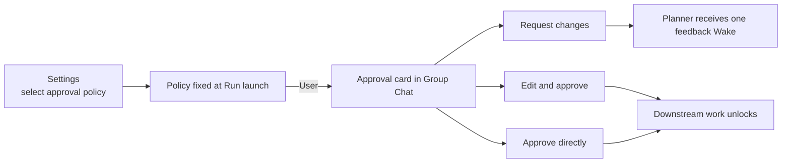

# Agent Org Planner Approval — Frontend UI Audit

- Date: 2026-07-13
- Scope: Approval policy in Agent Org create/edit, Group Chat approval card, Run phase, and Task presentation.
- Method note: The routed `frontend-ui-audit` skill is absent from both workspace and user paths. This report performs the equivalent `AGENTS.md` checks manually and does not claim to have executed the missing skill.

## Audit table

| Line / surface                   | Element                          | Verdict | Reason                                                                                                                                    | Suggested change |
| -------------------------------- | -------------------------------- | ------- | ----------------------------------------------------------------------------------------------------------------------------------------- | ---------------- |
| `PlanApprovalPolicySelector.tsx` | Approval policy selector         | keep    | Reuses the project `Select` and existing form section; the three policies use a typed union rather than free text.                        | None.            |
| `AgentTeamFormSections.tsx`      | Create Agent Org                 | fixed   | Creation supports Coordinator, User, and Automatic, defaulting to Coordinator.                                                            | None.            |
| `OrgDetailView.tsx`              | Edit Agent Org                   | fixed   | Create and edit share the same field and selector, avoiding wizard-only behavior.                                                         | None.            |
| `AgentOrgOverviewPanel.tsx`      | User approval region             | keep    | Appears only for `policy=user` with a pending approval; Coordinator-owned approvals are not duplicated to the user.                       | None.            |
| `AgentOrgPlanApprovalCard.tsx`   | Approval card                    | keep    | Reuses project Button, Textarea, and Markdown; shows Plan title and member display name rather than internal member id.                   | None.            |
| `AgentOrgPlanApprovalCard.tsx`   | Card state identity              | keep    | Stable test id and approval id support E2E without changing visual presentation.                                                          | None.            |
| `AgentOrgPlanApprovalCard.tsx`   | Edit and feedback input          | keep    | Includes `aria-label`, disabled, and loading states; long content is height-bounded and scrollable.                                       | None.            |
| `AgentOrgPlanApprovalCard.tsx`   | Error feedback                   | keep    | Command failure appears in the card with `role="alert"` and is not silently swallowed.                                                    | None.            |
| `AgentOrgPlanApprovalCard.tsx`   | Request changes / edit / approve | fixed   | Each action is explicit; empty feedback cannot submit, an empty Plan cannot be approved, and submitting disables duplicate clicks.        | None.            |
| Run projection + UI badge        | `AwaitingPlanApproval`           | fixed   | The Run remains Running while the UI says “Awaiting plan approval”; it is not mislabeled Paused or Done.                                  | None.            |
| Locale files                     | English and Chinese product copy | keep    | Product labels, guidance, and policy descriptions remain available in both supported locales. This audit document itself is English-only. | None.            |
| Group Chat approval E2E          | Rendered interaction             | fixed   | E2E opens the real overview, requests changes, enters feedback, resubmits, edits, approves, and verifies downstream release.              | None.            |

## Design consistency

## Verdict summary

- Fix: 6
- Keep with reason: 6
- New abstraction required: 0
- Unresolved blocking UI finding: 0

No arbitrary color, spacing system, or second button/input implementation was added. The card has explicit loading, disabled, error, and empty-content protection. For the user it is part of the Group Chat work overview; it does not force a manual switch into the Planner Session.
