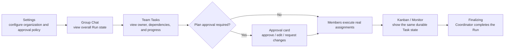

# Agent Org #272 Final Frontend UI Audit

- Date: 2026-07-14, updated with final verification on 2026-07-18
- Scope: Agent Org Settings, Group Chat overview and history, Plan approval, Task blocks, Kanban, Monitor, member navigation, mention input, and localized product copy changed by this branch.
- Method note: The repository's `frontend-ui-audit` skill is absent from workspace and user paths. The equivalent `AGENTS.md` checks were performed manually without claiming the missing skill was executed.

## Audit table

| Line / surface                          | Element                            | Verdict          | Reason                                                                                                                                        | Suggested change |
| --------------------------------------- | ---------------------------------- | ---------------- | --------------------------------------------------------------------------------------------------------------------------------------------- | ---------------- |
| `PlanApprovalPolicySelector.tsx`        | Approval policy                    | keep             | Uses the existing Select and one typed three-option field shared by create and edit.                                                          | None.            |
| `AgentOrgPlanApprovalCard.tsx`          | User approval card                 | keep             | Provides loading, disabled, empty-input protection, accessible labels, inline errors, and distinct approve/edit/request-changes actions.      | None.            |
| `AgentOrgOverviewPanel.tsx`             | Run overview and phase             | fixed            | Awaiting approval, Finalizing, Paused, and Waiting for work no longer impersonate one another.                                                | None.            |
| Group Chat history hooks and pagination | Durable transcript                 | fixed            | Refresh and “Load older” preserve complete durable history while the compact Run View remains bounded.                                        | None.            |
| Composer mention path                   | Member mention                     | fixed            | WebKit trigger parsing and member-option identity allow real keyboard selection of every Agent Org member.                                    | None.            |
| `OrgTaskBlock/index.tsx`                | Task tool result                   | fixed            | Expected authority or dependency correction appears as structured guidance rather than a frightening red system failure.                      | None.            |
| `TodoKanban.tsx` + `orgTaskOutcome.ts`  | Board state                        | fixed            | Open/Completed/Delete state projects from durable typed outcomes; rejected and args-only legacy calls cannot mutate replay state.             | None.            |
| `AgentEventBubbles.tsx`                 | Member events                      | keep             | Important collaboration state is readable while internal recovery details do not flood users as ordinary failures.                            | None.            |
| Agent Org create/edit member selection  | CLI member                         | fixed            | Incomplete CLI transport is hidden from runnable choices; historical definitions remain readable and deletable.                               | None.            |
| Member switchers                        | Exact unread state                 | fixed            | A member with an old unread row outside the recent preview remains visible and selectable in Group Chat and WorkStation.                      | None.            |
| Locale files                            | English and Chinese product copy   | keep             | Product UI continues to ship matching localized status, approval, error, and policy copy. Audit Markdown is English-only.                     | None.            |
| Rendered Agent Org E2E                  | Production UI path                 | keep             | Debug helpers seed or inspect only; mention, history, approval, pause/resume, recovery, settings, and Task presentation use the rendered App. | None.            |
| Changed TSX sweep                       | Arbitrary styles and accessibility | keep with reason | No second button/input/selector system, arbitrary color expansion, or new inaccessible control was introduced.                                | None.            |

## User flow

## Verification

- Full frontend Vitest: 450 files, 5,181 / 5,181 tests.
- TypeScript typecheck: pass.
- ESLint: pass.
- Rendered Debug App Agent Org E2E: 19 / 19.
- Group Chat includes real keyboard mention selection and 230+ durable history rows across refresh/pagination.

## Verdict

**Implementation and UI verification are complete for the approved scope.** The UI introduces no new design-system fork. Displayed state matches durable backend facts, and approval wait, pause, recovery, finality, historical navigation, and member selection are understandable to users.
