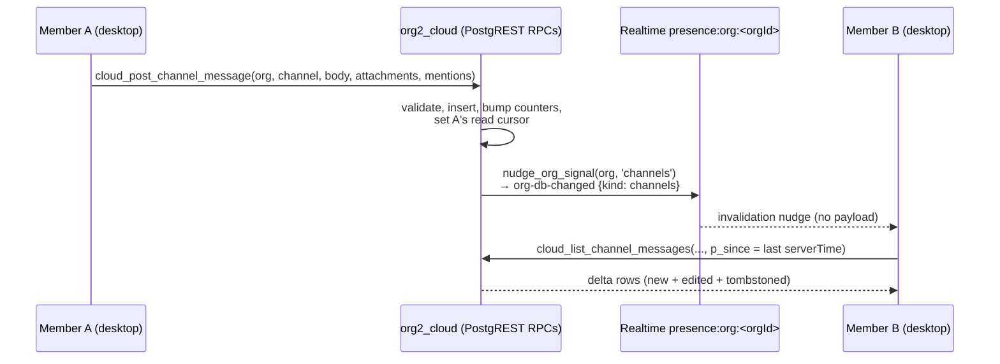

# Org Channels — Design (2026-07-31)

Slack-style channels for cloud orgs: named, org-visible chat rooms where members send
human messages and append **sessions / work items** as reference cards. No AI
participation in v1, and **no session replay inside a channel** — a session card links
out to the existing session surfaces.

This is a design-first document. No code changes accompany it. It is grounded in the
existing collaboration stack:

- `docs/architecture/managed-cloud-collaboration.md` (authorization contract)
- `docs/cloud-architecture-and-scalability.md` (topology, signal plane, conventions)
- `orgii-cloud-infra/supabase/migrations/0001–0011` (the whole API surface today)

---

## 1. Scope

### Goals (v1)

1. Per-org channels (create / rename / set topic / archive), visible to every active
   org member — the org-visibility analogue of `cloud_sessions.visibility = 'org'`.
2. Human messages: markdown body, edit, tombstone-delete, member @-mentions (stored,
   rendered; inbox fan-out is phase 2).
3. Append sessions and work items into a channel as **reference cards** — via drag,
   the `@` context menu, or an explicit picker. Cards show live status and link out.
4. Live-ish updates via the existing signal plane (invalidation nudge → RPC re-pull;
   no payload on the wire, no polling).
5. Per-viewer unread state (watermark cursor) driving sidebar/channel-list badges.

> **Update (2026-07-31, later the same day):** the control plane described in §4
> has been IMPLEMENTED as `orgii-cloud-infra/supabase/migrations/0014_org_channels.sql`
> plus the desktop data layer (`src/features/Org2Cloud/channels/`), sidebar
> section, and create/archive/delete/membership dialogs. Scope changed from
> this document's first draft per user direction: **visibility limits,
> per-channel membership, and posting policy are v1**, not phase 2. Where this
> section and §4's first-draft sketch disagree, the migration file is the
> contract: `cloud_channels` carries `visibility ('org'|'private')`,
> `post_policy ('everyone'|'managers')`, and `archived_at` (archive is a
> reversible soft state; **delete is HARD and org-admin-only, Slack-style** —
> the org-tombstone purge covers the rest); `cloud_channel_members` holds
> `role ('manager'|'member')` rows — the access list for private channels, the
> manager registry for org-visible ones. The message plane (§4.1's
> `cloud_channel_messages` / `channel_read_cursors`, §4.3's message RPCs)
> remains unimplemented and moves to the next migration.
>
> **Second scope addition (same day): local channels.** Channels also exist
> for the LOCAL (non-cloud) sidebar scope — accumulated on this machine the
> way sessions are, single-user, so users can create/manage channels with no
> cloud org. Backing store is an `atomWithStorage` + zod-validated registry
> (`src/store/ui/localChannelsAtom.ts`), not SQLite — a channel registry is
> small metadata; the heavier store can arrive with the local message plane.
> Local channels enforce the SAME rules as 0014 (normalized names,
> case-insensitive uniqueness with archived names reserved, 200-active cap,
> topic ≤ 250, archive soft / delete hard) so a future local→cloud
> promotion has no semantic cliff. No visibility/membership/post-policy
> locally (single user). UI mirrors the cloud sidebar section + dialogs.

### Non-goals (v1)

- **No AI interaction** — agents cannot be mentioned or post; no `@agent` affordance.
- **No session replay in channel** — the card is metadata-only; opening it goes
  through the existing session-open / cloud-reference admission paths.
- No DMs, threads, reactions, file attachments, or message search.
- No team-inbox integration of channel mentions (explicitly phase 2, migration 0013).

### Default decisions taken (flag if you want these changed)

| Decision                       | Default chosen                                                                                                                                               | Alternative                                                        |
| ------------------------------ | ------------------------------------------------------------------------------------------------------------------------------------------------------------ | ------------------------------------------------------------------ |
| Channel visibility             | ~~All org-visible~~ **Superseded:** v1 ships `org` + `private` visibility with a `cloud_channel_members` access list (see Update above)                      | —                                                                  |
| Posting limits                 | **Superseded:** v1 ships `post_policy` `everyone`/`managers`; enforced when the message plane lands                                                          | —                                                                  |
| Channel delete                 | Archive = soft (`archived_at`, manager/admin); Delete = hard, org owner/admin only, works on private channels the admin cannot read (Slack management plane) | Soft-delete only (first draft)                                     |
| `#general` seeding             | No server auto-seed; empty state pre-fills a suggested `general`                                                                                             | Auto-create on org creation (touches frozen `create_org`)          |
| Mentions → Team Inbox          | Stored from day 1 (`mentioned_user_ids`), surfaced in inbox in 0013                                                                                          | Full inbox fan-out in v1 (drags `teamInboxCoordinator` into scope) |
| Unread sync across own devices | Refresh on visibility edge only; no nudge on cursor writes                                                                                                   | Nudge `channels` on cursor write (noisy: fans out to whole org)    |
| Retention / quota              | Messages exempt from `stored_bytes` quota; caps instead (§4.4)                                                                                               | Count message bytes into org quota                                 |

---

## 2. Product shape

Two-pane surface (channel list ~240px | message feed), same skeleton as Team Inbox's
`SplitViewLayout`, opened as a ChatPanel tab and reachable from the sidebar:

- **Sidebar**: a "Channels" section under the active cloud org (modeled on the
  existing cloud-sessions sidebar section) listing channels with unread badges, plus
  a pinned entry following the Team Inbox 4-file pattern.
- **Channel list pane**: rows = name, last-message preview, relative time, unread
  badge. Reuses `TeamInboxListItem` unchanged.
- **Feed pane**: date-grouped message list (sticky day dividers), avatar + name +
  time + markdown body + up to 8 reference cards per message, catch-up scroll to
  first unread, composer at bottom.
- **Composer**: plain-textarea composer (the proven `CommentComposer` shape), with
  member-mention dropdown, session/work-item append (drag / `@` menu / picker
  dialog), Cmd+Enter send, draft preserved on failure.
- **Reference cards**: session card (agent icon, title, live status dot, owner,
  "Open") and work-item card (shortId, title, status/priority pills, "Open"). Cards
  are snapshots + live resolution — they render from the stored snapshot immediately
  and hydrate live status when the entity is resolvable in the cloud listings.

---

## 3. Architecture overview



Everything follows the house invariants:

- **RPC-only surface** — no edge functions, no direct DML from clients; all writes
  are `SECURITY DEFINER` RPCs asserting membership server-side.
- **Realtime carries invalidation only** — one new signal kind `channels` through
  the single `nudge_org_signal` choke point; clients re-pull via RPC.
- **Strictly event-driven client** — refetch on signal, on visibility edge, on
  mutation; never a polling loop.

---

## 4. Backend design — `orgii-cloud-infra` migration `0014_org_channels.sql`

### 4.1 Tables

Three tables, `org2_cloud` schema, all `org_id`-first, text-CHECK enums, soft delete,
no FK to `auth.users` (phase-B sharding rule — bare uuid validated by RPC):

```sql
create table if not exists org2_cloud.cloud_channels (
  org_id          uuid not null references org2_cloud.orgs(id) on delete cascade,
  id              uuid not null default gen_random_uuid(),
  name            text not null,            -- trimmed, 1..80
  topic           text,                     -- <= 250
  created_by      uuid not null,            -- auth.uid() at create; no FK
  message_count   integer not null default 0,        -- materialized (house pattern)
  last_message_at timestamptz,                        -- ordering + list preview
  created_at      timestamptz not null default now(),
  updated_at      timestamptz not null default now(),
  deleted_at      timestamptz,                        -- archive = soft delete
  primary key (org_id, id)
);
create unique index if not exists cloud_channels_org_name_idx
  on org2_cloud.cloud_channels (org_id, lower(name)) where deleted_at is null;

create table if not exists org2_cloud.cloud_channel_messages (
  id                 uuid primary key default gen_random_uuid(),
  org_id             uuid not null,
  channel_id         uuid not null,
  author_user_id     uuid not null,          -- always auth.uid(); no FK
  body               text not null default '',            -- <= 4000 chars
  attachments        jsonb not null default '[]',         -- <= 8 refs, validated
  mentioned_user_ids uuid[] not null default '{}',        -- <= 50, active members
  created_at         timestamptz not null default now(),
  edited_at          timestamptz,
  deleted_at         timestamptz,            -- tombstone; body blanked at read
  state_changed_at   timestamptz not null default now(),  -- single delta stamp (0006 pattern)
  foreign key (org_id, channel_id)
    references org2_cloud.cloud_channels(org_id, id) on delete cascade,
  constraint cloud_channel_messages_not_empty
    check (btrim(body) <> '' or jsonb_array_length(attachments) > 0)
);
create index if not exists cloud_channel_messages_page_idx
  on org2_cloud.cloud_channel_messages (org_id, channel_id, created_at desc, id desc);
create index if not exists cloud_channel_messages_delta_idx
  on org2_cloud.cloud_channel_messages (org_id, channel_id, state_changed_at);
create index if not exists cloud_channel_messages_mentions_gin_idx
  on org2_cloud.cloud_channel_messages using gin (mentioned_user_ids);

create table if not exists org2_cloud.channel_read_cursors (
  org_id         uuid not null,
  channel_id     uuid not null,
  viewer_user_id uuid not null,
  last_read_at   timestamptz not null,       -- watermark, not per-message receipts
  updated_at     timestamptz not null default now(),
  primary key (org_id, channel_id, viewer_user_id),
  foreign key (org_id, channel_id)
    references org2_cloud.cloud_channels(org_id, id) on delete cascade
);
```

Design notes:

- **Watermark, not receipts.** Team Inbox uses per-message receipts because mention
  items are discrete; a channel wants Slack's "read up to here" watermark. Unread =
  `count(*) where created_at > last_read_at and deleted_at is null and
author_user_id <> viewer`. Mark-read passes the `created_at` of the newest
  _rendered_ message (clamped to `now()`), so a concurrently-committing message with
  a slightly earlier stamp isn't silently swallowed.
- **Attachments as validated jsonb, not a join table.** Refs are bounded (≤8),
  render-only in v1 (no server-side "which channels reference session X" query), and
  the wire shape mirrors the client's existing `MessageReferenceItem`. If reverse
  lookup is ever needed, a GIN index or extraction table can be added additively.
- **Counters are materialized on the parent row** in the same transaction, under a
  per-`(org, channel)` advisory lock, per the 0003 canonical lock order.

Attachment wire shapes (camelCase, validated server-side):

```jsonc
{ "kind": "session",  "orgId": "…", "ownerUserId": "…", "sessionId": "…", "title": "snapshot" }
{ "kind": "workItem", "workItemId": "…", "projectId": "…", "shortId": "PROJ-0042", "title": "snapshot" }
```

The session shape is exactly the non-capability-bearing
`orgii://cloud/session/ref?v=1&org=…&owner=…&session=…` tuple from
`src/features/Org2Cloud/cloudSessionReference.ts` — we do **not** invent a second
reference format, and we never store share tokens in a message.

### 4.2 RLS / grants

Copy the 0010/0011 posture verbatim:

- `cloud_channels`, `cloud_channel_messages`: RLS on; `FOR SELECT USING
(is_org_member(org_id))` as defense-in-depth; **no grants to `authenticated`**
  (RPC-only); full DML to `service_role`.
- `channel_read_cursors`: RLS on, **zero policies**, all client roles revoked —
  viewer identity is derivable only via `auth.uid()` inside definer RPCs (the
  `team_inbox_mention_read_receipts` pattern, which keeps "viewer" from becoming an
  impersonation surface).
- Every RPC: `security definer set search_path to 'org2_cloud'`, starts with
  `assert_org_member(p_org_id)` (or admin), ends with revoke-from-public/anon +
  `grant execute to authenticated`.

### 4.3 RPCs

All return a single `jsonb` with camelCase keys + `serverTime`; errors are
`ORG2_*` raises. New codes: `ORG2_CHANNEL_NOT_FOUND`, `ORG2_MESSAGE_NOT_FOUND`,
`ORG2_ATTACHMENT_INVALID` (reuse `ORG2_CONFLICT` for name collisions,
`ORG2_VALIDATION` for shape errors).

| RPC                                                                                                                         | Who                 | Behavior                                                                                                                                                                                                                                                                                              |
| --------------------------------------------------------------------------------------------------------------------------- | ------------------- | ----------------------------------------------------------------------------------------------------------------------------------------------------------------------------------------------------------------------------------------------------------------------------------------------------- | --- | ------ | --- | --- | --- | --------------------------------------------------------------------------------------------------------------- |
| `cloud_create_channel(p_org_id, p_name, p_topic default null)`                                                              | member              | Trim/validate name (1–80), case-insensitive uniqueness among non-deleted, cap 200 active channels/org (`ORG2_QUOTA_EXCEEDED`), nudge `channels`                                                                                                                                                       |
| `cloud_update_channel(p_org_id, p_channel_id, p_name default null, p_topic default null)`                                   | creator or admin    | Rename / set topic; same validation; `updated_at = now()`; nudge                                                                                                                                                                                                                                      |
| `cloud_archive_channel(p_org_id, p_channel_id)`                                                                             | creator or admin    | Soft delete (`deleted_at`); messages retained; nudge                                                                                                                                                                                                                                                  |
| `cloud_list_channels(p_org_id)`                                                                                             | member              | ≤200 rows ordered `coalesce(last_message_at, created_at) desc`; lateral-join last non-deleted message for `{lastMessagePreview, lastMessageAuthorName}` (join `profiles` at read time — nothing denormalizes display names); per-channel `unreadCount` from the viewer's cursor                       |
| `cloud_post_channel_message(p_org_id, p_channel_id, p_body, p_attachments default '[]', p_mentioned_user_ids default '{}')` | member              | Validate body ≤4000 + non-empty rule; ≤8 attachments each schema-checked; mentions deduped, ≤50, each an **active** member (0011 rule); advisory lock `('org2_cloud.channels:'                                                                                                                        |     | org_id |     | ':' |     | channel_id)`; insert, bump `message_count`/`last_message_at`, upsert author's own read cursor; nudge `channels` |
| `cloud_edit_channel_message(p_org_id, p_message_id, p_body)`                                                                | author only         | Update body, `edited_at`, `state_changed_at`; nudge                                                                                                                                                                                                                                                   |
| `cloud_delete_channel_message(p_org_id, p_message_id)`                                                                      | author or org admin | Tombstone: set `deleted_at` + `state_changed_at`, decrement `unresolved`-style counters not needed; body blanked at read time (comment pattern)                                                                                                                                                       |
| `cloud_list_channel_messages(p_org_id, p_channel_id, p_cursor default null, p_limit default 50, p_since default null)`      | member              | Two modes, one signature (no-overload rule): **page** — descending keyset `(created_at, id)` with the 0011 string cursor `"<ISO>\|<uuid>"`, clamp ≤100, `limit n+1` → `nextCursor`; **delta** — `state_changed_at > p_since`, ≤200 rows, overflow flag tells the client to fall back to a page reload |
| `cloud_set_channel_read_cursor(p_org_id, p_channel_id, p_last_read_at)`                                                     | member (self)       | Clamp to `now()`, monotonic (never moves backward), returns authoritative `unreadCount` (0011 pattern)                                                                                                                                                                                                |

### 4.4 Caps & quotas (v1)

- 200 active channels/org · body ≤4000 chars · ≤8 attachments/message · ≤50 mentions.
- Messages **excluded** from `stored_bytes` org quota (they're small; sessions
  dominate). Revisit if abuse shows up; `cloud_ops_stats()` gains a channels row.
- No message-count cap per channel (unlike comments' 500/session) — pagination is
  keyset; a service-role `cloud_gc_channel_messages` retention sweep is spec'd but
  disabled by default.

### 4.5 Realtime

- New signal kind **`channels`**: a dedicated `touch_org_channels_signal()` trigger
  function (the `touch_org_roster_signal` pattern — `touch_org_change_signal`
  switches on `TG_TABLE_NAME`, and a dedicated function avoids editing the shared
  switch) installed as **`CONSTRAINT TRIGGER … DEFERRABLE INITIALLY DEFERRED`** on
  `cloud_channels` and `cloud_channel_messages`.
- Rides the existing `presence:org:<orgId>` topic → **no new `realtime.messages`
  policies needed**. Per-(org, kind) debounce means `channels` never shadows
  `comments`/`sessions`.
- Read-cursor writes do **not** nudge (viewer-local; whole-org fan-out would be
  noise).

### 4.6 The 0014 migration checklist (house rules that bite)

1. `-- ===` header spec with PARTs, RE-PASTE HAZARD note, and a pointer to the TS
   wire-contract file (`src/features/Org2Cloud/channels/types.ts`).
2. One `begin; … commit;`, fully idempotent, verify tail of `select … as *_check`.
3. Recreate `get_cloud_capabilities()` verbatim + new flag **`orgChannels`**; assert
   exactly **8** keys in the verify tail.
4. Recreate `cloud_delete_org` and `cloud_delete_account` with explicit purges of
   all three new tables (orgs are only soft-deleted — `on delete cascade` never
   fires; this is a twice-fixed bug class). Add the `pg_get_functiondef … like
'%cloud_channel_messages%'` verify assertions.
5. Single signatures only; `notify pgrst, 'reload schema';` at the end.
6. Respect the 0003 canonical lock order; advisory lock before counted writes.

---

## 5. Client design — ORGII desktop

### 5.1 Data layer: `src/features/Org2Cloud/channels/`

Cloud-only (no local leg — unlike Team Inbox there is nothing to merge), so the
coordinator is much simpler:

| File                    | Role                                                                                                                                                                                                                             |
| ----------------------- | -------------------------------------------------------------------------------------------------------------------------------------------------------------------------------------------------------------------------------- |
| `types.ts`              | Wire contract (zod, per-field `.nullish().catch(undefined)` tolerance); the SQL header points here                                                                                                                               |
| `channelsClient.ts`     | Throwing typed idiom: `ORG2_CHANNELS_ERROR_CODES`, `Org2CloudChannelsError`, whole-token `ORG2_*` extraction, routed via `endpointForOrg(orgId)`, `runCloudRequestWithTimeout`                                                   |
| `channelsAtom.ts`       | Jotai, in-memory, keyed on `org2CloudAuthIdentityKey`, wiped on identity change                                                                                                                                                  |
| `useOrgChannels.ts`     | Channel list hook: phase FSM (`signedOut\|noOrgs\|loading\|unsupported\|error\|ready`), monotonic request counter, capability-gated on `orgChannels`                                                                             |
| `useChannelMessages.ts` | Per-channel feed: initial page + `loadOlder` (keyset), delta pull on nudge (`p_since` = last `serverTime`), optimistic send with rollback, edit/delete, mark-read on scroll-bottom via the existing IntersectionObserver pattern |

Realtime wiring (three small edits, all additive):

1. `org2CloudControlBus.ts` — extend `Org2CloudDbChangeKind` with `"channels"`.
2. `useOrg2CloudRealtime.ts` — new `SignalPlane` `channels` + coalescer; covered by
   the existing 5-min coarse safety net and visibility-edge refresh.
3. Mount nothing new at root — the plane only invalidates atoms that channel UIs
   subscribe to.

### 5.2 UI: `src/modules/MainApp/Channels/`

Reuse map (the point of this design — almost every element exists):

| Surface element                                  | Reused component                                                                                                                                                                                                                                                                                          | Source                                          |
| ------------------------------------------------ | --------------------------------------------------------------------------------------------------------------------------------------------------------------------------------------------------------------------------------------------------------------------------------------------------------- | ----------------------------------------------- |
| Two-pane shell                                   | `SplitViewLayout` (`listWidth≈240`)                                                                                                                                                                                                                                                                       | `modules/shared/layouts`                        |
| Channel row                                      | `TeamInboxListItem` (icon slot = `#`, unread dot, preview, time)                                                                                                                                                                                                                                          | `MainApp/TeamInbox/components`                  |
| Last-message preview                             | `toCompactPreview()` markdown stripper                                                                                                                                                                                                                                                                    | `TeamInboxRow.tsx`                              |
| Panel header + actions                           | `PanelHeader` + `PANEL_HEADER_TOKENS`                                                                                                                                                                                                                                                                     | shared layouts                                  |
| Date dividers + catch-up scroll + auto-mark-read | `DateGroupSection`, `FloatingScrollNav`, `[data-unread]` scroll — **harvested from the orphaned `MainApp/Inbox` module**                                                                                                                                                                                  | `MainApp/Inbox/components/ChannelFeedPanel.tsx` |
| Slack-style timestamps                           | `formatInboxDate*`, `formatDateGroupLabel`, `getDateKey` (lift into `src/util/time/`)                                                                                                                                                                                                                     | `MainApp/Inbox/config.ts`                       |
| Message row                                      | Avatar (`@src/components/Avatar`) + `formatRelativeTime("short")` + `@src/components/MarkDown` body                                                                                                                                                                                                       | existing primitives                             |
| Virtualized feed                                 | `@tanstack/react-virtual`, threshold-gated with dynamic `measureElement`                                                                                                                                                                                                                                  | `HumanSessionView.tsx` template                 |
| Composer                                         | `CommentComposer` shape: `Textarea autoSize`, 4000 cap, Cmd+Enter, draft-preserved-on-failure, mention `Dropdown` + `MemberMentionChip` (**minus** the `@agent` affordance — out of scope)                                                                                                                | `SessionComments/CommentThreadList.tsx`         |
| Session card                                     | `SessionReferenceCard` **lifted** out of `MessageReferenceCards.tsx` into `src/components/`; live dot via `sessionByIdAtom` + `renderBreathingStatusDot` (never `sessionsAtom` — documented perf trap); falls back to `CloudSessionReferenceChip` resolution for teammate sessions not in the local store | ChatPanel blocks + Org2Cloud                    |
| Work-item card                                   | New sibling using `WORK_ITEM_STATUS_OPTIONS` / `WORK_ITEM_PRIORITY_OPTIONS` pills (`RowPropertyDropdown triggerVariant="pill"` readonly) + `formatWorkItemShortId`                                                                                                                                        | ProjectManager config                           |
| Card "Open"                                      | `useTeamInboxNavigation`-style intents → `openOrFocusSessionInChatPanelTabAtom` / `openWorkItemInChatPanelTabAtom` (lift the hook to shared)                                                                                                                                                              | TeamInbox                                       |
| Drag-append                                      | `sessionTabDrag` + `useSessionReferenceDropTarget` / `useTeamInboxSessionDropTarget` (rAF hit-test)                                                                                                                                                                                                       | shared/dnd, TeamInbox                           |
| `@`-append picker                                | existing `ContextMenu` layers: `sessions` + `projects → work items` + `cloudSession`; new consumer of `handleAtSelect`                                                                                                                                                                                    | scaffold/ContextMenu                            |
| Explicit picker dialog                           | `LinkSessionToWorkItemModal` shape (portal + search + virtuoso)                                                                                                                                                                                                                                           | ChatPanel panels                                |
| Unread badges                                    | sidebar pill (`workstationSidebarMenuItems` 99+ pattern), row dot, filter corner badge                                                                                                                                                                                                                    | existing three patterns                         |
| Empty/loading/error                              | `Placeholder` variants                                                                                                                                                                                                                                                                                    | shared layouts                                  |

Genuinely new work (small): a "NEW messages" divider inside the feed (nothing like it
exists yet — closest is the catch-up scroll), the work-item card, and the
channel-create dialog (name + topic, `Dialog` primitive).

**On the orphaned `src/modules/MainApp/Inbox/` module**: it is a complete unmounted
two-pane channel UI, but its channel registry is a hardcoded const, its data is
desktop-local (`inboxAtom`), its composer is a stub, and it uses raw hex colors
(design-token violation). Treat it as a **parts bin** (feed panel, date grouping,
formatting helpers), not a foundation. After harvesting, delete it in a follow-up
cleanup PR so two "channels" surfaces don't coexist.

### 5.3 Navigation wiring

- **ChatPanel tab**: new `ChatPanelTabType` `"channels"` — the surface registry is
  exhaustively typed, so the compiler enforces the entry
  (`engines/ChatPanel/TabContent/registry.ts` + lazy renderer + label + a 15-line
  `openChannelsInChatPanelTabAtom` copied from the Team Inbox singleton pattern).
- **Sidebar**, two pieces:
  1. Pinned "Channels" entry — the Team Inbox 4-file checklist
     (`sidebarConnectorUtils` id → `workstationSidebarMenuItems` entry with the
     unread-pill `trailingElement` → `sidebarMenuCollections` threading →
     `menuItemRouting` branch).
  2. Per-org channel list section modeled on `cloudSessionsSection.tsx`
     (org-scoped, unread badge per row, click → open tab focused on that channel).
- i18n: `navigation` / `sessions` namespaces, `cloud.channels.*` keys; `data-testid`
  on all interactive elements.

### 5.4 Sessions that aren't in the cloud yet

Appending a session posts the **cloud reference tuple**, so the session must exist in
`cloud_sessions` first. The append flow reuses the existing push-admission gate: if
the dragged/picked session isn't shared to the active org, the composer shows the
same "share to org first" affordance the reference-insert path already has
(`org2CloudPushAdmission` / `openCloudSessionReference` admission). A card whose
session was later retracted renders its stored title snapshot + a muted
"no longer shared" state (the `cloud_list_org_sessions` cache simply won't resolve
it) — same graceful degradation teammate references have today.

---

## 6. Delivery plan (PR slices)

| #   | Repo              | Content                                                                                                                                                                                                            | Gate                                                            |
| --- | ----------------- | ------------------------------------------------------------------------------------------------------------------------------------------------------------------------------------------------------------------ | --------------------------------------------------------------- |
| A   | orgii-cloud-infra | Migration `0014_org_channels.sql` (tables, RPCs, signal, capability, delete-purge, verify tail)                                                                                                                    | SQL verify tail; seed-based RPC smoke tests                     |
| B   | ORGII             | `features/Org2Cloud/channels/` client + atoms + realtime kind; no UI                                                                                                                                               | Unit tests on zod contract, cursor math, error mapping          |
| C   | ORGII             | Channels tab + sidebar + channel list + text-only feed + composer (create/post/edit/delete/unread)                                                                                                                 | Unit tests per `ui-feature-workflow`; i18n; tokens-only styling |
| D   | ORGII             | Reference cards + all three append flows + admission gating                                                                                                                                                        | Same                                                            |
| E   | ORGII             | Polish: NEW-messages divider, catch-up scroll, OS notification gating (new `notificationSettingsAtom` category, reuse `teamInboxNotificationTracker`'s historical-replay suppression), Inbox-module harvest/delete | Same                                                            |

Phase 2 (separate design pass): migration 0013 — channel mentions in Team Inbox
(union in `teamInboxCoordinator`), private channels (`restricted` + grants), message
search, retention GC enablement.

**Verification gate**: per `CLAUDE.md`, this is a sharing/collab surface — before
declaring any slice C–E "verified", run the `dual-instance-verification` protocol
(`.orgii/skills/dual-instance-verification/SKILL.md`): two signed-in instances in one
org — create/rename/archive propagation, post/edit/tombstone both directions, nudge
latency, unread watermark correctness (including the concurrent-commit clamp), append
session → resolve + open on the second machine, retracted-session degradation,
removed-member eviction (Slice A roster path), org-delete purge.

---

## 7. Open questions

1. **Who can create channels?** Default: any member (Slack model). Restrict to
   admins via a later org policy toggle if needed (`cloud_set_org_*` precedent).
2. **Channel archive vs delete** — v1 archive only (soft). Hard purge rides the
   existing GC family if ever needed.
3. **Message notifications** — v1 ships badge-only by default with OS notifications
   behind the existing notification-settings category; mention-triggered
   notifications become compelling only with 0013 inbox fan-out.
4. **`unsupported` UX** — when the active org's endpoint lacks `orgChannels`
   (self-hosted lag), the tab renders the standard capability-gated placeholder
   (Team Runtime precedent).
