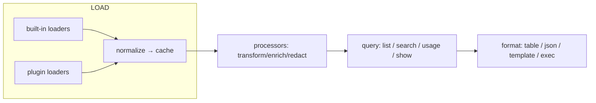

# orgtrack extensibility — custom loaders, scripts & formatters

_Design — 2026-07-19_

## Goal

Let users add three things to the `orgtrack` CLI **without recompiling it**:

1. **Loaders** — read sessions from a tool orgtrack doesn't support yet (a new
   agent, an in-house CLI, a proprietary store).
2. **Scripts (processors)** — transform / enrich / filter / redact loaded
   sessions before they're indexed or shown.
3. **Formatters** — render query results (`list` / `usage` / `show`) in a custom
   format (markdown, CSV, HTML, a team template).

Non-goals: a general plugin runtime, dynamic Rust loading (`dlopen`), or
capturing live sessions (that's the desktop app's hook path, out of scope here).

## Where each kind hooks into the pipeline



The key insight: **orgtrack already has the seams.** We formalize them rather
than invent them.

## The three implementation tiers

Extensibility is offered at three levels of effort/power. Most needs are met by
the lowest tier.

### Tier 0 — Declarative loader (no code)

`omp` and `qoder_cli` are already **pure config** over the generic
`anthropic_jsonl` loader — they declare a source id, a session prefix, candidate
root paths, and a parser version, and the generic loader does all parsing. Any
tool that stores Claude/Anthropic-style JSONL transcripts (a large and growing
class) needs _zero_ code.

We expose that config as a manifest. A `plugin.toml` of `kind = "loader"`,
`format = "anthropic-jsonl"`:

```toml
[plugin]
id     = "acme_agent"          # stable source id (a-z0-9_)
label  = "ACME Agent"
kind   = "loader"
format = "anthropic-jsonl"     # use the built-in generic JSONL reader

[loader]
session_prefix = "acme-"
parser_version = 1
# ~ and ${ENV} expand; globs allowed. First existing wins, all are scanned.
roots = [
  "~/.acme/agent/sessions",
  "${XDG_STATE_HOME}/acme/sessions",
]
exclude_subagent_dirs = false
```

The CLI maps this straight onto an `AnthropicJsonlSource { source, session_prefix,
provider_slug, display_name, parser_version, candidate_roots, exclude_subagent_dirs }`
and registers it. `list`/`search`/`usage`/`show` all work with no further code
because the output is the same `ImportedHistorySessionRow` + `ActivityChunk`
shape the built-ins produce.

Add more built-in `format` readers over time (`openai-jsonl`, `sqlite-table`,
`vscode-state`) so more tools become config-only.

### Tier 1 — Script loader (out-of-process, any language)

For stores the declarative readers can't parse, a plugin is **any executable**
that speaks a small JSON protocol. This is the "scripts" story — Python, Node,
Go, bash, whatever.

```toml
[plugin]
id     = "acme_agent"
label  = "ACME Agent"
kind   = "loader"
format = "exec"
exec   = "./scan.py"           # run with CWD = manifest dir
protocol = 1
```

Contract (stdin/stdout JSON, one call per verb):

- `orgtrack` invokes `./scan.py scan` with a request on stdin:
  ```json
  { "protocol": 1, "verb": "scan", "workspace": null, "since_ms": null }
  ```
- The plugin writes a response on stdout:
  ```json
  {
    "protocol": 1,
    "source": "acme_agent",
    "sessions": [
      {
        "sourceSessionId": "9f2c…",
        "name": "Refactor auth module",
        "createdAtMs": 1752900000000,
        "updatedAtMs": 1752900450000,
        "model": "acme-large",
        "inputTokens": 40210,
        "outputTokens": 8123,
        "cacheReadTokens": 220000,
        "cacheWriteTokens": 15000,
        "repoPath": "/Users/me/code/app",
        "branch": "feature/auth",
        "filesChanged": 6,
        "linesAdded": 210,
        "linesRemoved": 45,
        "touchedFiles": ["src/auth.ts", "src/db.ts"],
        "sourcePath": "/Users/me/.acme/agent/sessions/9f2c.json",
        "parentSessionId": null,
        "listable": true
      }
    ]
  }
  ```
- For `show`, `orgtrack` invokes `./scan.py load` with
  `{ "verb": "load", "sourceSessionId": "9f2c…" }` and expects a stream of
  activity chunks:
  ```json
  {
    "protocol": 1,
    "chunks": [
      {
        "createdAt": "2026-07-19T09:44:20Z",
        "actionType": "raw",
        "function": "user_message",
        "result": {
          "message": { "role": "user", "content": "add rate limiting" }
        }
      },
      {
        "createdAt": "2026-07-19T09:44:31Z",
        "actionType": "tool_call",
        "function": "run_command_line",
        "args": { "cmd": "npm test" },
        "result": { "observation": "…" }
      }
    ]
  }
  ```

The response session schema is **exactly the public projection of**
`ImportedHistoryCacheInput` (camelCase), minus the fields the CLI derives
itself (`sessionId` = `session_prefix + sourceSessionId`, `sourceFingerprint`,
`sourceMtimeMs`, `sourceSizeBytes` — the CLI stats `sourcePath`, or the plugin
may supply them to control incrementality). `chunks` is exactly the serialized
`core_types::activity::ActivityChunk`. Defining the wire types as a **stable,
versioned projection** (not the internal structs directly) keeps internal
refactors from breaking plugins.

The CLI ingests `sessions` via the existing
`imported_history::cache::sync_source_cache_from_conn(conn, source, live_ids,
inputs)` — the same primitive every built-in loader already uses — so plugin
sessions land in `imported_history_session_cache` + `imported_history_round_usage`
and flow through analytics identically.

### Tier 2 — Rust loader (compiled, first-party / performance)

For loaders that ship with orgtrack or need full speed/type-safety, implement
the existing `SourceAdapter` trait (canonical records) — the same contract
`orgii_cli` and `orgii_rust_agents` already implement — or the imported-history
`list_*_history_sessions_paginated` shape, and add one line to the registry.
This is a PR against core, not a drop-in, but it's how the community grows the
built-in set. (See "Registry integration".)

## Processors (scripts)

A processor is an executable that receives the loaded session set (or a single
session's chunks) on stdin and returns a modified set on stdout. Registered and
ordered in config; run after load, before persist/query.

```toml
[plugin]
id   = "redact-secrets"
kind = "processor"
exec = "./redact.py"
protocol = 1

[processor]
stage  = "session"     # "session" (metadata rows) | "chunk" (per-session content)
scope  = ["*"]         # source ids this applies to, or "*"
mutates = true         # declare intent; read-only processors can run in parallel
```

Protocol: stdin `{ "protocol": 1, "stage": "session", "sessions": [...] }` →
stdout `{ "protocol": 1, "sessions": [...] }` (same schema; a processor may drop,
add fields to `sourceMetadataJson`, rewrite `name`, or filter). A `chunk`-stage
processor gets `{ "sessionId", "chunks": [...] }` and returns `{ "chunks": [...] }`
— this is where redaction/enrichment of conversation content lives.

Common uses: redact secrets before indexing, tag sessions from branch names,
drop noise sessions, compute a custom metric into metadata.

## Formatters

Three sub-tiers, resolved by `--format <name>`:

1. **Built-in:** `table` (default), `json`.
2. **Template (no code):** a manifest pointing at a
   [minijinja](https://docs.rs/minijinja) template rendered against the result
   JSON. Covers markdown/CSV/HTML.
   ```toml
   [plugin]
   id = "md"
   kind = "formatter"
   format = "template"
   template = "session.md.j2"
   inputs = ["list", "show", "usage"]   # which result shapes it accepts
   ```
   ```jinja
   {# session.md.j2 #}
   
   ## {{ s.name }}  ·  {{ s.source }}  ·  {{ s.updatedAt }}
   - model: {{ s.model }} · tokens: {{ s.totalTokens }} · files: {{ s.filesChanged }}
   
   ```
3. **Exec:** `format = "exec"`, `exec = "./fmt.py"`; the CLI pipes the result
   JSON to stdin and prints stdout verbatim. For anything a template can't do.

The CLI always builds the same canonical result JSON it emits for `--json`;
formatters consume that. So `--format` is orthogonal to the command and reuses
the JSON we already produce.

## Discovery & precedence

Plugins are directories, each with a `plugin.toml`, discovered in:

1. `$ORGTRACK_PLUGIN_PATH` (colon-separated), if set — highest precedence.
2. `./.orgtrack/plugins/*/` — **project-scoped** (see Security).
3. `~/.orgtrack/plugins/*/` — user-scoped.
4. `<bin dir>/../share/orgtrack/plugins/*/` — bundled.

Later entries lose to earlier on id collision. `orgtrack plugins list` shows id,
kind, source dir, trust state, and validity (manifest parse + exec exists).

## Registry integration

`RegisteredSource` becomes an enum so the registry holds built-ins and plugins
uniformly:

```rust
pub enum SourceImpl {
    Builtin(ScanFn),                       // today's fn pointer
    DeclarativeJsonl(AnthropicJsonlSource), // Tier 0
    Exec(PluginManifest),                  // Tier 1
}
pub struct RegisteredSource { pub id: String, pub label: String, impl_: SourceImpl }
```

`scan_source` matches the variant: call the fn, run the generic JSONL loader
with the config, or exec the plugin + ingest. `registered_sources()` returns
built-ins ∪ discovered plugins. Two required changes in core:

- `sync_source_cache_from_conn` takes `source: &'static str`; plugin ids are
  runtime strings. Intern them once (`Box::leak` into a process-lifetime set, or
  relax the signature to `&str`). Bounded set → leaking is fine.
- **`show` routing.** `imported_history::load_activity_chunks_for_session`
  routes by a hardcoded prefix→loader enum, which won't know plugin prefixes.
  Fix: the CLI checks the plugin registry first for `show` (re-exec the plugin's
  `load` verb, freshest), and only falls back to core's router for built-ins.
  Optionally cache plugin chunks in a generic `imported_history` chunk table so
  `show --no-scan` works offline.

## Trust & security model (required, not optional)

Running discovered executables is code execution. **A plugin is never executed
until trusted.**

- **First use is inert.** A newly discovered `exec`/`template`/`processor`
  plugin is listed but **skipped with a warning** until the user runs
  `orgtrack plugins trust <id>`. Tier 0 declarative loaders (no code, just paths)
  may be exempt or lightly trusted since they only read files.
- **Trust is pinned to a hash** of the manifest + referenced exec/template
  bytes, recorded in `~/.orgtrack/trust.json`. Any change re-arms the prompt.
- **Project plugins are guilty until proven.** `./.orgtrack/plugins` means
  cloning a repo could ship code. They are **off by default**; require
  `--allow-project-plugins` (or per-id trust) and never inherit user-scope
  trust. This mirrors editor "workspace trust".
- **Bounded execution.** Reuse the existing per-source `--timeout` for loaders;
  add a processor/formatter timeout. Kill on overrun.
- **Environment hygiene.** Run with a scrubbed env (no secrets/tokens passed
  through), CWD = manifest dir, no network expectation. Document that plugins
  read local stores; they are not a place to phone home.
- **Least privilege by kind.** Loaders/processors get the request on stdin only;
  they don't receive the SQLite handle. All ingestion goes through the CLI's
  validated `sync_source_cache_from_conn` path, so a plugin can't write
  arbitrary tables.

## Versioning & compatibility

- Every wire payload carries `"protocol": <int>`. The CLI advertises the max it
  supports; a plugin declaring a newer protocol is skipped with a clear message.
- The session/chunk projections are **additive-only** within a protocol version;
  unknown fields are ignored (forward-compatible plugins).
- `parser_version` per loader already exists and drives cache invalidation —
  a plugin bumping it forces a re-parse, same as built-ins.

## CLI surface changes

```
orgtrack plugins list                 # discovered plugins + trust/validity
orgtrack plugins trust <id>           # pin-trust a plugin by content hash
orgtrack plugins test <id>            # dry-run a loader/formatter, validate output
orgtrack scan   --source acme_agent   # plugin loaders are just source ids
orgtrack list   --format md           # built-in / template / exec formatter
orgtrack usage  --format csv --allow-project-plugins
orgtrack ...    --no-plugins          # escape hatch: built-ins only
```

Config file `~/.orgtrack/config.toml` for durable choices (enabled processors +
order, default `--format`, trusted ids).

## Phased implementation plan

1. ✅ **Formatters (built-in tier)** — `--format table|json|md|csv` for
   `list` / `usage` / `show`, giving portable markdown/CSV export. _Shipped._
   (User template + exec formatters still to come — see below.)
2. ✅ **Tier 0 declarative loaders** — `plugin.toml` → `AnthropicJsonlSource`,
   discovery under `~/.orgtrack/plugins` + `$ORGTRACK_PLUGIN_PATH`, plugin-aware
   scan/list/search/show dispatch, `orgtrack plugins list`, `--no-plugins`.
   _Shipped._ (Core change: `anthropic_jsonl` is now public with owned roots.)
3. ✅ **Trust store + `plugins trust`** — `~/.orgtrack/trust.json` keyed by
   plugin id → sha256(manifest + exec). Exec plugins are inert until trusted;
   trust re-arms on any change. Declarative JSONL plugins are exempt (code-free).
   _Shipped._
4. ✅ **Tier 1 exec loaders** — `format = "exec"`, the `scan` / `load` JSON
   protocol over stdin/stdout, ingest via `sync_source_cache_from_conn`,
   `show` routing, scrubbed env + CWD + timeout-kill (no orphaned children).
   _Shipped._ (Processors — the transform/enrich/redact stage — still to come.)
5. ✅ **Processors** — `kind = "processor"` exec plugins, trust-gated. A
   `session` stage reshapes `list`/`search` rows; a `chunk` stage reshapes a
   `show`'s chunks (redact/enrich/filter/rename). Display-path only; chains in
   order; failing/untrusted is a data-preserving no-op. _Shipped._
6. ✅ **Template formatters** — `kind = "formatter"`, `format = "template"`:
   `--format <id>` renders the command's result JSON through a sandboxed
   minijinja template (no code, no fs/network → no trust). Context is the
   `--format json` shape per command. _Shipped._ (Exec formatters remain
   redundant with piping `--format json`; skipped.)
7. **Tier 2 + schema** — document the `SourceAdapter` PR path; extract the wire
   projections into a small `orgtrack-plugin-schema` crate/JSON-Schema so plugin
   authors in any language have a spec + fixtures to test against.

### Follow-ups surfaced during Phase 1

- **All-sources `usage`.** The `usage_dashboard` scopes the default view to four
  hardcoded buckets (`claude`/`codex`/`cursor`/`org2`); every other source —
  long-tail built-ins _and_ plugins — falls into an excluded `other` bucket. So
  plugin sessions index and appear in `list`/`search`/`show` but not in the
  default `usage`. A core addition (an "include other / all buckets" scope on
  `UsageFilter`) would let the CLI report usage for every source.

## Open recommendations

- **Wire schema home:** define the plugin projections in a dedicated, published
  schema (JSON Schema + a thin Rust crate) rather than reusing
  `orgtrack_protocol` (that crate is interaction-metadata sync, a different
  concern). Ship fixtures so non-Rust authors can self-test.
- **Prefer Tier 0/template first.** Most "custom loader/formatter" asks are a new
  JSONL path or a markdown/CSV shape — both no-code. Reserve exec plugins for the
  genuinely custom, where the trust cost is justified.
