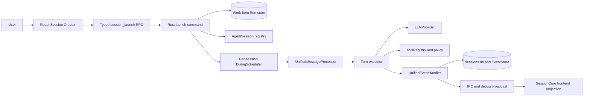
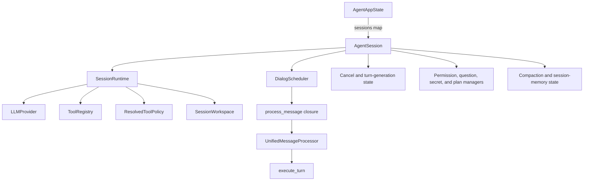

# Native-agent execution kernel

## Responsibility and boundary

ORG2's native-agent kernel turns one accepted session message into a serialized sequence of provider calls, tool calls, durable events, and frontend updates.

This record covers the interactive `rust_agent` path. It starts at Session Creator launch and ends at the kernel's persistence and event boundaries. It does not claim parity with external CLI sessions, imported history, or full Agent Org coordination.

All material claims are Source-observed at revision `b315ba4f82fb1fe294496793d7322095e7efe262`. Diagrams and pseudocode are Derived views of the cited source. No live provider request ran for this record.

## System context



The diagram shows ownership order, not one synchronous call stack. A normal launch can return after it spawns initial-turn submission. A durable work-item launch waits until the scheduler accepts the turn before it acknowledges delivery.

## Container and dependency view

| Container or layer | Current owner | Responsibility | May depend on |
| --- | --- | --- | --- |
| Session creation UI | `src/features/SessionCreator/`, `src/engines/SessionCore/hooks/session/useSessionCreator/` | Validate user input, expand context pills, resolve model and workspace selection, and construct launch fields. | Frontend state, Tauri API types, context collectors. |
| Typed frontend boundary | `src/api/tauri/agent/session.ts`, `src/api/tauri/rpc/` | Validate the RPC shape and expose `session_launch` to TypeScript. | Generated or declared schemas and Tauri transport. |
| Tauri application boundary | `src-tauri/crates/agent-core/src/state/commands/session/` | Validate launch fields, route session category, resolve identity, and adapt frontend requests to core launch and message services. | Core session services, project management, persistence, app state. |
| Session domain and application services | `src-tauri/crates/agent-core/src/core/session/` | Create sessions, own conversation lifecycle, construct prompts, schedule messages, and coordinate turn processing. | Provider, tool, specialization, coordination, and foundation services. |
| Generic agentic loop | `src-tauri/crates/agent-core/src/core/turn_executor/` | Execute ordered provider and tool iterations with cancellation and recovery. | Provider and tool contracts plus event-handler callbacks. |
| Provider and tool strategies | `src-tauri/crates/agent-core/src/core/providers/`, `src-tauri/crates/agent-core/src/core/tools/` | Adapt model APIs, expose tool schemas, apply policy, and execute requested effects. | Foundation services and registered integrations. |
| Foundation | `src-tauri/crates/agent-core/src/foundation/` | Supply persistence, event transport, security support, and shared infrastructure without depending on upper agent layers. | External crates and shared low-level modules. |
| Frontend projection | `src/engines/SessionCore/` | Load durable session state and project live events into chat, tool, replay, and simulator views. | Tauri APIs, frontend atoms, rendering registries. |

The repository's own [agent-core architecture map](src-tauri/crates/agent-core/src/ARCHITECTURE.md#2-layered-structure) describes `state → integrations/intelligence → core → foundation` as its intended direction and allows a narrow `core ↔ intelligence` capability relationship. Direct source confirms the main construction and execution boundaries used in this slice.

## Kernel object graph and state ownership



| State | Authoritative owner | Lifetime and rule |
| --- | --- | --- |
| Active session registry | `AgentAppState.sessions` | One map stores each `Arc<AgentSession>`; the app state forbids parallel maps for per-session resources. |
| Session identity and mutable execution state | `AgentSession` | Owns the runtime slot, cancel flag, scheduler, steering queue, managers, compaction, active turn, caches, and session-scoped background state. |
| Resolved runtime dependencies | `SessionRuntime` | One session gets one provider, tool registry, base policy, resolved agent snapshot, integrations snapshot, and shared workspace state. Most fields remain fixed after initialization; workspace roots remain live through a shared lock. |
| Turn serialization | `DialogScheduler` | One lazy worker consumes a bounded FIFO queue for one session. It rejects overflow, coalesces duplicate client message IDs, and skips invalidated queue generations. |
| Mid-turn steering | `AgentSession.steering_queue` | Plain user text received during an active turn can enter the current loop before the next provider iteration instead of waiting as a new turn. |
| Provider conversation frame | `UnifiedMessageProcessor` and the mutable `messages` vector | The processor assembles stable and dynamic system sections, durable history, current user content, and tool results for one turn. |
| Tool availability and approval | `ToolRegistry`, `ResolvedToolPolicy`, `AgentPermissionManager` | Registration controls which ready tools exist; base and execution-mode policy returns Allow, Deny, or Ask; the permission manager resolves Ask. |
| Durable session transcript | `sessions.db` tables and event pipeline | Session rows, ordered messages, tool records, snapshots, todos, work-item linkage, and event projections survive process lifetime. |
| Frontend view state | SessionCore atoms and event projection | The frontend owns display and navigation state, but it does not own native-agent execution or the durable transcript. |

Primary state definitions: [`AgentAppState`](src-tauri/crates/agent-core/src/state/unified.rs#L24), [`SessionRuntime` and `AgentSession`](src-tauri/crates/agent-core/src/state/session_runtime.rs#L35), and [`DialogScheduler`](src-tauri/crates/agent-core/src/core/session/scheduler.rs#L170).

## Construction path

The following pseudocode removes transport and UI details but preserves the current ownership order.

```text
PSEUDOCODE — interactive native-agent launch

validate composer and secret-scan input
project display text and context pills into agent content
resolve account, model, workspace, mode, and optional work-item context
call session_launch(params)

if params contains work_item_id and has no durable_run_id:
    create and claim a manual WorkItemRun
    attach its durable_run_id to params

validate category and workspace selection
translate params into AgentRunLaunchRequest
create the durable session row
if project work item:
    acquire its execution lock
prepare local workspace or worktree
write the fail-closed session marker

if initial content exists and no equivalent durable turn was accepted:
    submit send_initial_turn
    if launch is durable:
        await scheduler acceptance before acknowledging delivery
    else:
        spawn submission and return
```

The owning source is [`useSessionLaunch()`](src/engines/SessionCore/hooks/session/useSessionCreator/useSessionLaunch/index.tsx#L148), [`session_launch_impl()`](src-tauri/crates/agent-core/src/state/commands/session/launch.rs#L140), and [`launch_rust_agent_run()`](src-tauri/crates/agent-core/src/core/session/launch/mod.rs#L403).

## Execution collaborations

### Session aggregate and runtime factory

`AgentSession` acts as the per-conversation aggregate root. `AgentAppState` exposes it through one sessions map, and all session-owned locks, managers, queues, and runtime resources hang from that object.

`build_session_runtime()` acts as a factory. It selects one `LLMProvider`, registers built-in and MCP tools, and returns the base `ResolvedToolPolicy`. Session initialization adds resolved agent and integration snapshots before it stores the `SessionRuntime` on the session.

This split lets many sessions use different models, accounts, tools, policies, and workspaces in one process. Its cost is a large aggregate with several synchronized sub-states and a short initialization window where `AgentSession.runtime` is `None`.

Sources: [`session_runtime.rs`](src-tauri/crates/agent-core/src/state/session_runtime.rs#L35) and [`session_factory.rs`](src-tauri/crates/agent-core/src/init/session_factory.rs#L27).

### Provider strategy

`LLMProvider` defines provider-neutral chat and streaming operations, cancellation, side-query behavior, and session context. The turn executor receives `&dyn LLMProvider`; provider selection occurs before the turn starts.

This design keeps the loop independent from Anthropic, OpenAI-compatible, Responses, or Codex wire formats. Provider-specific request conversion and recovery remain outside the loop, while the loop still owns common ordering and tool continuation.

Source: [`LLMProvider`](src-tauri/crates/agent-core/src/core/providers/traits.rs#L436).

### Tool registry plus layered policy

Each `Tool` supplies a name, description, JSON Schema, readiness state, and asynchronous execution. `ToolRegistry` stores tools by name, supports a fallback registry, filters unready tools from provider definitions, and emits schemas in stable order. `ResolvedToolPolicy` evaluates Allow, Deny, or Ask and composes an execution-mode layer for each turn.

The registry controls availability; policy controls permission. Keeping these decisions separate prevents a denied tool from appearing as merely unavailable and permits user approval without rebuilding the registry.

Sources: [`Tool`](src-tauri/crates/agent-core/src/core/tools/traits.rs#L88), [`ToolRegistry`](src-tauri/crates/agent-core/src/core/tools/registry.rs#L75), and [`ResolvedToolPolicy`](src-tauri/crates/agent-core/src/core/tools/policy.rs#L200).

### Serialized actor-like session worker

`DialogScheduler` gives each session one lazy worker and one bounded queue. The worker moves accepted intents from queued to running and then completed or failed. A generation counter invalidates pending messages without replacing the worker. A separate steering queue lets an active turn receive plain-text course corrections.

This collaboration resembles an actor mailbox, but the source does not define an Actor abstraction. The precise claim is one queue and one worker per session, with additional shared state on `AgentSession`.

Sources: [`send_message_impl()`](src-tauri/crates/agent-core/src/state/commands/session/message/send.rs#L68) and [`DialogScheduler`](src-tauri/crates/agent-core/src/core/session/scheduler.rs#L175).

### Event and persistence sink

`UnifiedEventHandler` implements the turn loop's callback contract. It persists assistant, tool-call, tool-result, and steering-message data; manages retractable streamed segments; takes file snapshots; runs hooks and diagnostics; pushes EventStore rows; and broadcasts live updates.

The generic bus uses bounded Tokio channels and an inversion-of-control function slot for frontend broadcast, which avoids a compile-time dependency from the kernel into the application WebSocket layer. The SQLite schema stores ordered message rows and adds session attributes through idempotent migrations.

Sources: [`UnifiedEventHandler`](src-tauri/crates/agent-core/src/core/session/turn/event_handler/mod.rs#L1), [`foundation::bus`](src-tauri/crates/agent-core/src/foundation/bus/mod.rs#L18), and [`session_snapshots`](src-tauri/crates/agent-core/src/foundation/persistence/session_snapshots.rs#L50).

## Work-item context crosses three boundaries

ORG2 does not reduce work-item integration to one prompt string or one foreign key.

| Channel | Content | Consumer | Purpose |
| --- | --- | --- | --- |
| Composer context pill | Title, status, priority, labels, description, and todos | Model-facing user content projection | Gives the model readable task content at launch. |
| Structured launch fields | Organization, project, work-item ID, role, product mode, and definition or mode overrides | Launch, project-management, session, lock, and durable-run services | Binds execution to durable ownership and lifecycle machinery. |
| Dynamic system section | Linked item identity, scope rules, `org2-pm` commands, and delivery obligations | Provider prompt for project-mode linked sessions | Keeps work-management rules visible on later turns and after persistence reload. |

The structured fields do not enter the provider protocol as a separate work-item object. Backend prompt construction converts selected persisted fields into model-visible text. This preserves typed internal ownership while keeping provider interfaces generic.

Sources: [`workItemPickerModel.ts`](src/features/SessionCreator/variants/ChatPanel/workItemPickerModel.ts#L61), [`useSessionLaunch()`](src/engines/SessionCore/hooks/session/useSessionCreator/useSessionLaunch/index.tsx#L187), and [`render_linked_work_item_context()`](src-tauri/crates/agent-core/src/core/session/turn/processor/prompt.rs#L63).

## Kernel invariants

1. `AgentAppState.sessions` is the only in-memory registry for per-session aggregate resources.
2. One session worker executes at most one queued job at a time; queue generation invalidates work accepted under an older control boundary.
3. Each initialized session has its own provider, registry, base policy, and resolved configuration snapshot.
4. Tool readiness, registration, policy verdict, and user approval are distinct gates.
5. The turn executor owns the provider-and-tool iteration order; event handlers observe and persist effects through callbacks.
6. A durable work-item launch does not acknowledge delivery before its initial turn reaches scheduler acceptance.
7. Work-item identity and scope remain durable session state and can regenerate prompt guidance on later turns.
8. Cancellation must stop live event emission at the Rust boundary; frontend filtering is not the authority.

## Design choices and tradeoffs

| Choice | Benefit | Cost or limit |
| --- | --- | --- |
| One typed `session_launch` boundary for native and CLI categories | Gives the frontend one launch contract and shared result shape. | The backend still branches into materially different runtimes; a shared command does not prove behavioral parity. |
| Per-session provider, tools, and policy | Supports concurrent sessions with different models, workspaces, and access rules. | Session initialization and memory use scale with active sessions. No performance claim is made here. |
| Bounded FIFO scheduler plus steering buffer | Serializes durable turns while permitting an active turn to change course. | Steering and queued submission have different lifecycle and persistence paths that callers must distinguish. |
| Typed work-item metadata plus prompt projections | Keeps lifecycle ownership typed while giving the model readable task and delivery context. | Three representations can drift; current source must keep pill text, session fields, and dynamic guidance consistent. |
| Spawn normal initial submissions, await durable submissions | Keeps ordinary launch responsive and closes the durable-delivery crash window. | Launch success means different things unless callers inspect whether the request used a durable run. |
| Event handler owns both persistence and live emission | Preserves one ordering point for transcript and UI events. | The handler has many cross-cutting responsibilities and needs careful turn-generation and retry guards. |
| Idempotent `ALTER TABLE` schema evolution | Avoids a separate migration framework and tolerates repeated startup. | Schema history and rollback intent are less explicit than numbered migrations. |

## Known limits

- This record does not verify a live model request, tool execution, cancellation, or persistence recovery.
- It does not map every frontend event to its reducer or rendered component.
- It does not claim that Agent Org workers, background sessions, or external CLI sessions follow every native interactive branch.
- It does not establish transaction boundaries for all message and EventStore writes.
- It does not evaluate whether the large `AgentSession` aggregate or `UnifiedEventHandler` should be split; it only records current ownership.
- The repository architecture map is supporting documentation. Direct code remains the authority when the two differ.

## Source map

| Concern | Primary source |
| --- | --- |
| Frontend input projection | `src/engines/SessionCore/hooks/session/useSessionCreator/useSessionLaunch/inputPreparation.ts` |
| Frontend launch orchestration | `src/engines/SessionCore/hooks/session/useSessionCreator/useSessionLaunch/index.tsx` |
| RPC contract | `src/api/tauri/agent/session.ts`, `src/api/tauri/rpc/procedures/agentSession.ts` |
| Launch routing | `src-tauri/crates/agent-core/src/state/commands/session/launch.rs` |
| Core launch service | `src-tauri/crates/agent-core/src/core/session/launch/mod.rs` |
| Session and runtime ownership | `src-tauri/crates/agent-core/src/state/session_runtime.rs`, `src-tauri/crates/agent-core/src/state/unified.rs` |
| Runtime construction | `src-tauri/crates/agent-core/src/init/session_factory.rs`, `src-tauri/crates/agent-core/src/init/mod.rs` |
| Turn submission and queue | `src-tauri/crates/agent-core/src/state/commands/session/message/send.rs`, `src-tauri/crates/agent-core/src/core/session/scheduler.rs` |
| Prompt construction | `src-tauri/crates/agent-core/src/core/session/turn/processor/prompt.rs` |
| Turn execution | `src-tauri/crates/agent-core/src/core/session/turn/entry.rs`, `src-tauri/crates/agent-core/src/core/session/turn/processor/execute.rs`, `src-tauri/crates/agent-core/src/core/turn_executor/execute.rs` |
| Provider contract | `src-tauri/crates/agent-core/src/core/providers/traits.rs` |
| Tool contract and policy | `src-tauri/crates/agent-core/src/core/tools/traits.rs`, `registry.rs`, `policy.rs` |
| Event and persistence boundary | `src-tauri/crates/agent-core/src/core/session/turn/event_handler/`, `src-tauri/crates/agent-core/src/foundation/bus/`, `src-tauri/crates/agent-core/src/foundation/persistence/session_snapshots.rs` |

## Conformance note

This record is ready for the first-slice cross-record check after the interface and runtime records exist. Until then, it satisfies the architecture task's content boundary but has no passing G-ORG2-REF-001-VER002 run.
