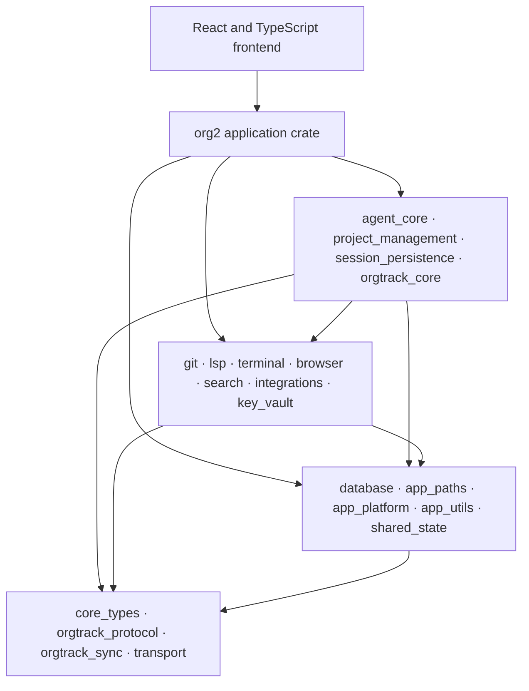
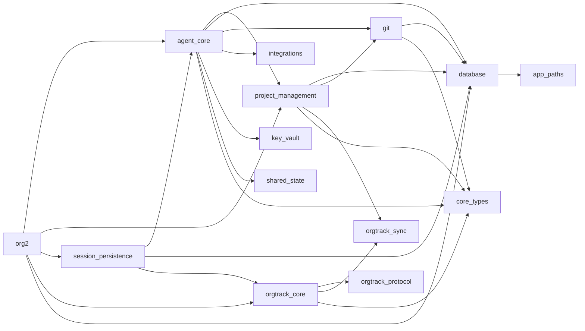

# ORG2 package dependencies

## Scope and evidence

This record explains the direct package structure that an engineer must preserve when they change ORG2. It covers the single frontend package and the local Rust workspace packages.

The dependency inventory comes from `cargo metadata --manifest-path src-tauri/Cargo.toml --format-version 1 --no-deps` at revision `b315ba4f82fb1fe294496793d7322095e7efe262`. Responsibility and layering are Derived from direct edges, public modules, and the application composition root. Test-only edges do not define the production layering in this record.

## Package shape

- The frontend is one pnpm workspace package rooted at the repository.
- The Rust workspace contains 43 local packages, including the `org2` application package.
- The `org2` package is the native composition root and directly depends on 32 local packages.
- `agent_core`, `project_management`, `session_persistence`, and `orgtrack_core` hold the largest product-domain boundaries.
- Small packages such as `app_paths`, `app_platform`, `core_types`, `transport`, and `orgtrack_protocol` provide lower-level contracts.

## Derived dependency layers



This diagram groups packages by responsibility. Cargo does not declare these layer names.

## Direct core graph



The graph shows an important asymmetry: `session_persistence` depends on `agent_core`, but `agent_core` does not directly depend on `session_persistence`. The application registers a narrow persistence bridge at startup so agent runtime code can use persistence without a reverse Cargo edge.

## Selected package inventory

| Package | Direct local dependencies | Role in the architecture |
| --- | --- | --- |
| `org2` | `agent_core`, `project_management`, `session_persistence`, `orgtrack_core`, workstation and infrastructure crates | Native application composition root, Tauri commands, and managed process state. |
| `agent_core` | `project_management`, `database`, `git`, `integrations`, `key_vault`, `browser`, `lsp`, `search`, `terminal`, `settings`, `shared_state`, foundation packages | Native agent definitions, sessions, prompt/provider/tool loop, coordination, and runtime policy. |
| `project_management` | `database`, `git`, `orgtrack_sync`, `search`, `core_types`, paths and utilities | Project intent, Work Items, durable Runs, routines, dispatch, sync, and work views. |
| `session_persistence` | `agent_core`, `database`, `orgtrack_core`, `core_types`, `app_paths` | Session events, turn intents, indexes, usage, and session metadata. |
| `orgtrack_core` | `core_types`, `orgtrack_protocol`, `orgtrack_sync`, `app_paths` | Canonical cross-tool history, source adapters, usage, replay, and repository evidence. |
| `integrations` | `project_management`, `git`, `core_types`, paths, platform, utilities | External services and computer-use integration. |
| `key_vault` | `integrations`, `orgtrack_core`, `core_types`, paths, platform, utilities | Credential lookup and provider/account material. |
| `git_api` | `agent_core`, `project_management`, `git`, `key_vault`, `app_platform` | API-facing Git operations that need agent and project context. |
| `git` | `database`, `core_types`, `app_paths` | Repository operations, repository persistence, and watchers. |
| `browser` | `app_window`, `perf_utils`, `shared_state` | Browser and webview behavior behind shared process state. |
| `database` | `app_paths` | SQLite connection configuration, pooling, schema callbacks, and writer coordination. |
| `app_paths` | `app_platform` | Stable application-data and executable paths. |
| `core_types` | none | Shared wire and domain-neutral value types. |
| `orgtrack_protocol` | none | Cross-repository evidence protocol values. |
| `orgtrack_sync` | none | Sync records and redaction/approval values without product dependencies. |
| `transport` | none | Transport-level primitives. |

The full Cargo metadata is the authoritative edge list. This table selects dependencies that explain implementation boundaries.

## Executable leaves

The workspace also contains narrow executables:

| Executable package | Direct product dependency | Intended boundary |
| --- | --- | --- |
| `orgtrack-pm-cli` | `project_management`, `database` | External project and Work Item protocol. |
| `orgtrack_cli` | `orgtrack_core`, `core_types` | Standalone cross-tool history scan and analysis. |
| `bin_provider_key_check` | `key_vault` | Provider credential check. |
| `bin_telegram_smoke` | `agent_core` | Focused Telegram smoke path. |
| `bin_gateway_chat_cli` | none local | Narrow gateway-chat entry. |
| `e2e-test` | `agent_core` | Separate end-to-end test package, kept out of normal application checking. |

These packages reuse domain code but do not import the application composition root.

## Frontend dependency boundary

The frontend has no internal npm package graph. Source modules share one TypeScript configuration and one Webpack build. Architectural boundaries therefore rely on directories, public module surfaces, typed Tauri wrappers, lint rules, circular-dependency checks, and review rather than package-manager enforcement.

The main frontend-to-native dependency follows this order:

```text
feature or engine
  -> typed API wrapper
  -> generated or named Tauri procedure
  -> registered Rust command
  -> owning Rust domain/service
```

Frontend rendering has its own registry under `SessionCore`. A renderer can change presentation for an event or tool, but it cannot add backend authority.

## Composition and dependency inversion

The application crate registers callbacks and bridges before it starts dependent services. This pattern avoids reverse package edges for cross-cutting behavior.

Observed examples include:

- The application registers schema initializer functions with `database`; the database crate does not import every schema owner.
- The application registers persistence functions so `agent_core` does not import `session_persistence`.
- The application registers event-pipeline functions so `agent_core` can publish events without importing the app-owned pipeline.
- The application registers extractor behavior so `core_types::SessionEvent` can derive UI data without importing the extractor implementation.
- The application registers bus callbacks so the agent core can publish to frontend transports without importing the API/WebSocket layer.
- The application registers settings, Git, and integration hooks before watchers or runtimes use them.

These bridges use narrow function contracts or process stores. They trade compile-time directness for an acyclic package graph and a testable leaf layer.

## Dependency rules

An implementation change should preserve these observed rules:

1. Shared value types must not import a product service.
2. Database connection plumbing must not import domain schemas.
3. A standalone CLI must depend on its domain library, not the Tauri application.
4. The application crate may compose domains, but a lower domain must not import the application crate.
5. Frontend code must use the typed native boundary rather than a direct database or provider connection.
6. UI rendering identity must stay separate from backend tool authorization.
7. A new cross-domain callback should have one registration owner and defined startup order.

Rules 1–6 are supported by the current graph and source boundaries. Rule 7 is Derived from the existing registration pattern.

## Build order and validation

Cargo calculates the exact build order from the direct graph. A useful conceptual order is:

1. Contract and platform leaves: `core_types`, `orgtrack_protocol`, `orgtrack_sync`, `transport`, `app_platform`.
2. Path and utility foundations: `app_paths`, `app_utils`, `database`, `shared_state`, `perf_utils`.
3. Workstation services: Git, browser, terminal, LSP, search, settings, integrations, and key vault.
4. Product domains: project management, orgtrack core, agent core, and session persistence.
5. API adapters, standalone binaries, and the `org2` application crate.

The repository exposes separate checks because one global command would hide which boundary failed:

- `pnpm typecheck`, `pnpm lint`, and `pnpm test` cover frontend contracts and behavior.
- `pnpm check:circular` detects frontend circular imports.
- `pnpm check:unused-exports` identifies unused TypeScript exports.
- `pnpm cargo:check`, `pnpm cargo:clippy`, and `pnpm cargo:test` cover Rust compilation, lint, and behavior.
- GitHub CI and nightly workflows apply different cost and frequency policies.

## Change-impact guide

| Planned change | Start with | Also inspect |
| --- | --- | --- |
| Shared event or activity shape | `core_types` | `agent_core`, `session_persistence`, `orgtrack_core`, frontend adapters and renderers. |
| Database connection or PRAGMA behavior | `database` | Both database schema registration paths and every process that opens the same file. |
| Native agent policy or tools | `agent_core` | Session factory, prompt construction, tool registry, frontend registry, and Tauri commands. |
| Work Item or durable Run behavior | `project_management` | Agent launch/settlement, `org2-pm`, projects schema, outbox, and frontend work views. |
| Imported coding history | `orgtrack_core` | `orgtrack_cli`, session persistence projections, and frontend history views. |
| Provider or credential integration | `integrations` or `key_vault` | Agent runtime factory, settings, network policy, and diagnostic binaries. |
| New Tauri operation | Owning domain plus app command registration | Typed frontend wrapper and command handler list. |
| New frontend renderer | SessionCore registry | Canonical backend identity and extracted event envelope. |

## Known limits

- Cargo metadata proves declared direct dependencies, not runtime call frequency or criticality.
- The groupings do not claim a formal clean-architecture policy.
- This record omits external Rust and npm dependency graphs.
- It does not prove that all inversion-of-control registrations occur before every test or secondary binary path.
- It does not calculate compile time, binary size, or change-coupling metrics.

## Source map

| Concern | Current source |
| --- | --- |
| Rust workspace members and centralized dependencies | [`src-tauri/Cargo.toml`](src-tauri/Cargo.toml) |
| Frontend workspace | [`pnpm-workspace.yaml`](pnpm-workspace.yaml), [`package.json`](package.json) |
| Native composition and bridge registration | [`src-tauri/src/lib.rs`](src-tauri/src/lib.rs), [`src-tauri/src/setup/`](src-tauri/src/setup/) |
| Agent domain surface | [`src-tauri/crates/agent-core/src/`](src-tauri/crates/agent-core/src/) |
| Project-management domain | [`src-tauri/crates/project-management/src/`](src-tauri/crates/project-management/src/) |
| Session persistence | [`src-tauri/crates/session-persistence/src/`](src-tauri/crates/session-persistence/src/) |
| Cross-tool history | [`src-tauri/crates/orgtrack-core/src/`](src-tauri/crates/orgtrack-core/src/) |
| Database inversion and writer boundary | [`src-tauri/crates/database/src/db/`](src-tauri/crates/database/src/db/) |
| Project-management CLI | [`src-tauri/crates/orgtrack-pm-cli/Cargo.toml`](src-tauri/crates/orgtrack-pm-cli/Cargo.toml) |
| History CLI | [`src-tauri/crates/orgtrack-cli/Cargo.toml`](src-tauri/crates/orgtrack-cli/Cargo.toml) |

## Conformance note

This record covers package structure, direct dependency direction, build order, integration boundaries, inversion points, and change impact. It does not turn a derived layer name into a source-declared rule.
