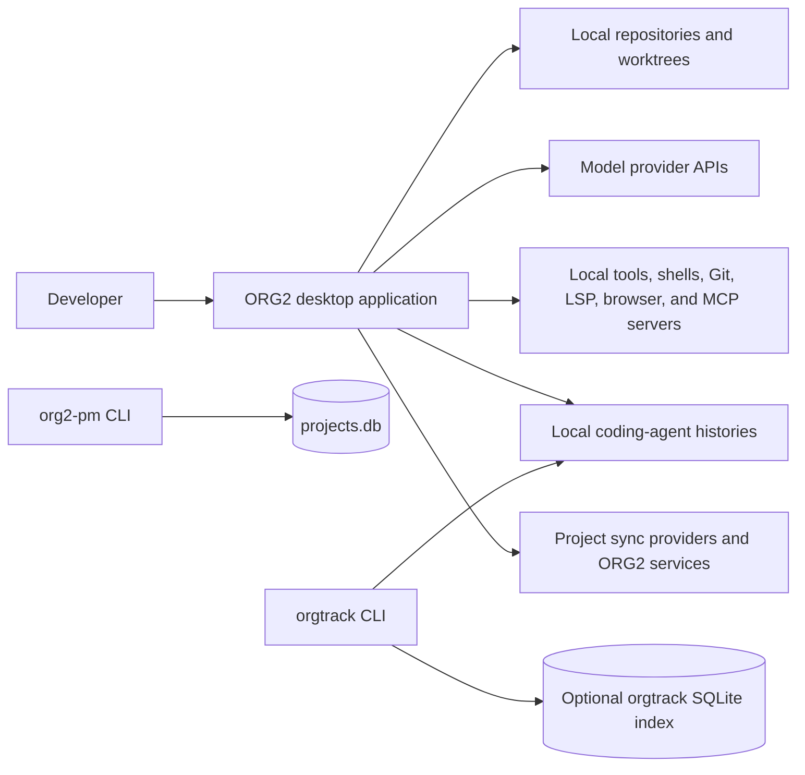
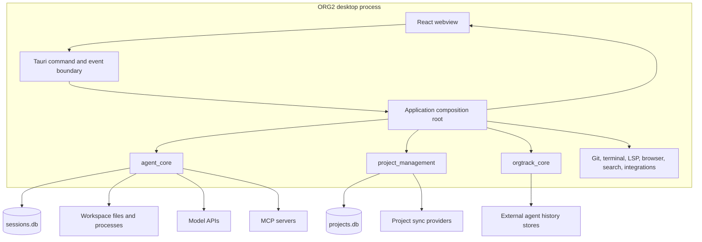

# ORG2 system topology

## Scope and evidence

This record maps ORG2 at system, deployable, and major-component levels. It explains where the desktop UI, native backend, local data, model providers, tools, external histories, and command-line programs meet.

All concrete behavior is Source-observed at revision `b315ba4f82fb1fe294496793d7322095e7efe262`. The diagrams and boundary groupings are Derived from the cited source. This record does not claim a deployed cloud topology or runtime-verified availability.

## System context

ORG2 is a local-first desktop application. The desktop process owns the main user interaction, native-agent execution, workspace effects, and durable local state. Remote systems supply model responses, authentication, updates, and optional project synchronization; they do not replace the local execution kernel.

## Deployable shape

| Deployable part | Current implementation | Responsibility |
| --- | --- | --- |
| Desktop webview | React 19 and TypeScript, bundled by Webpack | Renders sessions, work management, code, terminals, browser surfaces, and user interaction. |
| Native desktop process | Tauri 2 application with a Rust workspace | Owns privileged filesystem, process, database, Git, LSP, browser, integration, and agent-runtime behavior. |
| `org2-pm` binary | `orgtrack-pm-cli` Cargo package | Gives external agents a JSON protocol for project context and work commands. The Tauri bundle includes `binaries/org2-pm`. |
| `orgtrack` binary | `orgtrack_cli` Cargo package | Scans and analyzes histories from supported coding tools without the desktop application. |
| Local durable stores | SQLite databases plus scoped JSON and append-only artifacts | Store sessions, events, project data, settings, agent definitions, shell replays, and indexes. |
| Remote endpoints | Provider, OAuth, sync, update, and optional service endpoints | Supply capabilities that require network access. |

The frontend uses one pnpm workspace package. The Rust backend uses 43 local Cargo packages, including the application crate.

## Runtime containers

### Frontend composition

[`src/index.tsx`](src/index.tsx) is the webview entry point. It resolves the runtime identity, initializes shared authentication storage, logging, localization, theme, Tauri APIs, and background assets before it mounts the application. It treats localization as required and lets some visual initialization degrade with a warning.

Frontend features call typed wrappers around Tauri commands and consume Tauri or WebSocket events. Session rendering routes event and tool names through the registry under [`src/engines/SessionCore/rendering/registry/`](src/engines/SessionCore/rendering/registry/).

### Native composition root

[`src-tauri/src/lib.rs`](src-tauri/src/lib.rs) is the native composition root. Its `run()` function performs these material steps:

1. Resolve the runtime instance and application-data paths.
2. Register database schema initializers and inversion-of-control hooks before a dependent subsystem can start.
3. Repair incomplete shell replay artifacts.
4. Build the Tauri application and install plugins.
5. Register the generated command handler.
6. Create long-lived managed state during Tauri setup.
7. Start background services and expose native state to commands.

The setup path manages the event store, index manager, PTY state, LSP manager, UI index, browser state, unified agent state, MCP state, agent definitions, Agent Orgs, settings, and power state. This makes the Tauri application layer the owner of process-wide wiring, not the owner of every domain rule.

## Major native components

| Component | Primary responsibility | Important dependencies |
| --- | --- | --- |
| `agent_core` | Native session launch, provider loop, tools, policies, prompts, Agent Orgs, and runtime state | Provider integrations, project management, database bridges, Git, LSP, browser, search, terminal, settings. |
| `project_management` | Projects, Work Items, durable Work Item Runs, routines, dispatch, sync, and work views | `database`, `git`, `orgtrack_sync`, `search`, shared types and paths. |
| `session_persistence` | Session events, turn intents, turn index, usage, and session metadata | `database`, `agent_core`, `orgtrack_core`, shared types and paths. |
| `orgtrack_core` | Cross-tool history discovery, normalization, usage analysis, replay projection, and repository evidence | Shared types, protocol, sync, and application paths. |
| `database` | Paths, connection configuration, connection pooling, schema callbacks, and session-writer serialization | Application paths and SQLite. |
| `integrations` | External service configuration and computer-use integration | Git, project management, shared types, paths, and platform helpers. |
| `git`, `lsp`, `terminal`, `browser`, `search` | Privileged workstation capabilities | Narrow platform, path, database, and shared-state dependencies. |
| Application crate `org2` | Startup, Tauri commands, process-wide state, and cross-crate wiring | Most product crates. |

Read [package dependencies](ref-eng/architecture/package-dependencies.md#org2-package-dependencies) for the direct Cargo graph.

## User, harness, and agent interaction

The frontend does not call providers directly. It submits a typed session or message request through the Tauri boundary. The native execution kernel resolves the agent, provider, policy, workspace, and tools, then serializes each accepted turn through its session scheduler.

The model receives a prompt that combines stable agent policy with volatile session, workspace, Work Item, skill, and user context. Tool calls return through the same native loop. The loop applies hooks, cancellation, policy, permission, and file-safety checks before it performs a tool effect.

Live events give the user early output. Durable turn intents, session events, and Work Item Runs record separate lifecycle facts. The frontend treats the terminal turn event as authoritative settlement.

Read [the execution kernel](ref-eng/architecture/native-agent-execution-kernel.md#native-agent-execution-kernel), [the execution seams](ref-eng/interfaces/native-agent-execution-seams.md#native-agent-execution-seams), and [the interactive loop](ref-eng/runtime/interactive-native-agent-loop.md#interactive-native-agent-loop) for the full trace.

## External command-line surfaces

### Project-management protocol

[`src-tauri/crates/orgtrack-pm-cli/`](src-tauri/crates/orgtrack-pm-cli/) builds the `org2-pm` binary. It depends only on `project_management`, `database`, and serialization libraries. This narrow dependency set lets an external agent read project context and issue work commands without embedding the desktop UI or agent runtime.

The package description says the distribution installs the command on `PATH` as `org2`, while the workspace-unique Cargo binary remains `org2-pm`. The Tauri configuration proves only that the bundle includes `binaries/org2-pm`; this record does not assert the final installation alias on every platform.

### Cross-tool history CLI

[`src-tauri/crates/orgtrack-cli/`](src-tauri/crates/orgtrack-cli/) builds `orgtrack`. It uses `orgtrack_core` to discover local histories, normalize them, query usage, show activity, resume supported sessions, and run threshold checks. A run uses a temporary index by default or a caller-selected SQLite file.

`orgtrack` supports declarative loaders, trust-gated executable loaders, read-path processors, formatters, and hooks. It keeps executable plugins inert until the user trusts their content hash.

## Extension mechanisms

| Extension seam | How it extends ORG2 | Boundary control |
| --- | --- | --- |
| Tauri commands | Adds a typed frontend-to-native operation. | The application command list is explicit and compiled. |
| Native tools | Implements the `Tool` contract and registers through the tool registration modules. | Effective policy, readiness, permissions, hooks, and cancellation filter each call. |
| MCP | Registers server tools into a session registry with namespaced identities. | Agent configuration can disable servers or tools; authentication can expose only an auth tool. |
| Agent definitions | Adds or overrides agent capabilities, model, policy, skills, tools, and subagents. | Built-ins and user definitions resolve through a process store before launch. |
| Agent Orgs | Composes agents as members with hierarchy and launch overrides. | Org and member identity stay explicit in launch and durable run context. |
| Skills | Adds workspace or configured instruction resources to prompt construction. | Agent definition include, exclude, enable, and source-directory rules select them. |
| External artifact import | Detects and translates foreign policies, skills, MCP servers, and agent definitions into their native ORG2 owners. | Detection is read-only, fidelity warnings precede apply, target names are constrained, and overwrite is explicit. |
| Channel providers | Adapts external chat transports to the shared session runtime and outbound delivery bus. | Access policy, persisted conversation binding, metadata reinjection, redaction, splitting, retry, and provider adapters control the boundary. |
| Lifecycle hooks | Runs configured commands before or after selected agent events. | Global and workspace `.orgii/hooks.json` files define hooks; tool execution still owns final effects. |
| Frontend renderers | Maps canonical event and tool identities to UI labels and components. | A single registry defines display routing; it does not authorize backend effects. |
| Orgtrack plugins | Adds external history loaders, processors, formats, and check hooks. | Executable plugin hashes require explicit trust and re-arm after a change. |

## Trust boundaries

| Boundary | Untrusted or variable input | Current control point |
| --- | --- | --- |
| Webview to native process | User input and frontend command payloads | Typed RPC wrappers plus native command validation. |
| Agent to workspace | Model-selected tool calls, paths, and commands | Tool policy, workspace restriction, forbidden paths, command risk rules, permission, and file-safety checks. |
| Native process to providers | Prompt content, credentials, and streamed responses | Provider adapters, key-vault access, cancellation, response parsing, and retry budgets. |
| Native process to MCP | Server definitions, authentication, schemas, and results | Per-session registration, namespacing, disabled-server/tool lists, and auth gating. |
| External chat to Agent Session | Provider messages, sender/chat identity, attachments, and channel credentials | Provider codec, access policy, conversation binding, context redaction, shared agent policy, and delivery wrapper. |
| Foreign agent artifacts to native configuration | Local instruction files, bundles, MCP commands, prompts, and frontmatter | Bounded detector roots, fidelity preview, explicit selection and overwrite, target-name validation, and native-store apply. |
| Application to local histories | Files and databases produced by other tools | Source-specific parsers, best-effort scan boundaries, canonical activity types, and bounded source timeouts in `orgtrack`. |
| Application to sync providers | Remote project records and credentials | Adapter boundaries, token storage, import progress, conflicts, and outbox processing. |
| Orgtrack to executable plugins | User-selected external code | Explicit content-hash trust, scrubbed environment, bounded execution, and no database handle. |
| Webview content | Rich text, images, artifacts, URLs, and frames | Tauri content-security policy, scoped asset protocol, and bounded shell-open patterns. |

These controls reduce risk. They do not prove that every command, renderer, provider, or plugin is secure at runtime.

## Build and delivery choices

- Webpack builds the frontend into `build/`; Tauri uses that directory as `frontendDist`.
- Tauri starts `pnpm run dev:frontend` in development and `pnpm run build` before a packaged build.
- Cargo centralizes feature-sensitive dependency versions such as Tauri, Tokio, `reqwest`, `rmcp`, and bundled SQLite.
- The workspace provides separate frontend type, lint, unit-test, Rust check, Clippy, Rust-test, circular-dependency, and unused-export commands.
- GitHub workflows separate pull-request policy, CI, nightly full checks, cache warming, release, and attribution checks.
- The packaged application includes the `org2-pm` external binary and updater artifacts.
- The Tauri security configuration defines an explicit content-security policy, asset scope, deep-link schemes, updater endpoint, and shell-open allow pattern.

The source contains several fast or platform-specific build paths. This record names the stable composition only; it does not recommend one local optimization path.

## Distinct design choices and tradeoffs

- ORG2 keeps the user interface in a webview and privileged execution in Rust. This gives a broad React UI without granting browser code direct process or filesystem authority.
- ORG2 uses many focused Rust crates but one native composition root. This limits most dependency direction while keeping startup wiring visible in one place.
- ORG2 treats agent execution, project intent, durable work execution, and frontend display as separate lifecycles. This adds identifiers and reconciliation, but it prevents a provider completion from silently completing a Work Item.
- ORG2 supports both native agents and imported external histories. The shared activity model enables comparison, while source adapters preserve provider-specific parsing.
- ORG2 has several extension systems because they solve different problems: model tools, prompt skills, lifecycle hooks, UI renderers, MCP servers, and history plugins do not share one generic plugin contract.
- ORG2 keeps local databases and workspaces authoritative for local execution. Remote integrations use explicit adapters and outboxes instead of becoming the only state owner.

## Known limits

- This topology does not measure startup time, database contention, provider latency, renderer coverage, or plugin isolation.
- It does not prove which optional service endpoints a given installation enables.
- It does not inventory every Tauri command, Cargo crate, frontend feature, or database table.
- It does not treat comments as runtime proof when a direct code path is absent.
- It does not define a cloud deployment architecture.

## Source map

| Concern | Current source |
| --- | --- |
| Frontend entry and startup | [`src/index.tsx`](src/index.tsx) |
| Native entry and composition root | [`src-tauri/src/lib.rs`](src-tauri/src/lib.rs) |
| Frontend package and scripts | [`package.json`](package.json), [`pnpm-workspace.yaml`](pnpm-workspace.yaml) |
| Rust workspace and dependency policy | [`src-tauri/Cargo.toml`](src-tauri/Cargo.toml) |
| Tauri build, bundle, CSP, and updater | [`src-tauri/tauri.conf.json`](src-tauri/tauri.conf.json) |
| Tauri command inventory | [`src-tauri/src/commands/handler_list.inc`](src-tauri/src/commands/handler_list.inc) |
| Tool construction | [`src-tauri/crates/agent-core/src/init/session_factory.rs`](src-tauri/crates/agent-core/src/init/session_factory.rs), [`src-tauri/crates/agent-core/src/core/tools/`](src-tauri/crates/agent-core/src/core/tools/) |
| MCP | [`src-tauri/crates/agent-core/src/specialization/mcp/`](src-tauri/crates/agent-core/src/specialization/mcp/) |
| Skills and hooks | [`src-tauri/crates/agent-core/src/specialization/skills/`](src-tauri/crates/agent-core/src/specialization/skills/), [`src-tauri/crates/agent-core/src/specialization/hooks/`](src-tauri/crates/agent-core/src/specialization/hooks/) |
| External artifact import | [`src-tauri/crates/agent-core/src/specialization/external_import/`](src-tauri/crates/agent-core/src/specialization/external_import/), [`src/scaffold/WizardSystem/shared/externalImport/`](src/scaffold/WizardSystem/shared/externalImport/) |
| Channel gateway and providers | [`src-tauri/crates/agent-core/src/integrations/gateway/`](src-tauri/crates/agent-core/src/integrations/gateway/), [`src-tauri/crates/agent-core/src/integrations/channels/`](src-tauri/crates/agent-core/src/integrations/channels/) |
| Frontend event and tool registry | [`src/engines/SessionCore/rendering/registry/`](src/engines/SessionCore/rendering/registry/) |
| Project-management CLI | [`src-tauri/crates/orgtrack-pm-cli/`](src-tauri/crates/orgtrack-pm-cli/) |
| Cross-tool history CLI and plugins | [`src-tauri/crates/orgtrack-cli/`](src-tauri/crates/orgtrack-cli/) |
| Build and release workflows | [`.github/workflows/`](.github/workflows/) |

## Conformance note

This record covers system topology, external CLI integration, extension mechanisms, trust boundaries, design choices, and build or delivery choices required by the active specification. It identifies direct source owners and marks derived structure as Derived.
