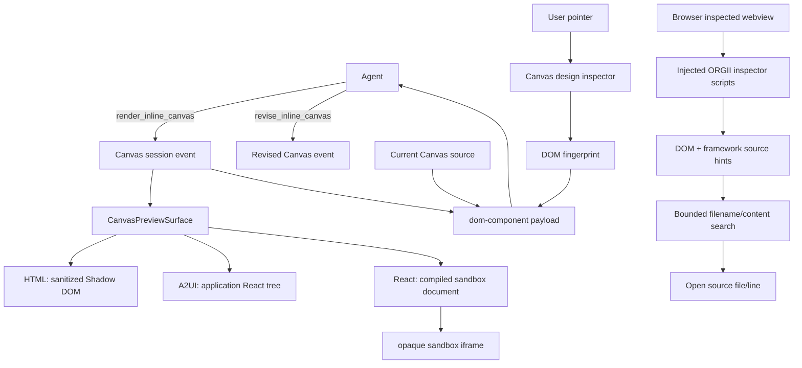

# ORG2 UI prototyping and grounding

## Scope

This record explains how ORG2 renders agent-generated Canvas prototypes, lets a user select rendered UI, grounds that selection for an agent, and performs DOM-to-source navigation in the Browser surface. It also separates those product mechanisms from WKWebView/WebKitGTK/WebView2 developer diagnostics.

The primary implementation reference remains the accepted source revision `b315ba4f82fb1fe294496793d7322095e7efe262`. Material limits called out below were re-verified against upstream ORG2 `develop` at `6f56a34036d7cd2443da0fc8acb9a5ad0e208b40` so they are not treated as stale snapshot artifacts.

## Architecture summary

## 1. Canvas is an event-backed prototype surface

`render_inline_canvas` accepts four modes:

- `html` — self-contained HTML/SVG/CSS, sanitized and rendered into an open ShadowRoot.
- `a2ui` — typed JSONL rendered by the A2UI React renderer.
- `react` — agent-produced React source compiled into a self-contained document and executed in a sandboxed iframe.
- `url` — represented as an external-open action rather than embedded in Canvas.

The backend tool explicitly returns acceptance rather than claiming visual verification. The frontend observes the Canvas event and renders its projection.

A Canvas revision is addressed by the prior Canvas event id. `revise_inline_canvas` can apply exact literal `find`/`replace` edits when the current source admits a unique localized change, or accept complete replacement source for structural changes.

## 2. Canvas Design mode is an in-application DOM inspector

The Canvas selector is not WebKit Inspector or Chrome DevTools Protocol. `useCanvasDesignInspector` installs capture-phase pointer listeners on the Canvas root and owns the interaction while inspection is active.

Observed behavior:

- hover resolves the inspected element;
- click finalizes one element;
- drag creates a region/marquee selection;
- `event.composedPath()` permits traversal through open Shadow DOM boundaries;
- capture-phase prevention blocks the artifact's own click behavior while inspecting;
- `ResizeObserver` plus animation-frame geometry refresh keeps overlays aligned without repeatedly serializing the element.

The capture returns a bounded runtime fingerprint containing DOM selector/XPath, tag/id/class/safe attributes, text/HTML excerpts, geometry, selected computed styles, ARIA/role information, and a best-effort React component name.

## 3. Canvas grounding is strong at runtime but not deterministic at source

`canvasDomCapture.ts` explicitly emits `sourceLocation: null`.

The design request therefore grounds the agent with:

1. the selected runtime DOM fingerprint;
2. the Canvas event/session identity;
3. the current complete Canvas source;
4. a sanitized visual preview when available;
5. the user's requested change.

`domComponentPayload.ts` serializes these facts into the same `dom-component` payload family used elsewhere and instructs the agent to revise exactly the selected Canvas event. For localized changes the revision tool requires an exact source match, which limits accidental broad edits.

This is **runtime + artifact grounding**, followed by model-mediated DOM-to-source resolution. It is not an exact selected-node-to-source-span mapping.

## 4. Browser inspection uses a stronger DOM-to-source detection path

The WorkStation Browser has a separate inspector. `useWebviewInspector` invokes native Browser commands to enable/disable inspect mode and polls the selected element from the inspected webview.

The Browser crate injects ORGII-owned JavaScript into the target webview. Its source-location detector tries, in priority order:

1. `data-insp-path` from code-inspector-style instrumentation;
2. common source/debug data attributes;
3. React fiber debug metadata (`_debugSource`, `type.__source`, component identity/stack/search hint);
4. Vue `__file` metadata;
5. Svelte development/source annotations;
6. styled-component identity hints.

The selected Browser element can therefore carry an actual path/line/column when the inspected application exposes sufficient development metadata, or only a component/search hint when it does not.

## 5. The active source-navigation fallback is bounded search, not ui-indexer

Current upstream source explicitly states that the repository-wide component index is retired and preserved under `.archive`.

Active `useSourceNavigation`:

- consumes the detected component name or search hint;
- performs bounded native filename search for frontend file extensions;
- scores exact component filenames and matching `index.tsx`/`index.jsx` folders highly;
- performs a bounded regex content search for component declaration/use patterns;
- returns at most a small ranked candidate set;
- opens the resolved file at the available line.

Therefore `src-tauri/crates/ui-indexer/` is useful historical evidence of an earlier deterministic index design but is **not the active Browser source-navigation authority** at current upstream `develop`.

## 6. React Canvas has a real selection boundary gap

`CanvasApp` currently makes Design mode available for every non-URL, non-streaming Canvas, including `mode === "react"`.

React Canvas content is executed by `ReactArtifactRunner` inside an iframe with `sandbox="allow-scripts"` and without `allow-same-origin`. The artifact therefore receives an opaque origin and no direct path to Tauri IPC.

The Canvas design inspector, however, listens on the parent `CanvasDesignSurface` DOM. Pointer events inside the iframe's browsing context do not bubble into the parent document, and the opaque-origin sandbox prevents the parent from traversing the iframe DOM.

No Canvas-specific iframe-to-parent selection bridge is present in the verified path.

**Derived conclusion:** HTML and A2UI Canvas internals are inspectable by the parent selector; React Canvas internals are not addressable by the same mechanism even though Design mode is offered.

## 7. Native webview DevTools is orthogonal diagnostics

ORG2 runs on Tauri platform webviews: WKWebView on macOS, WebKitGTK on Linux, and WebView2 on Windows. Native inspector/DevTools facilities are valuable for console, network, JavaScript/runtime, layout, and performance diagnostics.

They are not the product's UI-selection or source-grounding authority. Product grounding is implemented through ORGII's DOM capture/injected inspector/source-navigation code and must remain portable across platform webview engines.

## Trust boundaries

- Static HTML is sanitized before entering the Canvas Shadow DOM.
- React artifacts execute in an opaque-origin iframe with scripts allowed but same-origin and Tauri access withheld.
- Canvas source passed back to the agent is explicitly marked untrusted data.
- Browser inspection executes ORGII-owned scripts in the inspected webview and only transports bounded element/source metadata back through Tauri commands.
- Source search is constrained to the selected repository and frontend file types.

## Known limits

1. Canvas DOM selection does not provide deterministic source spans.
2. React Canvas design selection does not cross the sandboxed iframe boundary in the verified implementation.
3. React fiber/debug-source detection depends on framework/build metadata and can degrade to component-name/search hints.
4. Browser source navigation is candidate search when an exact runtime source path is unavailable.
5. Native webview DevTools are platform-specific and are not a portable product grounding API.

## Design lesson for reuse

**Derived:** ORG2's strongest reusable pattern is the separation of rendered-target capture from source resolution. Runtime DOM identity, artifact/revision identity, and source identity should remain explicit layers rather than being collapsed into a browser-inspector protocol.

Any future design that needs deterministic editing of generated React prototypes should preserve iframe isolation and introduce an explicit artifact-local source-anchor/source-map channel rather than weakening the sandbox.

That final sentence is a design implication, not a claim about current ORG2 implementation.

## Representative source owners

- `src/engines/Simulator/apps/canvas/CanvasApp.tsx`
- `src/engines/Simulator/apps/canvas/design/CanvasDesignSurface.tsx`
- `src/engines/Simulator/apps/canvas/design/useCanvasDesignInspector.ts`
- `src/engines/Simulator/apps/canvas/design/canvasDomCapture.ts`
- `src/engines/ChatPanel/blocks/CanvasInlineCard/CanvasPreviewSurface.tsx`
- `src/engines/ChatPanel/blocks/CanvasInlineCard/ReactArtifactRunner.tsx`
- `src/features/DomSelection/domComponentPayload.ts`
- `src/modules/WorkStation/Browser/hooks/useWebviewInspector.ts`
- `src/modules/WorkStation/Browser/hooks/useSourceNavigation.ts`
- `src-tauri/crates/browser/src/scripts/js/inspector-element-info.js`
- `src-tauri/crates/browser/src/scripts/js/inspector-source-loc.js`
- `src-tauri/crates/agent-core/src/specialization/tools/render_inline_canvas.rs`

See [UI grounding seams](ref-eng/interfaces/ui-grounding-seams.md) for the caller/callee contracts and [G-ORG2-REF-003 evidence](ref-eng/evidence/G-ORG2-REF-003-ui-grounding.md) for the observation matrix and current-upstream verification.