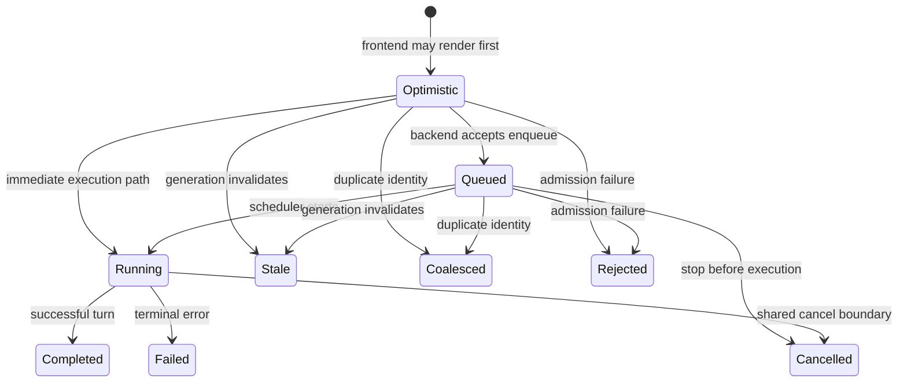
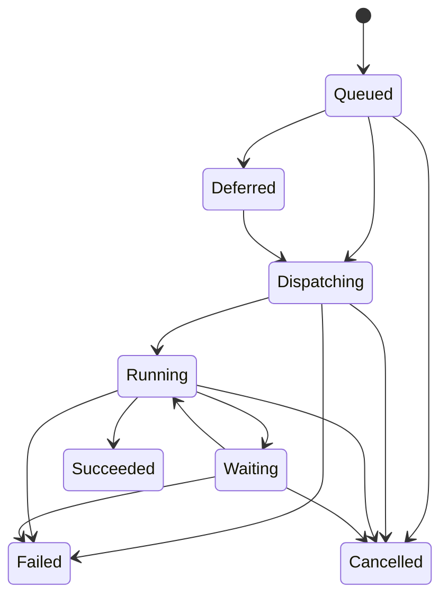
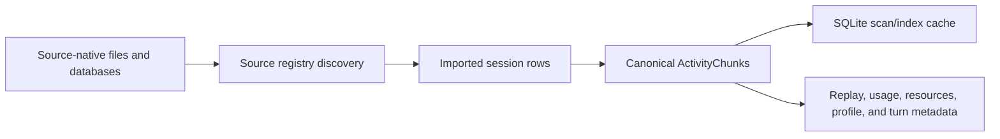

# ORG2 state lifecycles

## Scope and evidence

This record explains how ORG2 moves state between live memory, durable records, event projections, local artifacts, and frontend views. It separates SQLite write-ahead logging from application history.

All concrete behavior is Source-observed at revision `b315ba4f82fb1fe294496793d7322095e7efe262`. The lifecycle diagrams and storage categories are Derived from the cited source. This record does not claim crash-safe exactly-once behavior across every store.

## State-owner map

| State | Primary owner | Durable form | Rebuild or recovery source |
| --- | --- | --- | --- |
| Active agent runtime | `AgentSession` | Session identity and history, not the full runtime object | Agent definition, persisted session, selected workspace, provider/account configuration. |
| Active dialog turn | `AgentSession` | Turn Intent, events, usage, and optional Work Item Run | Scheduler and persisted intent/session state. |
| Agent Org execution | Agent Org run, task, inbox, and approval stores | Run envelope, root/member session links, task state, inbox rows, resolution rows, completion intent | Frozen org snapshot, session state, work revision, and finality reconciliation. |
| Channel conversation route | Gateway binding store | Conversation key to session binding plus integration configuration | Persisted binding, enabled channel configuration, and lazy session replacement. |
| Logical submission | Turn-intent store | `session_turn_intents` row | Direct row; lifecycle transitions are guarded. |
| Session activity | Event store/session persistence | `events` and related message/session tables | Durable event rows and source histories. |
| User-visible round | Turn index | `session_turns` plus index state | Events and Turn Intents. |
| Project intent | Project store | Projects and Work Items in `projects.db` | Direct project rows and import/sync sources. |
| Durable execution episode | Work Item Run service | Run row plus dispatch outbox | Target snapshot, Run state, dispatch state, linked turn/session. |
| Agent definitions | Definition stores | Scoped JSON files plus compiled built-ins | Built-in source, user definitions, and built-in override files. |
| Shell transcript | Shell replay subsystem | Append-only artifact plus manifest and bookmarks | Artifact frames; startup repair marks incomplete artifacts. |
| Frontend session view | SessionCore adapters and atoms | Mostly a projection; some browser storage | Native events, typed fetches, and durable reload. |
| Cross-tool history index | `orgtrack_core` or `orgtrack` store | Temporary or selected SQLite index | External source histories and fingerprints. |

## Physical persistence layout

### `sessions.db`

`~/.orgii/sessions.db` is the broad runtime database. Current owners use it for session events and metadata, agent sessions, turn intents and indexes, token/tool usage, CLI sessions, repository tracking, inbox, lineage, orchestration support, and other runtime records.

The `database` crate owns connection paths, pooling, PRAGMAs, and writer coordination. Domain crates own their schemas. The application registers the full ordered schema initializer before another subsystem opens a connection.

### `projects.db`

`~/.orgii/projects/projects.db` stores Project Orgs, Projects, Work Items, Work Item Runs, routines, dispatch, sync, conflicts, and related project data.

ORG2 keeps this database separate so project data can act as a self-contained export and sync bundle without exposing the larger, more sensitive session database. A reader that needs both sides can attach a second database, but ordinary domain operations stay within their owning file.

### Files and artifacts

Not all durable state belongs in SQLite:

- Agent definitions and built-in overrides use scoped JSON stores.
- Workspace and global hooks use `.orgii/hooks.json`.
- Shell replay uses append-only artifact files because a complete terminal stream is larger and more sequential than the bounded event row.
- External coding-agent histories remain in their source-native files or databases; Orgtrack normalizes them into a read/index model.
- Application settings and credentials use their own stores and owners.

This mixed strategy avoids one generic database schema for values with different trust, size, and portability requirements.

## SQLite WAL and application history

SQLite WAL and ORG2 application events solve different problems.

| Mechanism | Purpose | Lifetime | Semantic meaning |
| --- | --- | --- | --- |
| SQLite WAL | Atomic database commits, recovery, and concurrent readers while one writer commits | SQLite-managed and checkpointed | None beyond database pages and transaction durability. |
| Session events | Session activity and display history | Product-managed durable rows | User, assistant, tool, status, and UI meaning. |
| Turn intents | Logical submission lifecycle | Product-managed durable rows | Admission, execution, and terminal state for one user intent. |
| Work Item Runs | Durable work execution | Product-managed durable rows | Trigger, target snapshot, dispatch, result, failure, and usage. |
| Dispatch/sync outboxes | Asynchronous delivery and retry | Until acknowledged, retired, or retained by policy | Pending external or internal delivery work. |
| Shell replay | Complete terminal frames and as-of playback | Product-managed append-only artifacts | Exact shell output stream, completion, or incomplete recovery state. |

WAL cannot replay a business workflow. Session events do not replace WAL for crash recovery. A WAL checkpoint changes database storage state but does not create a domain event.

## Connection and writer policy

Every new database connection applies:

- `busy_timeout = 15000`;
- `journal_mode = WAL`;
- `synchronous = NORMAL`;
- a bounded page cache and in-memory temporary storage;
- `wal_autocheckpoint = 2000`.

The timeout is a backstop. ORG2 serializes writes to `sessions.db` with one process-wide Rust mutex. A write closure then uses `BEGIN IMMEDIATE` so it acquires SQLite's writer right at transaction start.

Readers do not take the writer mutex. WAL lets them keep a stable read view while one writer commits. A second ORG2 process does not share the Rust mutex, so cross-process contention falls back to SQLite locking and the busy timeout.

The connection pool keeps a bounded set of configured idle connections per physical database path. Pool generations and file identity prevent reuse after schema registration, tests, migration, or file replacement make an old connection unsafe.

## Interactive turn lifecycle



The Turn Intent row enforces a transition whitelist. An illegal downgrade or cross-run ownership mismatch returns an error and leaves the stored row unchanged.

The runtime follows this storage order for the normal native turn:

1. Persist or confirm session identity.
2. Create or reuse the Turn Intent at scheduler admission.
3. Mark the intent running when the worker starts.
4. Save the user message and load durable history before the provider call.
5. Append or patch session events while model and tool output arrives.
6. Finalize the active dialog turn.
7. Settle an owned Work Item Run when present.
8. Finalize the session and publish the authoritative terminal turn event.
9. Write the terminal Turn Intent state and refresh derived views.

The exact code path can warn and continue for some auxiliary writes. It does not wrap all nine steps and both databases in one transaction.

## Session event lifecycle

```text
provider or tool callback
  -> canonical SessionEvent
  -> live event handler buffer
  -> frontend delta or upsert
  -> durable event write-through
  -> derived snapshot and turn index
```

`SessionEvent` supports `running`, `pending`, `awaiting_user`, `completed`, and `failed` display states. A tool or message event can receive a patch as more data arrives. Streaming snapshots and deltas let the frontend apply incremental changes without loading every event after each token.

The durable `events` table stores canonical IDs, session, event type, function, arguments, result, content, timestamp, metadata, and history sequence. A derived `session_turns` projection groups events into rounds and materializes modified files, resource interactions, and Git artifacts.

This is event-centered persistence, not strict event sourcing:

- event rows can receive updates;
- retry can retract uncommitted streaming segments;
- rewind and editing can delete later events and reset sequences;
- the turn index can rebuild from events and intents;
- the system does not reconstruct every product entity by replaying one universal log.

The separate [session event pipeline](ref-eng/data-and-storage/session-event-pipeline.md#session-event-pipeline) adds ingestion, the per-session live store, cache conversion, bounded browse, search, and analytics. These are review and interaction projections over canonical session activity. SQLite WAL remains a database recovery mechanism and does not replace them.

## Agent Org Run lifecycle

```text
effective Agent Org snapshot
  -> durable run plus root coordinator session
  -> native and CLI member materialization
  -> run-scoped tasks, inbox, approvals, interventions, and turns
  -> completion intent at a work revision
  -> transactional finality reconciliation
  -> Completed, Abandoned, or keep Running
```

A run can also become Paused, Failed, or Cancelled. Paused is nonterminal. Finality reloads canonical run facts under the shared session writer before it changes terminal state. Open tasks, unread inbox, active sessions, interventions, in-flight intents, pending approvals, or stale completion intent block completion. Startup recovery requeues eligible member tasks, reconciles resolved runs, and pauses runs that still claimed to run before restart.

Source inbox messages remain immutable. Resolution rows represent cancellation or supersession. The operational run view uses bounded payload-free previews and does not become the message-history owner. See [Agent Org coordination](ref-eng/runtime/agent-org-coordination.md#agent-org-coordination).

## Channel binding and reset lifecycle

```text
enabled channel
  -> gateway workers and hydrated BindingStore
  -> external conversation key binds to Agent Session
  -> inbound messages reuse the binding
  -> idle reset archives and invalidates the old session
  -> binding clears
  -> next inbound message creates the replacement lazily
```

The binding store keeps an in-memory hot-path map and a durable database value. Reset does not occur during an active turn or active child session. A failed activity query conservatively keeps the binding. Pending reset-notice state lets the next response tell the user that ORG2 created a new conversation. See [Channel gateway routing](ref-eng/runtime/channel-gateway-routing.md#channel-gateway-routing).

## Work Item Run lifecycle



The enum defines these states; individual service methods enforce the allowed transition at each command boundary.

The enqueue transaction captures an immutable target snapshot and creates the dispatch outbox work. A worker claims a lease before it launches or resumes a session. A durable native launch waits for scheduler acceptance before it acknowledges dispatch start.

The linked Turn Intent can carry the Run ID. Terminal turn settlement writes Run success, failure, or cancellation with usage and error information. The Run remains an execution fact. It does not update the Work Item to complete without the separate Work Item rule or review path.

## Routine and asynchronous delivery lifecycle

A routine schedule creates a `RoutineFire` for a due occurrence. Concurrency policy can skip, replace, or queue a fire. A runnable fire can produce a Work Item Run and dispatch row. Reconciliation can detect a dispatch that terminated before session launch.

Project sync and collaboration also use outbox-style rows. An outbox records pending delivery, claim or attempt state, and outcome. This prevents a local transaction from depending on immediate remote availability.

At-least-once dispatch requires idempotent identities. It does not imply exactly-once external effects.

## Shell replay lifecycle

Long shell output uses an append-only artifact instead of forcing the complete stream into a session event.

```text
shell starts
  -> create replay reference and running manifest
  -> append ordered frames
  -> advance visible sequence and byte bookmark
  -> finalize file and completed_at
  -> mark complete
```

If a process stops during append, startup recovery repairs indexes and marks the artifact incomplete. A timeline event uses an immutable bookmark so historical playback cannot reveal bytes that arrived after that event.

The session event keeps a bounded preview and replay reference. The artifact keeps the complete stream.

## Cross-tool ingestion lifecycle



An Orgtrack scan treats each provider as an independent source boundary. It can skip an absent, locked, invalid, or timed-out source and retain results from other sources.

The command-line tool scans fresh by default. A caller can select a persistent SQLite index and later use `--no-scan`. Incremental scans use source fingerprints or watermarks where the source adapter supports them.

Loader plugins join the source registry only after discovery and, for executable plugins, explicit content-hash trust. Processor plugins transform the read/display path and do not mutate the stored index.

## Frontend projection and reconciliation

The frontend receives live events before every durable read model has settled. It serializes event application so a terminal event does not overtake earlier deltas on the same channel.

Frontend state is a projection:

- optimistic user content improves response time but does not prove scheduler acceptance;
- `agent:complete` can carry content and usage but does not prove final turn settlement;
- `agent:turn_completed` carries the authoritative terminal intent status;
- a reload can reconcile the view from durable session and project state;
- versioned browser caches are disposable and can be cleared during startup migration.

The projection can fail without erasing the durable result. Repeated frontend handler failures force a visible failed state so the input does not remain locked indefinitely.

## Failure and recovery boundaries

| Failure | Current state response |
| --- | --- |
| SQLite writer contention inside one process | Writers queue on the process mutex; `BEGIN IMMEDIATE` acquires the file writer lock. |
| Cross-process SQLite contention | The busy timeout applies; callers can still receive a lock error after the budget. |
| Database move with WAL content | Migration attempts a truncate checkpoint before it copies the main database and retains WAL/SHM as a safety fallback. |
| User-message save or history load failure | The active turn fails before provider execution can continue. |
| Auxiliary event, hook, diagnostic, or notification write failure | The path can warn and preserve the main provider result, depending on the owner. |
| Provider stream interruption | Bounded retry can retract only uncommitted current output and regenerate it. |
| Context overflow | Reactive compaction can rebuild the provider view and retry within a fixed budget. |
| User cancellation | Shared cancellation reaches provider, permission, tool, processor, and event-generation checks; the intent settles cancelled. |
| Process crash during shell stream | Startup repair marks the replay incomplete and repairs its indexes. |
| Dispatch process stops | Lease expiry and reconciliation make the durable outbox work visible again or terminal. |
| External history source fails | Orgtrack reports or skips that source and continues the bounded scan. |

## Persistence invariants

- `sessions.db` and `projects.db` have different ownership and export boundaries.
- WAL never serves as a product event journal.
- One process-wide session writer owns one `sessions.db` write transaction at a time.
- A Turn Intent cannot move through an unlisted status transition.
- A Turn Intent cannot silently change from one Agent Org Run owner to another.
- A Work Item Run captures the execution target before dispatch.
- Dispatch acknowledgement does not prove Run success.
- Run success does not prove Work Item completion.
- The turn index and frontend state remain projections of lower-level facts.
- Shell replay bookmarks preserve an as-of boundary for append-only output.
- No current source establishes one atomic commit across session events, Turn Intents, Work Item Runs, frontend delivery, and remote effects.

## Design choices and tradeoffs

- Two SQLite files reduce project-export exposure and sync coupling, but a feature that joins work and conversation state must coordinate two stores.
- WAL plus concurrent readers suits streaming output, but SQLite still permits only one writer per file. ORG2 adds a process mutex to make that constraint explicit.
- Event rows plus materialized turn projections give fast UI reads and rebuild capability, but they require versioning and reconciliation.
- Separate Turn Intent, Dialog Turn, Session Event, and Work Item Run identities prevent lifecycle collapse, but callers must propagate the correct identity.
- Append-only shell artifacts preserve full terminal output without bloating normal event rows, but they add file-manifest recovery and cleanup.
- Outboxes isolate local commits from remote or asynchronous delivery, but at-least-once processing requires idempotent consumers.
- Cross-tool normalization enables shared analytics, but canonical chunks can only preserve facts that a source adapter extracts.

## Known limits

- This record does not prove power-loss behavior for `synchronous = NORMAL` on every filesystem.
- It does not measure write throughput, WAL checkpoint stalls, lock wait time, or database size.
- It does not establish exactly-once execution across process or machine failure.
- It does not inventory every table, migration, JSON store, cache, or retention rule.
- It does not claim that session events can reconstruct all ORG2 state.
- It does not validate an actual database file or run a crash-recovery test.

## Source map

| Concern | Current source |
| --- | --- |
| Database split, PRAGMAs, pooling, and migration | [`src-tauri/crates/database/src/db/connection.rs`](src-tauri/crates/database/src/db/connection.rs) |
| Session writer serialization | [`src-tauri/crates/database/src/db/writer.rs`](src-tauri/crates/database/src/db/writer.rs) |
| Session tables and turn projection | [`src-tauri/crates/session-persistence/src/schema.rs`](src-tauri/crates/session-persistence/src/schema.rs), [`src-tauri/crates/session-persistence/src/turn_index.rs`](src-tauri/crates/session-persistence/src/turn_index.rs) |
| Turn Intent transitions | [`src-tauri/crates/session-persistence/src/turn_intents.rs`](src-tauri/crates/session-persistence/src/turn_intents.rs) |
| Event shape, snapshots, and replay references | [`src-tauri/crates/types/src/session_event.rs`](src-tauri/crates/types/src/session_event.rs) |
| Event writes, editing, and transactions | [`src-tauri/crates/session-persistence/src/crud.rs`](src-tauri/crates/session-persistence/src/crud.rs), [`src-tauri/crates/session-persistence/src/editing.rs`](src-tauri/crates/session-persistence/src/editing.rs) |
| Projects database schema and outbox | [`src-tauri/crates/project-management/src/projects/schema.rs`](src-tauri/crates/project-management/src/projects/schema.rs) |
| Work Item Run values and service | [`src-tauri/crates/project-management/src/projects/types/work_runs.rs`](src-tauri/crates/project-management/src/projects/types/work_runs.rs), [`src-tauri/crates/project-management/src/projects/`](src-tauri/crates/project-management/src/projects/) |
| Routine persistence and reconciliation | [`src-tauri/crates/project-management/src/projects/io/routines.rs`](src-tauri/crates/project-management/src/projects/io/routines.rs) |
| Agent Org run, inbox, and finality | [`src-tauri/crates/agent-core/src/core/coordination/agent_org_runs/`](src-tauri/crates/agent-core/src/core/coordination/agent_org_runs/), [`src-tauri/crates/agent-core/src/core/coordination/agent_inbox/`](src-tauri/crates/agent-core/src/core/coordination/agent_inbox/) |
| Channel binding and reset | [`src-tauri/crates/agent-core/src/integrations/gateway/binding.rs`](src-tauri/crates/agent-core/src/integrations/gateway/binding.rs), [`src-tauri/crates/agent-core/src/state/commands/channel_handler/idle_reset.rs`](src-tauri/crates/agent-core/src/state/commands/channel_handler/idle_reset.rs) |
| Live session and active turn | [`src-tauri/crates/agent-core/src/state/session_runtime.rs`](src-tauri/crates/agent-core/src/state/session_runtime.rs) |
| Session event ingestion, live store, search, and analytics | [`src-tauri/src/agent_sessions/event_pipeline/`](src-tauri/src/agent_sessions/event_pipeline/) |
| Shell replay recovery | [`src-tauri/crates/agent-core/src/core/tools/impls/coding/exec/shell_replay/`](src-tauri/crates/agent-core/src/core/tools/impls/coding/exec/shell_replay/) |
| Cross-tool source and canonical model | [`src-tauri/crates/orgtrack-core/src/sources/`](src-tauri/crates/orgtrack-core/src/sources/), [`src-tauri/crates/orgtrack-core/src/canonical.rs`](src-tauri/crates/orgtrack-core/src/canonical.rs) |
| Orgtrack CLI index and plugin behavior | [`src-tauri/crates/orgtrack-cli/src/`](src-tauri/crates/orgtrack-cli/src/) |

## Conformance note

This record covers data ownership, storage split, session and Work Item lifecycles, journaling choices, WAL, cross-tool ingestion, frontend projection, concurrency, failure, and recovery. It states where source evidence stops.
