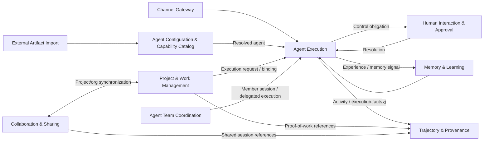

# ORG2 context map

## Scope

This map models **semantic ownership and collaboration**, not crate dependencies. It is Derived from the source-grounded entity corpus, UA's five behavioral domains, and the broader UA architecture inventory.

## Context classes

### Core product contexts

- **Agent Execution** — execution of one resolved agent session.
- **Agent Team Coordination** — coordinated multi-agent execution.
- **Project & Work Management** — durable product work and execution linkage.
- **Memory & Learning** — persistent memory and learned knowledge.
- **Trajectory & Provenance** — canonical historical and provenance semantics.

### Supporting contexts

- **Agent Configuration & Capability Catalog** — editable definitions and launch-time capability composition.
- **Human Interaction & Approval** — human/policy control obligations.
- **Collaboration & Sharing** — multi-user/cloud organization and sharing semantics.

### Edge contexts

- **Channel Gateway** — external-message adapter.
- **External Artifact Import** — foreign-model anti-corruption layer.

### Infrastructure

Git, terminal, browser automation, LSP, search, databases, key vault, transport, and OS services are implementation capabilities underneath the contexts. They are not promoted to bounded contexts because they do not own ORG2 product identities or business lifecycles.

## Relationship rules

1. **Configuration resolves before execution.** Editable `AgentDefinition` state is resolved into launch-time values before Agent Execution consumes it.
2. **Work does not become execution.** `WorkItem` and `WorkItemRun` remain Work Management identities even when they launch or resume an `AgentSession`.
3. **Agent-team tasks do not become work items.** An Agent Org task is a run-scoped coordination primitive, not the durable project work record.
4. **Observation does not become execution ownership.** Trajectory & Provenance records execution history but does not own the live `AgentSession`.
5. **Cloud organizations do not replace project organizations.** Mappings/aliases are integration relationships between separate identities.
6. **Edge contexts translate; they do not redefine native semantics.**
