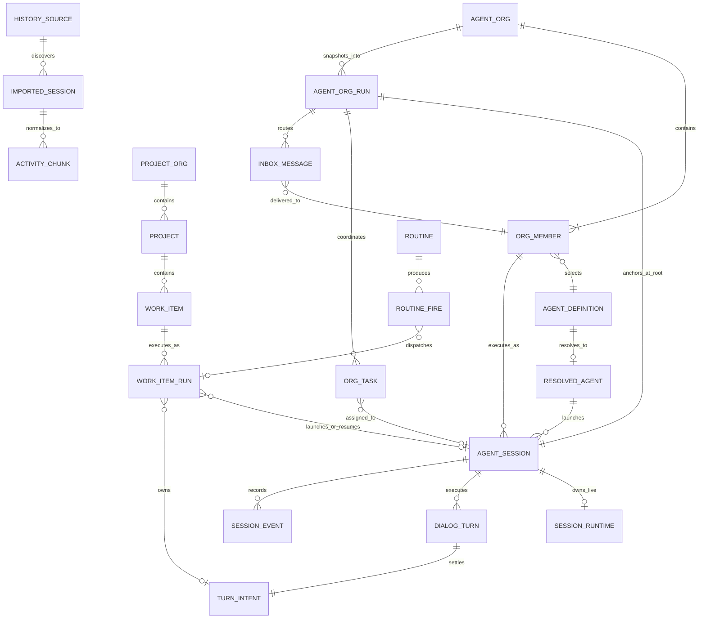

# ORG2 core entities

## Scope and evidence

This record identifies the entities that carry product identity or lifecycle in ORG2. It focuses on agent configuration, live execution, project work, durable runs, and cross-tool history.

All fields and relations are Source-observed at revision `b315ba4f82fb1fe294496793d7322095e7efe262`. The grouped model is Derived from Rust types, persistence schemas, and current runtime calls. The model does not claim that every Rust struct is a domain entity.

## Bounded-context interpretation

This record remains the source-observed entity inventory. The canonical logical context classification now lives in [ORG2 domain model](ref-eng/domain-models/README.md), with one semantic owner per concept in [Entity ownership](ref-eng/domain-models/entity-ownership.md). Do not infer bounded-context boundaries directly from the global entity diagram below.

## Domain map

The diagram shows semantic relations. It does not imply one physical foreign key for every line.

## Agent definition model

### Agent Definition

`AgentDefinition` is the durable configuration identity for a native agent. Its `id` selects a built-in agent, a built-in override, or a user-created definition.

It can define:

- name, description, tier, and optional inheritance;
- capabilities and session model;
- model, account, token, context-window, temperature, and compaction choices;
- tool selection, MCP exclusions, skills, workspace-resource loading, and workspace-rule loading;
- autonomy, workspace restriction, blocked commands, forbidden paths, and risk rules;
- subagents, delegation, execution mode, concurrency, reliability, and learning behavior;
- prompt or soul content and whether that content is sovereign.

`AgentDefinitionsStore` owns user definitions and built-in overrides in memory. Compiled built-ins remain code-owned. A built-in override replaces the compiled definition at lookup; it is not a second active agent identity.

### Resolved Agent

`ResolvedAgent` is a launch-time value, not a separately persisted entity. Resolution applies defaults, inheritance, overrides, capability selection, policy, model settings, skills, tools, subagents, and workspace context. Launch code consumes this closed value so later execution does not repeatedly interpret the editable definition.

Resolution can fail for an unknown agent, an inheritance problem, missing model/account configuration, or an invalid capability/policy combination. A failed resolution creates no live session runtime.

### Agent Org and Org Member

`AgentOrg` groups member definitions for coordinated execution. An `OrgMember` selects an agent definition and can add hierarchy or launch overrides. A run carries explicit organization, member, and session identities; membership does not erase the underlying agent definition.

The store for Agent Orgs is separate from the store for agent definitions. This keeps reusable agent identity separate from one organizational composition.

### Agent Org Run and coordination values

`AgentOrgRunRecord` is the durable execution envelope for one Agent Org launch. It freezes the organization snapshot, coordinator identity, root session, entry mode, optional Work Item links, status, summary, error, and timestamps. The root session anchors the run transcript and lets bounded parent traversal resolve a member session back to its run.

Org tasks, inbox messages, inbox resolutions, completion intent, interventions, and plan approvals belong to one run or session context. They do not become reusable Agent Definitions. Source inbox rows remain immutable; cancellation and supersession append resolution records. A bounded run view derives current tasks, message previews, approvals, progress, and finality from these owners.

A completion intent records the work revision that the coordinator observed. `Completed` therefore depends on current canonical blockers and cannot result only from a coordinator request. See [Agent Org coordination](ref-eng/runtime/agent-org-coordination.md#agent-org-coordination) for the full protocol.

## Session execution model

### Agent Session

`AgentSession` is the live execution aggregate for one native session identity. It owns:

- the selected `AgentDefinition`;
- a lazily initialized `SessionRuntime`;
- the per-session dialog scheduler;
- the current `DialogTurn` and its generation;
- cancellation, processing, steering, compaction, and prompt-cache state;
- permission, question, secret, mode-switch, and plan-approval managers;
- optional Wingman, memory, learning, and Agent Org coordination state.

The live aggregate does not replace the durable session row. Runtime state can disappear at process exit and be recreated from persisted identity and history.

### Session Runtime

`SessionRuntime` is a resolved strategy bundle inside an Agent Session. It holds the provider, tool registry, effective tool policy, model/account, workspace state, resolved agent, integration snapshot, launch overrides, and optional Agent Org context.

The runtime is session-scoped because provider, policy, tools, workspace, and organization context can differ between sessions. It is not a global singleton.

### Dialog Turn

`DialogTurn` is one active execution episode in a session. Its `turn_id` identifies the active provider/tool loop and owns state, input, usage statistics, start time, and a shared cancellation flag.

Only one dialog turn is active in an Agent Session at a time. The scheduler serializes accepted messages before it calls the turn processor.

### Turn Intent

`TurnIntent` is the durable identity of one logical user submission. Its key is `(session_id, turn_intent_id)`. The same identity crosses frontend optimistic state, native submission, scheduler admission, the persisted user event, turn indexing, and terminal settlement.

Its source identifies the admission path: user submit, queue, force send, resume, Agent Org, Wingman, or mobile remote. Its status follows a guarded lifecycle from optimistic or queued to running and then to a terminal status. Stale, coalesced, and rejected intents never produce a normal executed round.

`turn_id` and `turn_intent_id` are not interchangeable:

- `turn_intent_id` identifies the user's durable submission across boundaries.
- `turn_id` identifies the actual active execution attempt.

### Session Event

`SessionEvent` is the canonical event/display record for one session activity. It carries event identity, session identity, source, canonical function/action identity, display text and status, arguments, result, optional file/process/call context, extracted UI data, and optional shell replay references.

Events support patches and derived snapshots. They form durable session history and frontend projection input, but the table is not a strict immutable event-sourcing journal: code can update, retract, truncate, or rebuild some event-derived state.

### Turn Index

`session_turns` is a materialized projection over session events and turn intents. It groups event sequences into user-visible rounds and stores status, timing, previews, modified files, resource interactions, and Git artifacts. `session_turn_index_state` records the projection version and source watermark.

The turn index is rebuildable. It must not become the owner of raw event identity or turn-intent lifecycle.

## Project and work model

### Project Org

`ProjectOrg` is the top-level project namespace. It owns an ID, name, slug, source, sync provider, optional sync configuration and connection identity, and timestamps.

This is a project-management organization. It is separate from an Agent Org, which composes execution agents.

### Project

`ProjectData` combines project metadata, description, slug, and optional sync adapter. `ProjectMeta` owns status, priority, health, lead, members, labels, repository links, schedule dates, Work Item ID allocation, and optional agent defaults.

A Project belongs to one Project Org. Its linked repositories provide execution context but do not become child Project identities.

### Work Item

`WorkItemData` combines YAML-like frontmatter, a body, and a filename representation. Its frontmatter owns:

- stable and short IDs, title, project, status, priority, assignment, labels, milestone, parent, and stage;
- dates, creator, origin session, deletion marker, and starred state;
- todos, comments, history, delegations, and handoff state;
- linked sessions, proof of work, orchestrator configuration and state;
- follow-ups, schedule, routine source, execution lock, close-out, and work products.

Many nested values are owned parts of a Work Item, not globally independent entities. Comments and work products have local identities because other operations address them, but their lifecycle remains scoped to the Work Item.

### Work Item Run

`WorkItemRun` is one durable execution episode for one Work Item. It is separate from both product intent and session transport.

The Run captures:

- a trigger such as manual, schedule, routine, discussion, stage barrier, review, follow-up, or retry;
- an immutable target snapshot with Work Item revision, selected workspace/repository, launch mode, agent definition, and optional Agent Org;
- status, attempts, timestamps, selected or created session identity, turn-intent identity, failure, and usage;
- dispatch ownership through the durable outbox.

A successful Work Item Run does not silently complete its Work Item. Work Item close-out and review stay separate product decisions.

### Dispatch record

`pm_dispatch_outbox` owns delivery attempts for a Work Item Run. A lease identifies one active dispatcher. Delivery acknowledgement proves that a launch reached its required admission boundary; it does not prove that the Run or Work Item succeeded.

The outbox supports at-least-once delivery. Stable run and dispatch identities make retries idempotent at the application boundary.

### Routine and Routine Fire

A `RoutineDefinition` describes a schedule, target, execution template, output mode, concurrency policy, and catch-up policy. Each due occurrence becomes a `RoutineFire`. The fire can enqueue a Work Item Run and tracks its own status and error.

Routine time calculation, fire identity, dispatch, and Work Item execution remain separate steps. This prevents a timer tick from acting as proof that agent work ran.

## Cross-tool history model

### History Source

The source registry exposes supported history providers through stable descriptors and scan functions. Each adapter discovers source-native sessions and returns normalized rows. Missing or unreadable providers can fail independently during a best-effort scan.

### Imported Session

An imported session row carries normalized list/search metadata for a source-native session. The original source and source-native identity remain part of its address. Import does not turn an external session into a live `AgentSession`.

### Activity Chunk

Source loaders normalize provider-specific messages, tool calls, and status records into `ActivityChunk`. Projectors use this shared shape for display, usage, resource interaction, turn metadata, replay, and profile signals.

Normalization preserves a common analysis surface while source-specific parsers retain responsibility for source formats. The `orgtrack` CLI can persist a disposable or caller-selected index; the source history remains external evidence.

### Canonical evidence records

`orgtrack_core` also defines canonical records for sessions, activities, file changes, commit links, edit artifacts, diffs, and checkpoints. `orgtrack_sync` defines sync payloads for projects, Work Items, session evidence, trajectories, attempts, lessons, and validation.

These records support evidence and exchange. They do not replace the live Agent Session, Work Item, or Work Item Run lifecycle.

## Identity and ownership table

| Identity | Owner | Scope and invariant |
| --- | --- | --- |
| `agent_definition_id` | Agent definition store | Selects one built-in/effective or user definition. |
| Agent Org ID and member ID | Agent Org store | Identify one composition and one member within it. |
| Agent Org Run ID | Agent Org run store | Identifies one coordinated execution envelope and its frozen organization snapshot. |
| Org task ID | Agent Org task store | Identifies one run-scoped work assignment and its current state. |
| Inbox row ID and request ID | Agent inbox store | Identify one routed message and correlate request-response exchanges. |
| `session_id` | Session persistence and live session state | Identifies one conversation/runtime lineage across process restarts. |
| `turn_intent_id` | Turn-intent store | Identifies one logical submitted intent within a session. |
| `turn_id` | Agent Session | Identifies one active execution attempt. |
| Session event ID | Event store | Identifies one durable/display activity in a session. |
| Project Org ID | Project store | Names a project namespace and sync scope. |
| Project ID/slug | Project store | Identifies project intent and repository context. |
| Work Item ID/short ID | Project store | Identifies one unit of planned product work. |
| Work Item Run ID | Run service | Identifies one durable execution episode. |
| Dispatch ID and lease | Dispatch outbox | Identifies one delivery record and its current claimant. |
| Routine ID and fire ID | Routine service | Separate the schedule definition from one occurrence. |
| External source plus session ID | Orgtrack source adapter | Preserves source-native history identity across scans. |

## Important relation rules

- One Agent Definition can launch many sessions; one session uses one effective definition at launch.
- One Agent Org contains members that refer to reusable Agent Definitions.
- One Agent Org can produce many Agent Org Runs; each Run freezes one launch-time organization snapshot.
- One Agent Org Run has one root coordinator session and can have many member sessions, tasks, and inbox messages.
- One completion intent refers to one observed work revision; finality derives from current blockers inside the run writer transaction.
- Inbox cancellation or supersession appends a resolution record and does not rewrite the source message.
- One Session can contain many Turn Intents, Dialog Turns, and Session Events.
- One logical Turn Intent can own one Work Item Run, but ordinary session turns have no Run.
- One Project contains many Work Items; one Work Item can produce many Runs.
- One Run launches or resumes at most one selected Session target at a time.
- One Work Item Run terminal does not imply Work Item completion.
- One Routine can produce many Fires; a Fire can dispatch work through a Run.
- Imported sessions are read/analysis entities and do not become live native sessions through normalization alone.
- Reverse navigation is derived where practical; no generic relationship table defines all of these relations.

## Events and historical facts

ORG2 uses several historical mechanisms with different meanings:

| Mechanism | Meaning |
| --- | --- |
| Session events | User, assistant, tool, status, and display history for a session. |
| Turn intents | Guarded lifecycle history for logical user submissions. |
| Work Item history | Work-scoped changes and actors embedded with the Work Item representation. |
| Work Item Runs | Durable execution episodes with trigger, snapshot, status, failure, and usage. |
| Agent Org Runs and tasks | Coordinated execution state, work revision, completion intent, and finality. |
| Agent inbox and resolution rows | Typed agent-to-agent message history with append-only cancellation or supersession. |
| Dispatch and sync outboxes | Delivery intent and retry state for external or asynchronous work. |
| Shell replay artifacts | Append-only terminal frames with immutable as-of bookmarks. |
| SQLite WAL | Database recovery and concurrency mechanism, not a domain event journal. |

No single generic event log is the canonical source for all product state.

## Known limits

- This model does not inventory every UI view, sync record, provider type, or nested Work Item value.
- Some persistence uses JSON columns or files, so the Rust type expresses constraints that SQLite does not enforce by itself.
- The model does not prove cross-process exactly-once execution.
- The model does not claim that every session category uses the native `AgentSession` aggregate.
- It does not treat generated Graphify or UA entities as product-domain entities.

## Source map

| Concern | Current source |
| --- | --- |
| Agent definitions and resolution | [`src-tauri/crates/agent-core/src/core/definitions/schema.rs`](src-tauri/crates/agent-core/src/core/definitions/schema.rs), [`src-tauri/crates/agent-core/src/core/definitions/resolved.rs`](src-tauri/crates/agent-core/src/core/definitions/resolved.rs) |
| Definition store and Agent Orgs | [`src-tauri/crates/agent-core/src/core/definitions/store.rs`](src-tauri/crates/agent-core/src/core/definitions/store.rs), [`src-tauri/crates/agent-core/src/core/definitions/orgs.rs`](src-tauri/crates/agent-core/src/core/definitions/orgs.rs) |
| Agent Org Runs, finality, and progress | [`src-tauri/crates/agent-core/src/core/coordination/agent_org_runs/`](src-tauri/crates/agent-core/src/core/coordination/agent_org_runs/) |
| Agent inbox messages and resolutions | [`src-tauri/crates/agent-core/src/core/coordination/agent_inbox/`](src-tauri/crates/agent-core/src/core/coordination/agent_inbox/) |
| Live session and runtime | [`src-tauri/crates/agent-core/src/state/session_runtime.rs`](src-tauri/crates/agent-core/src/state/session_runtime.rs) |
| Dialog turn and processing context | [`src-tauri/crates/agent-core/src/core/session/types/turn.rs`](src-tauri/crates/agent-core/src/core/session/types/turn.rs), [`src-tauri/crates/agent-core/src/core/session/types/context.rs`](src-tauri/crates/agent-core/src/core/session/types/context.rs) |
| Turn intents | [`src-tauri/crates/session-persistence/src/turn_intents.rs`](src-tauri/crates/session-persistence/src/turn_intents.rs) |
| Session events and projections | [`src-tauri/crates/types/src/session_event.rs`](src-tauri/crates/types/src/session_event.rs), [`src-tauri/crates/session-persistence/src/schema.rs`](src-tauri/crates/session-persistence/src/schema.rs) |
| Projects and Work Items | [`src-tauri/crates/project-management/src/projects/types/project.rs`](src-tauri/crates/project-management/src/projects/types/project.rs), [`src-tauri/crates/project-management/src/projects/types/work_items.rs`](src-tauri/crates/project-management/src/projects/types/work_items.rs) |
| Durable Work Item Runs | [`src-tauri/crates/project-management/src/projects/types/work_runs.rs`](src-tauri/crates/project-management/src/projects/types/work_runs.rs), [`src-tauri/crates/project-management/src/work_run_service/`](src-tauri/crates/project-management/src/work_run_service/) |
| Routines | [`src-tauri/crates/project-management/src/projects/types/routines.rs`](src-tauri/crates/project-management/src/projects/types/routines.rs), [`src-tauri/crates/project-management/src/projects/io/routines.rs`](src-tauri/crates/project-management/src/projects/io/routines.rs) |
| Cross-tool canonical records | [`src-tauri/crates/orgtrack-core/src/canonical.rs`](src-tauri/crates/orgtrack-core/src/canonical.rs), [`src-tauri/crates/orgtrack-core/src/sources/`](src-tauri/crates/orgtrack-core/src/sources/) |
| Cross-repository sync records | [`src-tauri/crates/orgtrack-sync/src/records.rs`](src-tauri/crates/orgtrack-sync/src/records.rs) |

## Conformance note

This record covers domain and state ownership, entity identity, relations, execution episodes, events, and cross-tool ingestion. It distinguishes durable entities from resolved values and derived projections.
