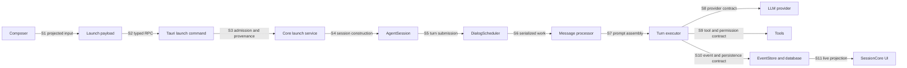

# Native-agent execution seams

## Scope and evidence

This record defines the main contracts on the interactive `rust_agent` path. It complements the [execution-kernel architecture](ref-eng/architecture/native-agent-execution-kernel.md#native-agent-execution-kernel). It does not define a new API.

All behavior is Source-observed at revision `b315ba4f82fb1fe294496793d7322095e7efe262`. The seam map is a Derived view of the cited source. No live provider request ran for this record.

## Seam map

## Contract index

| ID | Seam | Caller | Callee | Input | Output | Invariant | Failure behavior | Variation or interception point | Source owner |
| --- | --- | --- | --- | --- | --- | --- | --- | --- | --- |
| S1 | Composer to model-input projection | `useSessionLaunch.handleLaunch` | `prepareLaunchInput`, then `projectOutgoingUserMessage` | Editor content, serialized pills, terminal-pill text, repository context, and Canvas capability | `userInput` for display and `agentInput` for the first model message | Display serialization and model input remain separate; model input expands supported context and does not receive editor-internal payloads as raw text | Pending-pill wait or projection errors reject launch and reach the launch handler's error path | `allowCanvasInterception` selects Canvas interception; dispatch category disables it for CLI agents | [`inputPreparation.ts`](src/engines/SessionCore/hooks/session/useSessionCreator/useSessionLaunch/inputPreparation.ts), `prepareLaunchInput` |
| S2 | Frontend launch payload to typed RPC | `useSessionLaunch.handleLaunch` | `buildSessionLaunchPayload`, `sessionLaunch`, and `rpc.agentSession.sessionLaunch` | Projected content, category, model/account, workspace, agent identity, work-item context, mode, images, and launch options | Validated `SessionLaunchParams` request and `SessionLaunchResult` response | Only `rust_agent` and `cli_agent` enter the unified launch builder; explicit work-item context overrides creator defaults | Frontend validation stops submission; unsupported categories throw; RPC/schema or backend errors reject the launch promise | Category, local/worktree placement, agent definition or Agent Org target, background mode, and optional work-item fields | [`launchPayload.ts`](src/engines/SessionCore/hooks/session/useSessionCreator/useSessionLaunch/launchPayload.ts), [`index.tsx`](src/engines/SessionCore/hooks/session/useSessionCreator/useSessionLaunch/index.tsx), [`session.ts`](src/api/tauri/agent/session.ts), [`agentSession.ts`](src/api/tauri/rpc/procedures/agentSession.ts) |
| S3 | Tauri launch admission to core launch | `session_launch_impl` | Durable Work Item run service and category-specific launch adapter | Deserialized `SessionLaunchParams` | A launch result; for linked work, a claimed and acknowledged durable dispatch | Worktree fields pass compatibility checks before launch; a linked Work Item obtains a durable run and lease before category launch; dispatch acknowledgement follows successful session acceptance | Invalid workspace fields or category return an error; linked-work failure records the dispatch failure before the error returns | `rust_agent` versus `cli_agent`; user-session versus Work Item provenance; local workspace versus worktree | [`launch.rs`](src-tauri/crates/agent-core/src/state/commands/session/launch.rs), `session_launch_impl` |
| S4 | Core launch request to session construction | `launch_rust_agent_run` | Launch target/workspace resolvers, session persistence, runtime initialization, and initial-turn sender | `AgentRunLaunchRequest` with target, resources, workspace, organization context, provenance, and content | A persisted session identity and `AgentRunLaunchResult`; a durable launch returns only after initial-turn acceptance, while an ordinary launch can submit the turn in a spawned task | Target identity conflicts fail before execution; launch provenance and workspace selection become session-owned state; linked launches keep their durable run identity | Target, workspace, and persistence failures return before launch; durable initial-turn failure returns an error; ordinary spawned submission records failure after the launch may have returned | Agent definition versus Agent Org; native harness selection; local workspace versus existing or new worktree; user session versus Work Item | [`launch/mod.rs`](src-tauri/crates/agent-core/src/core/session/launch/mod.rs), `launch_rust_agent_run`; [`launch_org.rs`](src-tauri/crates/agent-core/src/core/session/launch/launch_org.rs), `send_initial_turn` |
| S5 | Turn intent to initialized session | Every turn source through `send_message_impl` | Identity resolver, `init_session`, durable Project dispatcher, steering queue, or session scheduler | Session ID, model/account overrides, content/display text, mode, images, intent IDs, source, and optional Agent Org run IDs | An accepted or coalesced `AgentResponse`, or an error when submission fails | All ordinary turn sources converge on one submission function; an explicit Agent Org run ID cannot cross the runtime's run identity; a running plain-text user submit can become steering rather than a second turn | Identity/runtime mismatch, missing session after initialization, persistence failure, invalid mode, durable dispatch failure, or scheduler rejection returns an error | Turn source, resume, force-send, Project mode, direct intervention, mid-turn steering, and Agent Org wake | [`send.rs`](src-tauri/crates/agent-core/src/state/commands/session/message/send.rs), `send_message_impl` |
| S6 | Accepted turn to serialized execution | `send_message_impl` | `DialogScheduler.enqueue`, then one lazy `WorkerTask` per session | `ScheduledMessage` with kind, IDs, generation, optional durable run, content, and an execution closure | Immediate queue metadata, followed later by terminal events and intent state | One worker processes each session FIFO; generation changes invalidate stale pending work; client message IDs coalesce duplicates; maintenance work does not present itself as a user turn | Full or closed queue rejects the message and marks the intent rejected; panics become turn errors; stale generations are skipped; execution errors emit a structured terminal error for turn jobs | `Turn` versus `Maintenance`; queue capacity; generation invalidation; duplicate client IDs | [`scheduler.rs`](src-tauri/crates/agent-core/src/core/session/scheduler.rs), `DialogScheduler` and `WorkerTask` |
| S7 | Session state to provider-ready prompt | `UnifiedMessageProcessor.process` | `build_system_prompt`, `build_dynamic_sections`, and prompt builder | Runtime identity, tools, skills, workspace, history, mode, IDE state, user message, Agent Org state, and linked Work Item state | Stable system prefix, volatile per-turn system sections, and ordered conversation messages | Stable and volatile material stay separate for prompt-cache stability; linked Work Item guidance comes from the current persisted session row; dynamic context stays after the stable prefix | Optional context failures log warnings and add bounded fallback text or omit the optional section; they do not become fabricated context | Prompt hooks, agent definition, execution/product mode, workspace resources, skills, memory, Agent Org task snapshot, and linked Work Item context | [`prompt.rs`](src-tauri/crates/agent-core/src/core/session/turn/processor/prompt.rs), `build_system_prompt` and `build_dynamic_sections` |
| S8 | Agentic loop to model provider | `execute_turn` and `provider_iteration` | `LLMProvider` | Ordered messages, filtered tool definitions, model, token and temperature settings, delta callback, and cancellation signal | `LLMResponse` with text, usage, tool calls, or a typed provider error | The generic loop depends on the provider trait, not a concrete API; streaming implementations must observe cancellation or use the trait's non-streaming fallback | Provider errors enter the loop's bounded recovery path; cancellation stops the stream; an unrecovered error fails the turn; `ContextTooLong` can trigger processor-level compaction and retry | Provider factory, concrete `LLMProvider`, native harness, `ChatOptions`, side-query isolation, and reliability wrapper | [`traits.rs`](src-tauri/crates/agent-core/src/core/providers/traits.rs), `LLMProvider`; [`execute.rs`](src-tauri/crates/agent-core/src/core/turn_executor/execute.rs), `execute_turn`; [`processor/execute.rs`](src-tauri/crates/agent-core/src/core/session/turn/processor/execute.rs) |
| S9 | Model tool call to authorized effect | `execute_turn` tool iteration | Hook intervention, `ResolvedToolPolicy`, `PermissionProvider`, `ToolRegistry`, then `Tool` | Tool name, JSON arguments, call/session/intent context, mode policy, permission state, and cancellation signal | Structured `ToolExecuteResult` plus an LLM-facing tool-result message and lifecycle events | Denied tools are hidden or blocked; `Ask` tools wait for a permission verdict; cancellation races the wait; registry lookup and policy checks precede execution; file-write guards run before effects | Plugin block, parse failure, user denial, cancellation, stale-file guard, unknown tool, policy denial, or tool error becomes a tool-result error or a cancelled batch, not an unauthorized effect | Tool registration, fallback registry, readiness, on-demand priority, layered policy, prompt hooks, permission provider, and `Tool` implementation | [`policy.rs`](src-tauri/crates/agent-core/src/core/tools/policy.rs), [`registry.rs`](src-tauri/crates/agent-core/src/core/tools/registry.rs), [`traits.rs`](src-tauri/crates/agent-core/src/core/tools/traits.rs), [`permission.rs`](src-tauri/crates/agent-core/src/core/turn_executor/helpers/permission.rs), [`single.rs`](src-tauri/crates/agent-core/src/core/turn_executor/tool_execution/single.rs) |
| S10 | Turn lifecycle to durable and live events | `execute_turn` through `TurnEventHandler` callbacks | `UnifiedEventHandler`, unified persistence, event-pipeline bridge, and broadcast bus | Message/thinking deltas, tool calls/results, usage, file changes, retries, completion, turn ID, and cancellation generation | Database rows, EventStore events, snapshots, hooks/diagnostics, and IPC events | Cancelled or superseded turn generations cannot push new durable EventStore entries; thinking precedes assistant text on flush; tool call and result share the call ID; stream-retry segments remain retractable until the iteration commits | Persistence failures log warnings where the loop can continue; cancelled or stale-generation events drop; failed file tools discard their snapshots; exhausted stream recovery emits a terminal signal | Event-handler capability flags, hooks, LSP diagnostics, Wingman tee, EventStore bridge, and debug broadcast | [`event_handler/mod.rs`](src-tauri/crates/agent-core/src/core/session/turn/event_handler/mod.rs), `UnifiedEventHandler`; [`event_pipeline_bridge.rs`](src-tauri/crates/agent-core/src/foundation/bus/event_pipeline_bridge.rs) |
| S11 | Backend events to frontend session projection | Per-session IPC channel and EventStore change stream | `createRustAgentAdapter`, `dispatchAgentEvent`, specialized handlers, and frontend `EventStore` | Raw event type and payload scoped to a session | Ordered transcript updates, streaming/tool UI state, token usage, permission surfaces, and session-status callbacks | The adapter serializes event application; session filtering prevents cross-session writes; `agent:complete` is intermediate and `agent:turn_completed` carries authoritative turn finality; trailing events do not reopen a completed turn | Disposed handlers drop events; repeated dispatch failures surface a failed status; terminal-handler failure still unlocks the input; unknown event kinds log once instead of disappearing silently | Feature flags, event-specific handlers, coding-session bridge, live-stop filtering, queue-status state machine, and renderer registries | [`createRustAgentAdapter.ts`](src/engines/SessionCore/sync/adapters/createRustAgentAdapter.ts), [`eventHandlers/index.ts`](src/engines/SessionCore/sync/adapters/rustAgent/eventHandlers/index.ts), [`sessionHandlers.ts`](src/engines/SessionCore/sync/adapters/rustAgent/eventHandlers/sessionHandlers.ts) |

## Cross-seam invariants

- Session identity remains stable from launch result through scheduler, provider events, EventStore writes, and frontend filtering.
- `userInput` is the display form; `agentInput` is the model-facing form; structured Work Item fields have a separate lifecycle role.
- Each accepted user-facing turn enters one per-session serialization boundary before it calls the provider.
- Tool visibility, permission, and execution use one effective policy path for the turn.
- Cancellation applies at queue generation, provider stream, permission wait, tool execution, and event-write boundaries.
- Durable state and live UI state use different transports, but stable IDs and ordered event application let the frontend reconcile them.
- `agent:complete` does not alone settle the frontend turn; `agent:turn_completed` provides authoritative intent-level finality.

## Extension guidance

Use the narrowest seam that owns the new behavior:

| Change | Primary seam | Rule |
| --- | --- | --- |
| Add a new launch field | S2 and S3 | Add it to the typed frontend schema and backend request before core logic consumes it. |
| Add a session execution mode | S5, S7, and S9 | Resolve it once, render its prompt effect, and compose its tool-policy delta through the current mode policy path. |
| Add a provider | S8 | Implement `LLMProvider` and use the provider factory; do not fork the turn loop. |
| Add a tool | S9 | Implement `Tool`, register it in the correct category, declare readiness, and rely on the shared policy and permission path. |
| Add a live event | S10 and S11 | Define one stable payload, emit it at the owning backend boundary, and add an explicit frontend handler or no-op case. |
| Add persistent transcript behavior | S10 | Preserve call, turn, and session IDs and use the EventStore bridge rather than a parallel frontend-only history. |
| Add work-management semantics | S3, S5, and S7 | Keep durable run admission, turn dispatch, and prompt guidance consistent; readable composer context alone is not durable linkage. |

## Known limits

- This record does not prove runtime timing, provider-wire parity, database crash recovery, or UI rendering through execution.
- It does not claim that `cli_agent`, imported-history, mobile, Wingman, or Agent Org coordinator paths use every seam in the same way.
- Source comments help explain intent, but the contracts above include only behavior visible in current code paths.
- The repository has more optional branches than this first slice. A later record must cover a branch before an engineer treats it as a documented contract.

## Conformance note

The contract table satisfies the active interface requirement because every seam names the caller, callee, input, output, invariant, failure behavior, variation point, and source owner. Runtime behavior remains unverified until a controlled run records it.
